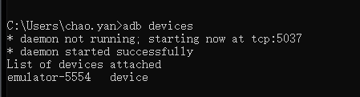

# ADB调试桥

* Android 调试桥 (adb) 是一种功能多样的命令行工具，可让您与设备进行通信。adb 命令可用于执行各种设备操作（例如安装和调试应用），并提供对 Unix shell（可用来在设备上运行各种命令）的访问权限。它是一种客户端-服务器程序，包括以下三个组件：
    * **客户端**：用于发送命令。客户端在开发计算机上运行。您可以通过发出 adb 命令从命令行终端调用客户端。
    * **守护程序 (adbd)**：用于在设备上运行命令。守护程序在每个设备上作为后台进程运行。
    * **服务器**：用于管理客户端与守护程序之间的通信。服务器在开发机器上作为后台进程运行。
- ADB（Android Debug Bridge）是Android SDK中的一个工具, 使用ADB可以直接操作管理Android模拟器或者真实的Andriod设备。
>ADB主要功能有:

- 在Android设备上运行Shell(命令行)；
- 管理模拟器或设备的端口映射；
- 在计算机和设备之间上传/下载文件；
- 将电脑上的本地APK软件安装至Android模拟器或设备上；

---


## 1> adb 的工作原理

* 当您启动某个 adb 客户端时，该客户端会先检查是否有 adb 服务器进程正在运行。如果没有，它会启动服务器进程。服务器在启动后会与本地 TCP 端口 5037 绑定，并监听 adb 客户端发出的命令 - 所有 adb 客户端均通过端口 5037 与 adb 服务器通信。
* 然后，服务器会与所有正在运行的设备建立连接。它通过扫描 5555 到 5585 之间（该范围供前 16 个模拟器使用）的奇数号端口查找模拟器。服务器一旦发现 adb 守护程序 (adbd)，便会与相应的端口建立连接。请注意，每个模拟器都使用一对按顺序排列的端口 - 用于控制台连接的偶数号端口和用于 adb 连接的奇数号端口。
>例如：
    * 模拟器 1，控制台：5554
    * 模拟器 1，adb：5555
    * 模拟器 2，控制台：5556
    * 模拟器 2，adb：5557
>在端口 5555 处与 adb 连接的模拟器与控制台监听端口为 5554 的模拟器是同一个。

---


## 2> 在设备上启用 adb 调试

* 要在通过 USB 连接的设备上使用 adb，您必须在设备的系统设置中启用**USB 调试**（位于**开发者选项**下）。
* 需要在设备上开启USB调试。
* 如需在通过 WLAN 连接的设备上使用 adb，请参阅[通过 WLAN 连接到设备](https://developer.android.google.cn/studio/command-line/adb?hl=zh-cn#wireless&fileGuid=g8kT3ykgqTrWhXDT)。
* 可以选择在Android Studio中运行安卓虚拟机

---


## 3> 查找设备

* 使用 devices 命令生成已连接设备的列表。
```shell
adb devices [-l]
```
- 

>作为回应，adb 会针对每个设备输出以下状态信息：
* 序列号：由 adb 创建的字符串，用于通过端口号唯一标识设备。 下面是一个序列号示例：emulator-5554
    * 状态：设备的连接状态可以是以下几项之一：
    * offline：设备未连接到 adb 或没有响应。
    * device：设备现已连接到 adb 服务器。请注意，此状态并不表示 Android 系统已完全启动并可正常运行，因为在设备连接到 adb 时系统仍在启动。不过，在启动后，这将是设备的正常运行状态。
    * no device：未连接任何设备。
>说明：如果您包含 -l 选项，devices 命令会告知您设备是什么。当您连接了多个设备时，此信息很有用，可帮助您将它们区分开来。

---


### 3.1 设备未列出时

>adb devices 命令的极端命令序列会导致正在运行的模拟器不显示在 adb devices 输出中（即使在您的桌面上可以看到该模拟器）
>当满足以下所有条件时，就会发生这种情况：
    1. adb 服务器未在运行，
    2. 您在使用 emulator 命令时，将 -port 或 -ports 选项的端口值设为 5554 到 5584 之间的奇数，
    3. 您选择的奇数号端口处于空闲状态，因此可以与指定端口号的端口建立连接，或者该端口处于忙碌状态，模拟器切换到了符合第 2 条中要求的另一个端口，以及
    4. 启动模拟器后才启动 adb服务器。
>解决方案：
* 避免出现这种情况的一种方法是让模拟器自行选择端口，并且每次运行的模拟器数量不要超过16 个。
* 另一种方法是始终先启动 adb 服务器，然后再使用 emulator 命令，如下例所示：
    * 停止 adb 服务器，然后按照所示顺序输入以下命令。
    * 提供系统中有效的 avd 名称
```shell
$ adb kill-server                         
$ emulator -avd Nexus_6_API_25 -port 5555  
$ adb devices                              
```

---


```shell
# 或
$ adb kill-server
$ emulator -avd Nexus_6_API_25 -port 5557
$ adb start-server  # 重启adb
$ adb devices
```

---


## 4> 将命令发送至特定设备

* 先获得了已连接设备的列表，然后使用其中一个设备的序列号在该设备上安装了 helloWorld.apk。
```shell
$ adb devices
List of devices attached
emulator-5554 device
emulator-5555 device
$ adb -s emulator-5555 install helloWorld.apk
```
>**注意**：如果您在多个设备可用时发出命令但未指定目标设备，adb 会生成错误。
* 如果有多个可用设备，但只有一个是模拟器，请使用 -e 选项将命令发送至该模拟器。同样，如果有多个设备，但只连接了一个硬件设备，请使用 -d 选项将命令发送至该硬件设备。

- 

* 表示在虚拟机上安装test1.apk

---


## 5> 安装应用和卸载


---


### 5.1 install

* 可以使用 adb 的`install`命令在模拟器或连接的设备上安装 APK
```shell
$ adb install [-l|-r|-t|-s|-d|-g] path_to_apk
# 或
$ adb -s <连接设备序列号> install [-l|-r|-t|-s|-d|-g] <path_to_apk>
```
>adb install 后面可以跟一些可选参数来控制安装 APK 的行为，可用参数及含义如下

|参数|含义|
|:----:|:----|
|-l|将应用安装到保护目录 /mnt/asec|
|-r|允许覆盖安装|
|-t|允许安装 AndroidManifest.xml 里 application 指定android:testOnly="true"的应用|
|-s|将应用安装到 sdcard|
|-d|允许降级覆盖安装|
|-g|授予所有运行时权限|


---


### 5.2 安装失败的解决办法

|输出|含义|解决办法|
|:----:|:----|:----:|
|INSTALL_FAILED_ALREADY_EXISTS|应用已经存在，或卸载了但没卸载干净|adb install时使用-r参数，或者先adb uninstall <packagename>再安装|
|INSTALL_FAILED_INVALID_APK|无效的 APK 文件|    |
|INSTALL_FAILED_INVALID_URI|无效的 APK 文件名|确保 APK 文件名里无中文|
|INSTALL_FAILED_INSUFFICIENT_STORAGE|空间不足|清理空间|
|INSTALL_FAILED_DUPLICATE_PACKAGE|已经存在同名程序|    |
|INSTALL_FAILED_NO_SHARED_USER|请求的共享用户不存在|    |
|INSTALL_FAILED_UPDATE_INCOMPATIBLE|以前安装过同名应用，但卸载时数据没有移除；或者已安装该应用，但签名不一致|先adb uninstall <packagename>再安装|
|INSTALL_FAILED_SHARED_USER_INCOMPATIBLE|请求的共享用户存在但签名不一致|    |
|INSTALL_FAILED_MISSING_SHARED_LIBRARY|安装包使用了设备上不可用的共享库|    |
|INSTALL_FAILED_REPLACE_COULDNT_DELETE|替换时无法删除|    |
|INSTALL_FAILED_DEXOPT|dex 优化验证失败或空间不足|    |
|INSTALL_FAILED_OLDER_SDK|设备系统版本低于应用要求|    |
|INSTALL_FAILED_CONFLICTING_PROVIDER|设备里已经存在与应用里同名的 content provider|    |
|INSTALL_FAILED_NEWER_SDK|设备系统版本高于应用要求|    |
|INSTALL_FAILED_TEST_ONLY|应用是 test-only 的，但安装时没有指定-t参数|    |
|INSTALL_FAILED_CPU_ABI_INCOMPATIBLE|包含不兼容设备 CPU 应用程序二进制接口的 native code|    |
|INSTALL_FAILED_MISSING_FEATURE|应用使用了设备不可用的功能|    |
|INSTALL_FAILED_CONTAINER_ERROR|1. sdcard 访问失败;<br>2. 应用签名与 ROM 签名一致，被当作内置应用。|1. 确认 sdcard 可用，或者安装到内置存储;<br>2. 打包时不与 ROM 使用相同签名。|
|INSTALL_FAILED_INVALID_INSTALL_LOCATION|1. 不能安装到指定位置;<br>2. 应用签名与 ROM 签名一致，被当作内置应用。|1. 切换安装位置，添加或删除-s参数;<br>2. 打包时不与 ROM 使用相同签名。|
|INSTALL_FAILED_MEDIA_UNAVAILABLE|安装位置不可用|一般为 sdcard，确认 sdcard 可用或安装到内置存储|
|INSTALL_FAILED_VERIFICATION_TIMEOUT|验证安装包超时|    |
|INSTALL_FAILED_VERIFICATION_FAILURE|验证安装包失败|    |
|INSTALL_FAILED_PACKAGE_CHANGED|应用与调用程序期望的不一致|    |
|INSTALL_FAILED_UID_CHANGED|以前安装过该应用，与本次分配的 UID 不一致|清除以前安装过的残留文件|
|INSTALL_FAILED_VERSION_DOWNGRADE|已经安装了该应用更高版本|使用-d参数|
|INSTALL_FAILED_PERMISSION_MODEL_DOWNGRADE|已安装 target SDK 支持运行时权限的同名应用，要安装的版本不支持运行时权限|    |
|INSTALL_PARSE_FAILED_NOT_APK|指定路径不是文件，或不是以.apk结尾|    |
|INSTALL_PARSE_FAILED_BAD_MANIFEST|无法解析的 AndroidManifest.xml 文件|    |
|INSTALL_PARSE_FAILED_UNEXPECTED_EXCEPTION|解析器遇到异常|    |
|INSTALL_PARSE_FAILED_NO_CERTIFICATES|安装包没有签名|    |
|INSTALL_PARSE_FAILED_INCONSISTENT_CERTIFICATES|已安装该应用，且签名与 APK 文件不一致|先卸载设备上的该应用，再安装|
|INSTALL_PARSE_FAILED_CERTIFICATE_ENCODING|解析 APK 文件时遇到CertificateEncodingException|    |
|INSTALL_PARSE_FAILED_BAD_PACKAGE_NAME|manifest 文件里没有或者使用了无效的包名|    |
|INSTALL_PARSE_FAILED_BAD_SHARED_USER_ID|manifest 文件里指定了无效的共享用户 ID|    |
|INSTALL_PARSE_FAILED_MANIFEST_MALFORMED|解析 manifest 文件时遇到结构性错误|    |
|INSTALL_PARSE_FAILED_MANIFEST_EMPTY|在 manifest 文件里找不到找可操作标签（instrumentation 或 application）|    |
|INSTALL_FAILED_INTERNAL_ERROR|因系统问题安装失败|    |
|INSTALL_FAILED_USER_RESTRICTED|用户被限制安装应用|    |
|INSTALL_FAILED_DUPLICATE_PERMISSION|应用尝试定义一个已经存在的权限名称|    |
|INSTALL_FAILED_NO_MATCHING_ABIS|应用包含设备的应用程序二进制接口不支持的 native code|    |
|INSTALL_CANCELED_BY_USER|应用安装需要在设备上确认，但未操作设备或点了取消|在设备上同意安装|
|INSTALL_FAILED_ACWF_INCOMPATIBLE|应用程序与设备不兼容|    |
|does not contain AndroidManifest.xml|无效的 APK 文件|    |
|is not a valid zip file|无效的 APK 文件|    |
|Offline|设备未连接成功|先将设备与 adb 连接成功|
|unauthorized|设备未授权允许调试|    |
|error: device not found|没有连接成功的设备|先将设备与 adb 连接成功|
|protocol failure|设备已断开连接|先将设备与 adb 连接成功|
|Unknown option: -s|Android 2.2 以下不支持安装到 sdcard|不使用-s参数|
|No space left on device|空间不足|清理空间|
|Permission denied ... sdcard ...|sdcard 不可用|    |
|signatures do not match the previously installed version; ignoring!|已安装该应用且签名不一致|先卸载设备上的该应用，再安装|


---


### 5.3 uninstall

* uninstall用于卸载
```shell
$ adb uninstall [-k] PACKAGE_NAME
# 
$ adb -s <设备名> uninstall [-k] PACKAGE_NAME
```
* -k 参数可选，表示卸载应用但保留数据和缓存目录。

---


## 6> 查看安装应用列表和应用运行情况


---


### 6.1 查看应用列表

>查看应用列表：
```plain
adb shell pm list packages
```
>查看应用：筛选条件
```plain
$ adb shell pm list packages -s # 查看系统应用
$ adb shell pm list packages -3 # 查看第三方应
# 比如要查看包名包含<字符串>的应用列表
$ adb shell pm list packages <字符串>  
$ adb shell pm list packages | grep <字符串>
```

---


### 6.2 查看应用详细信息

```shell
adb shell dumpsys package <packagename>
```
* 输出中包含很多信息，包括 Activity Resolver Table、Registered ContentProviders、包名、userId、安装后的文件资源代码等路径、版本信息、权限信息和授予状态、签名版本信息等。

---


### 6.3 应用运行情况

```shell
$ adb shell dumpsys meminfo PACKAGE_NAME
$ adb -s 设备号 shell dumpsys meminfo 包名
```

---


### 6.4 查看正在运行的Services

```shell
adb shell dumpsys activity services [<packagename>]
```
* `<packagename>`参数不是必须的，指定`<packagename>`表示查看与某个包名相关的 Services，不指定表示查看所有 Services。
* `<packagename>`不一定要给出完整的包名，比如运行 adb shell dumpsys activity services org.mazhuang，那么包名 org.mazhuang.demo1、org.mazhuang.demo2 和 org.mazhuang123 等相关的 Services 都会列出来。

---


## 7> 清除应用数据与缓存

```shell
$ adb shell pm clear <packagename>
```
* 这条命令的效果相当于在设置里的应用信息界面点击了「清除缓存」和「清除数据」。

---


## 8> 停止adb服务器

* 在某些情况下，您可能需要终止 adb 服务器进程，然后重启以解决问题。
```shell
$ adb kill-server
```
* 用于停止adb服务器，然后可以通过任意的adb命令重启adb服务器。

---


## 9> 发出adb命令

* 可以从开发机器上的命令行发出 adb 命令，也可以通过脚本发出。
```shell
$ adb [-d | -e | -s serial_number] command
```
>如果只有一个模拟器在运行或者只连接了一个设备，系统会默认将 adb 命令发送至该设备。如果有多个模拟器正在运行并且/或者连接了多个设备，您需要使用 -d、-e 或 -s 选项指定应向其发送命令的目标设备。

---


## 9> 发出Shell命令

* 可以使用 shell 命令通过 adb 发出设备命令，也可以启动交互式 shell。如需发出单个命令，请使用 shell 命令，如下所示：
```shell
$ adb [-d |-e | -s serial_number] shell shell_command
```
* 要在设备上启动交互式 shell，请使用`shell`命令，如下所示：
```shell
$ adb [-d | -e | -s serial_number] shell
```
* 要退出交互式 shell，请按 Ctrl + D 键或输入`exit`。

---


