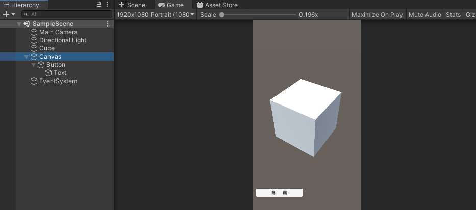
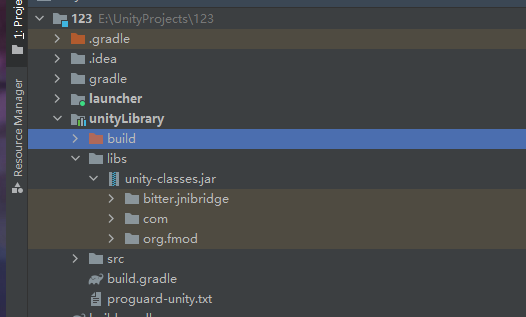
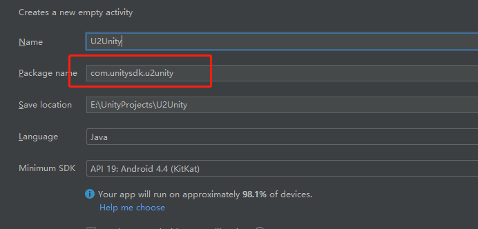
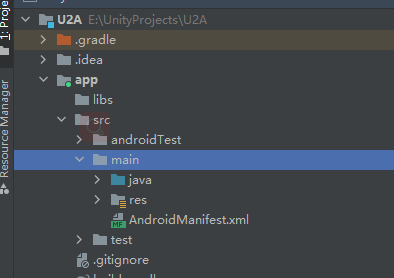
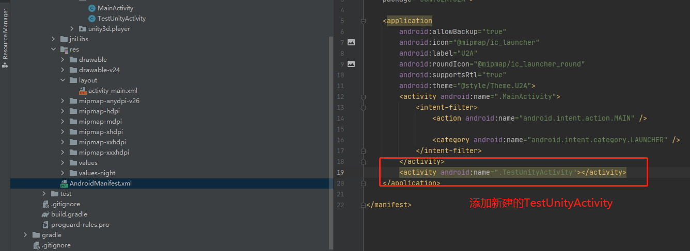

# Android Studio与Unity的简单混合开发

- Unity 和 Android 混合开发大致分为以下两大类：
1. Unity做好项目之后导出为Android Studio项目，导入到Android Studio中进行之后的功能开发。最后由Android Studio打包APK。即Unity辅助Android开发（Android开发为主），对Android技能要求较高。
2. Android Sutido做好项目导出jar或aar包，导入到Unity中作为Unity的插件使用，最后由Unity打包APK。即Android辅助Unity开发（Unity开发为主），对Unity技能要求较高。
> 注意：Unity打包APK时，调用安卓SDK，把所有游戏内容整合打包出的APK中只有一个MainActivity。

---

## 1> Unity 工程导出至Android Studio

- 在Unity中创建一个工程，实现一个方块在场景中的旋转，通过一个button显示和隐藏方块。



---
### 1.1 创建脚本

- ButtonCommand.cs拖到Button上
```csharp
using System.Collections;
using System.Collections.Generic;
using UnityEngine;
using UnityEngine.UI;

public class ButtonCommand : MonoBehaviour
{
    Button _button;
    GameObject gmCube;
    Text text;
    string show = "显  示";
    string hide = "隐  藏";

    private void OnEnable()
    {
        gmCube = GameObject.Find("Cube");
       text = transform.GetChild(0).GetComponent<Text>();
        text.text = hide;
        _button = GetComponent<Button>();
        AddLisener();
    }
    public void ShowCube()
    {
        gmCube.SetActive(true);
    }
    public void HideCube()
    {
        gmCube.SetActive(false);
    }

    bool isShow = true;
    void AddLisener()
    {
        _button.onClick.AddListener(()=> {

            if (isShow)
            {
                isShow = false;
                HideCube();
                text.text = show;
                Debug.Log("点击了隐藏");
            }
            else
            {
                isShow = true;
                ShowCube();
                text.text = hide;
                Debug.Log("点击了显示");

            }

        });
    }
    
}
```
- Cube_Rotato.cs拖到Cube上
```csharp
using System.Collections;
using System.Collections.Generic;
using UnityEngine;

public class Cube_Rotato : MonoBehaviour
{
    private void Update()
    {
        transform.Rotate(Vector3.up * Time.deltaTime*50f);
    }
}

```
---
### 1.2 导出Unity项目
- 切换为 Android 平台， 勾选 Export Project ，然后 Player Settings 设置，尤其是包名，设置好后， 就可以 Export 导出工程


- Export导出到一个空文件夹中,导出后的 Unity 工程，了解 Android Studio 工程的，可以看得出与之差不多。


---
### 1.3 导入到Android Studio中

- 然后再Android Studio中，File>New>Import Project,选择之前导出的Unity工程，导入到Android Studio中。引用Android Studio的SDK环境，不使用导入项目原有的UnitySDK引用。
  


- 在Android Studio中打包的效果和Unity导出的apk效果相同。
- 从Unity到Andriod中二次开发。
---

## 2> Android原有工程导入Unity工程

- Android Studio 原有工程上导入Unity工程，Android Studio 的 MainActivity 为主界面，UnityActivity 为跳转界面

---
### 2.1 创建Android工程

- 创建的Android Studio项目的包名需要需要与Unity工程中的包名一致。



- 原有项目的结构如下：
  


---

### 2.2 在Unity导出的工程文件导入到Android工程

- 把 Unity导出的工程的文件，对应添加到新建的 Android 工程，包括 unity-class.jar，assets文件夹，和 jniLibs 文件夹，Java文件夹。


- 复制的unity-classes.jar需要右键 Add As Library


---
### 2.3 在MainActivity.java中添加跳转到Unity的事件按钮

- 在 MainActivity.java 脚本中添加一个按钮，并且绑定按钮事件，点击跳转到 UnityActivity；新建TestUnityActivity.java，显示UnityActivity界面（注意：继承 UnityPlayerActivity），并监听返回键事件返回到MainActivity；MainActivity 布局文件等 具体如下图


```Java
//添加的脚本如下
    public void click(View view){
        //点击跳转到UnityActivity
        Intent intent = new Intent(this,TestUnityActivity.class);
    }
```

- 编写TestUnityActivity类，需要继承UnityPlayerActivity类

```java

public class TestUnityActivity extends UnityPlayerActivity {
    //UnityPlayerActivity 是调起Unity，所以继承UnityPlayerActivity，
    //然后，添加监控用户按下返回键，返回主菜单MainActivity

    @Override
    protected void onCreate(Bundle bundle){
        super.onCreate(bundle);
    }

    @Override
    public  boolean onKeyDown(int i, KeyEvent keyEvent){
        //添加返回键 返回MainActivity
        if (i == KeyEvent.KEYCODE_BACK){
            Intent  intent = new Intent(this,MainActivity.class);
            startActivity(intent);
            finish();
        }
        return super.onKeyDown(i,keyEvent);
    }
}
```
---

### 2.4 其他MainActivity 布局文件

- 在 app>src>main>res>layout 中找到activity_main布局文件，为主界面添加一个button。
 


- 在main文件下的 AndroidManifest.xml。添加新建的TestUnityActivity



---

