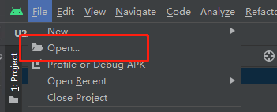
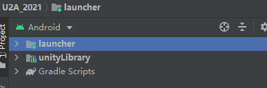
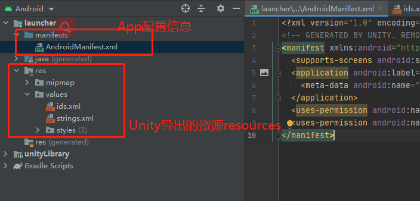
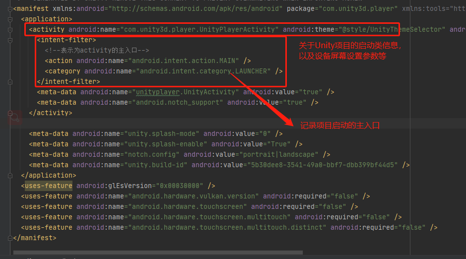
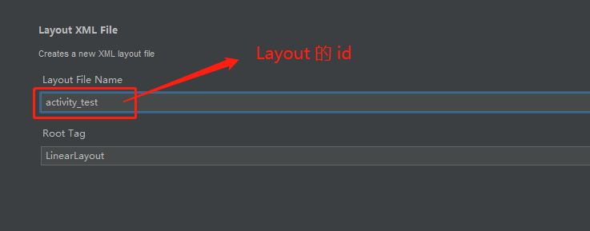
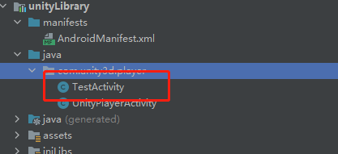

# Unity导出安卓二次开发
---

## 1> 导出Export

- 在Build Settings中导出安卓项目
  


---
## 2> 在Android Studio中打开安卓项目

- File>Open...





---
## 3> 模块launcher



---
## 4> 模块unityLibrary


- 未修改配置信息的前提下，在安卓中打包与在Unity打包的apk运行的效果一致。

---

## 5> 在安卓中设置button跳转到Unity界面

- Unity的主入口位置（AndroidManifest.xml）
  


---
### 5.1 创建XML——Button

- 创建一个Button界面。先在res下创建一个layout文件夹，创建并选择 layout XML file，


  


---
### 5.2 创建Java类，关联button用于触发跳转

- 设置一个java类，用一个button点击事件跳转到Unity界面。

  


```java
public class TestActivity extends Activity {

    @Override
    protected void onCreate(Bundle savedInstanceState) {
        super.onCreate(savedInstanceState);

        setContentView(R.layout.activity_test);
        //layout下视创建xml的时候的命名为主

        Button btn = findViewById(R.id.button);

        btn.setOnClickListener(new View.OnClickListener() {
            @Override
            public void onClick(View view) {
                Intent intent = new Intent(TestActivity.this,UnityPlayerActivity.class);
                startActivity(intent);
            }
        });
    }
}
```
- 需要修改 AndriodManifest 的信息


---
### 5.3 打包运行

- 在真机或者虚拟机运行可以看到跳转的效果

---
