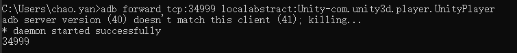

# Unity在Android真机调试


---


## 1> Unity中切换到安卓开发平台

* 选中Development, AutoConnect Profiler, Script Debugging


---


## 2> 手机连接到Win或其他平台

* 需要连接到ADB服务端，adb devices 指令可以查看设备连接信息。
* 设备连接需要连接的设备打开USB调试功能。


* 显示离线offline时可以，在设备开发者模式下重新启用USB调试。

---

## 3> 连接设备，建立Unity与设备之间的连接

* 确定好要在安卓真机上要测试的Unity工程项目的PackageName
* 设备USB连接时，输入指令，创建ADB端口连接
```powershell
adb forward tcp:34999 localabstract:Unity-<PackageName>
```



---


## 4> 打包Unity安卓项目

* 使用Build&Run直接在手机上安装运行(或者先Build到本地然后将apk手动安装到安卓手机上)，
* 安装成功后在设备应用的右下角有Debug Builder的水印,
* 在Profiler的Playmode下选择34999端口的设备


>Console窗口PlayerLogging选择34999端口的安卓设备, 即可查看手机端运行的信息，Debug信息也会在Console上打印出来


---


## 5> 在真机上测试应用

* 在设备中运行应用，再建立好设备与Unity的连接之后，可以再Profiler中查看设备的运行情况，再Console中查看Log信息。
* 只对Unity此项目的package的应用包的测试在Unity中有效。
* 需要先启动应用后，然后再在Profiler和Console中选择连接设备。
---
