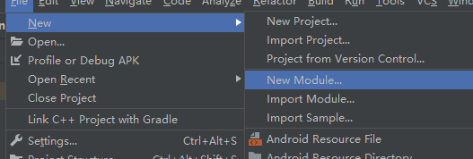
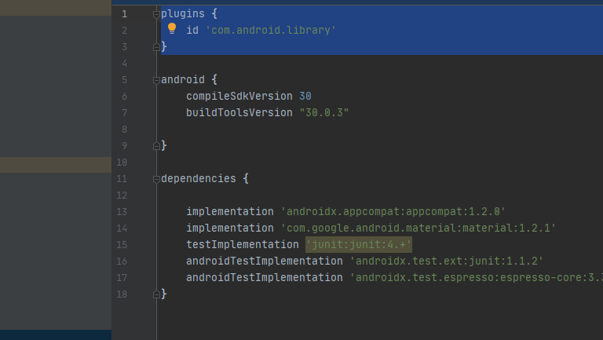
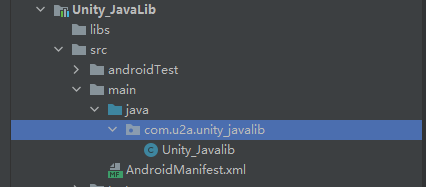
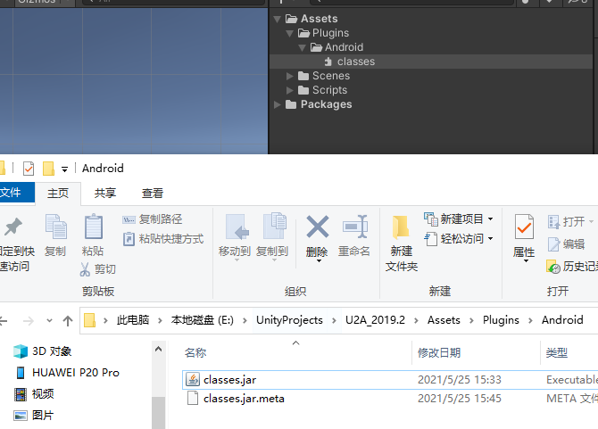

# Java与C#的交互

---

## 1> 在Studio中创建Java类库

---
### 1.1 Studio项目中创建Module

- 可以在已有的项目中创建一个Module，选择Android Library，或者新建一个空项目




---
### 1.2 修改模块中的Build.gradle文件

- 确保在文件头部的id为library
- 若是新建项目修改的是app文件下的Build,需要将application替换成library

```Java
plugins {
    id 'com.android.library'
}
```



- 其中在 android{}块中只保留开头两个属性值，其他对于构建类库不需要。

---

### 1.3 创建一个Java新类放在指定位置

- 在src/main/java/<包名>下创建一个java类并添加内容



---
- 脚本内容如下：

```java
public class Unity_Javalib {
    public static String LOG = "LOG";
    public String name;

    public static void SetLOG(String log){
        LOG = log;
        Log.d(LOG,"SetLOG:"+log);
    }

    public static String GetLOG(){
        Log.d(LOG,"GetLOG:"+LOG);
        return LOG;
    }

    public void SetName(String name){
        this.name = name;
        Log.d(LOG,"SetName:"+name);
    }
    public  String GetName(){
        Log.d(LOG,"GetName:"+name);
        return name;
    }   
}
```

---
### 1.4 Build该模块


- Build完成后生成一个新文件夹，生成的Jar 在 build/intermediates/arr_main_jar 下，表示为纯净的Android Java类库。
- 而 arr 包在 build/outputs/arr 下，包括 Jar 在内，也有一些拓展非类库资源。

> arr包创建一个副本，修改后缀为zip，解压之后可以看到arr中包含有jar 包。


> 可以根据需求导入jar，或者arr，均可。

---
## 2> 在Unity中导入Jar/arr包

- 在Unity Project窗口中，需要将jar包放在指定的文件夹下。Assets/Plugins/Android,这样就可以在Unity项目中引用安卓项目的类库。



---

## 3> Unity中C#调用Java的类库
---
### 3.1 AndroidJavaClass

```csharp
//AndroidJavaClass 表示Java的一个类对象
AndroidJavaClass javaClass = new AndroidJavaClass("Package.name.ClassName");

//调用Java中的静态方法          
javaClass.CallStatic("StaticFunc");
string str_class = javaClass.CallStatic<string>("StaticFunc");

//获取和修改java类中的类变量
string str_Staticfield = javaClass.GetStatic<string>("StaticField");
javaClass.SetStatic("StaticField", "newValue");
```
---
### 3.2 AndroidJavaObject

```csharp
//AndroidJavaObject 表示Java的类对象实例
AndroidJavaObject javaObject = new AndroidJavaObject("Package.name.ClassName")

//调用Java中的实例方法
javaObject.Call("Func","Params");
string str_Obj = javaObject.Call<string>("Func");

//获取和修改java类的实例变量
string s_Obj = javaObject.Get<string>("Field");
javaObject.Set<string>("Field", "newValue");
```
---
## 4> 使用Java调用C#方法

---
### 4.1 导入Unity类库至Android Studio项目中

- 首先需要将Unity项目中的Unity类库导入到java中。

- 首先在Unity编辑器目录下，非Project文件，路径如下：根目录\Editor\Data\PlaybackEngines\AndroidPlayer\Variations\mono\Release\Classes 下的Classes.jar


- 复制到Studio之前打包的模块/libs目录下，并且需要右键 Add As Library... (添加为库文件)


- 在构建为library后，子文件中的Unity3d提供了Unity为java提供的接口


---
### 4.2 调用Unity类中的方法

- 在Java类中调用UnitySendMessage方法。
  
```java
UnityPlayer.UnitySendMessage(s1,s2,s3);
    
//s1:"游戏物体的名称"
//s2:"所挂载的方法"
//s3:"参数列表，无参数时空字符串代替");
```
- 在安卓项目中修改Java类，调用一些Unity的方法，需要重新打包，并覆盖掉之前在Unity中导入的classes.jar包。
---