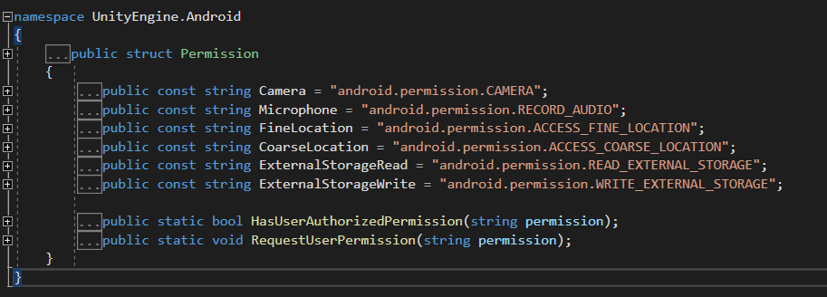

# C#调用安卓的权限

---
## 1> Unity中的Android Permission

- using UnityEngine.Android;
  


- 向用户请求相机权限：封装一个方法调用
```csharp
void RequestCameraPermission()
{
    if (!Permission.HasUserAuthorizedPermission(Permission.Camera))//若未自动获取权限时
    {
        Permission.RequestUserPermission(Permission.Camera); 
        //调用方法时会向用户请求
    }
}

```
---
