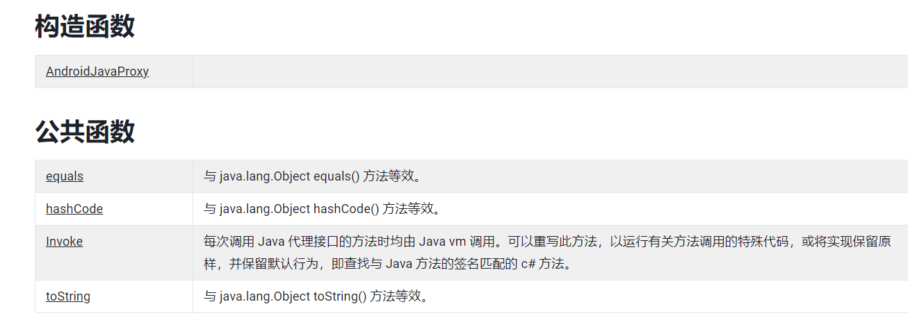

# Unity与Android的通信

---
## 1> Unity提供的主要几个接口

- Unity提供的主要几个接口分别为：

1. AndroidJavaClass 类

2. AndroidJavaObject 对象

3. AndroidJavaRunnable Unity对java.lang.Runnable object的实现（委托）

4. AndroidJavaProxy 接口，用于实现任何java接口；通过invoke调用接口中的方法

5. AndroidJavaException 继承于Exception的android异常类

6. AndroidJNI java本地开发接口

7. AndroidJNIHelper 用于JNI交互的Helper接口；签名创建与方法查找。

---

## 2> AndroidJavaObject

- AndroidJavaObject 是 java.lang.Object 的通用实例的 Unity 表示。它可用作到任何 Java 类实例的无类型接口。代表Java的一个对象。

```csharp
public void AndroidJavaObject()
{
 //Ctor
    //基于Java类名称构造的一个java对象在Unity的映射对象，可以跟参数列表
    AndroidJavaObject javaObject = new AndroidJavaObject("Java.classname");
    //获取Java.lang.class 的通用实例。
    AndroidJavaClass javaClass = new AndroidJavaClass("Java.classname");
 
 //Function
    //调用Java方法，Call<>表示方法返回值，CallStatic表示调用静态方法
    javaObject.Call("methodName", "Params args[]");
    javaClass.CallStatic<string>("methodName");
    
    //调取Java对象字段,Get返回非静态字段值，GetStatic返回静态字段值，<>约定返回类型
    AndroidJavaObject field1 = javaObject.Get<AndroidJavaObject>("fieldName");
    AndroidJavaObject field2 = javaClass.GetStatic<AndroidJavaObject>("fieldName");
   
    //设置Java对象字段的值，
    javaObject.Set<string>("fieldName", "newValue");
    javaClass.SetStatic<string>("fieldName", "newValue");

    //Dispose() IDisposable回调，与using(){}结合使用
    javaClass.Dispose();
}

```


---
### 2.1 获取当前App的Activity
- 获取Activity基础方法，后面方法有调用
```csharp
public static AndroidJavaObject CurrentActive()
{
    if (Application.platform == RuntimePlatform.Android)
    {
        return new AndroidJavaClass("com.unity3d.player.UnityPlayer").CallStatic<AndroidJavaObject>("currentActivity");
    }
    else
    {
        return null;
    }
}
```
---
### 2.2 获取指定包名的Activity
```csharp
public static AndroidJavaObject GetActivity(string package_name,string activity_name)
{
    return new AndroidJavaClass(package_name).CallStatic<AndroidJavaObject>(activity_name);
}
```
### 2.3 获取原生类型：android.provider.Settings中的属性，以android_id为例。
```csharp
    public string GetAndroidID()
    {
        string android_id = "NONE";
        try
        {
#if UNITY_ANDROID && !UNITY_EDITOR
            AndroidJavaClass up = new AndroidJavaClass("com.unity3d.player.UnityPlayer");
            //AndroidJavaClass 表示Java一个原生类.
            AndroidJavaObject currentActivity = up.GetStatic<AndroidJavaObject>("currentActivity");
            AndroidJavaObject contentResolver = currentActivity.Call<AndroidJavaObject>("getContentResolver");
            AndroidJavaClass secure = new AndroidJavaClass("android.provider.Settings$Secure");
            //CallStatic 的使用:静态方法获取一个Android原生类型
            android_id = secure.CallStatic<string>("getString", contentResolver, "android_id");
#endif

        }
        catch (System.Exception e)
        {
            Debug.LogError(e);
        }
        return android_id;
    }
```

---
### 2.4 获取包名

```csharp
public static string GetPackageName()
{
    return CurrentActive().Call<string>("getPackageName");
}
```

---
### 2.5 在UI线程中运行
```csharp
public static void RunOnUIThread(AndroidJavaRunnable runnable)
{
    CurrentActive().Call("runOnUiThread"，runnable)
}
```
---
### 2.6 设置 不自动锁屏
```csharp
public static void DisableScreenLock()
{
    CurrentActive().Call<AndroidJavaObject>("getWindow").Call("addFlags",128);
}
```

---
### 2.7 获取内置SD卡的路径
```csharp
public static string GetStoragePath()
{
    if(Application.platform == RuntimePlatform.Android){
        return new AndroidJavaClass("android.os.Environment").CallStatic<AndroidJavaObject>("getExternalStorageDirectory").Call<string>("getPath");
    }else{
        return "d:/movie"
    }
}
```
---
## 3> AndroidJavaClass

- AndroidJavaClass 是 java.lang.Class 的通用实例的 Unity 表示。
- 继承于AndroidJavaObject,用法见AndroidJavaObject。

---
## 4> AndroidJavaProxy

- 此类可用于实现任何 Java 接口。与代理对象中的接口匹配的任何 Java vm 方法调用都将自动传递给 c# 实现。

```csharp
public void AndroidJavaProxy()
{
 //Ctor
    AndroidJavaProxy anProxy_string = new AndroidJavaProxy("java.javaInterface");
    AndroidJavaProxy anProxy_JavaClass = new AndroidJavaProxy(new AndroidJavaClass("javaInterface"));

 //Function
    //Java.lang.Object.equals()判定两个对象是否相等。
    bool isEquals = anProxy_string.equals(new AndroidJavaObject("className"));

    //返回对象的hashCode()
    int hashcode = anProxy_JavaClass.hashCode();

    //调用Java代理接口的方法。
    anProxy_JavaClass.Invoke("methodName",new object[1] {"args"});
    anProxy_JavaClass.Invoke("methodName",new AndroidJavaObject[0]);

    //与Java.lang.Object.toString()方法等效,返回C# class name + " <c# proxy java object>".
    string strs = anProxy_JavaClass.toString();
}

```



---
## 5> AndroidJavaRunnable

```Csharp
public delegate void AndroidJavaRunnable();
```
- 可以作为参数将Unity无参方法传递进Java线程。
- AndroidJavaRunnable 是 java.lang.Runnable 对象的 Unity 表示。AJRunnable是一个委托，当每次将其作为参数传递给Java时，都会创建一个新的Java.lang.reflect.Proxy对象（具有不同hashcode的新Java对象），因此对于用AJRunnable表示的Java对象使用equals始终返回false，连自身比较也是。

```csharp
public class ExampleClass : MonoBehaviour
{
    // 将执行 context 传递给Java UI线程。  
    void Start()
    {
        AndroidJavaClass unityPlayer = new AndroidJavaClass("com.unity3d.player.UnityPlayer");
        AndroidJavaObject activity = unityPlayer.GetStatic<AndroidJavaObject>("currentActivity");
        activity.Call("runOnUiThread", new AndroidJavaRunnable(runOnUiThread));
    }

    void runOnUiThread()
    {
        Debug.Log("I'm running on the Java UI thread!");
    }
}
```
---

## 6> AndroidException

- 继承Exception，重写stackTrace属性，用于追踪捕捉并显示Android的堆栈状态。

---

## 7> AndroidJNIHelper与AndroidJNI

- 需要一定的Android Java 原生接口（JNI）的知识储备。
- 2021.5.28