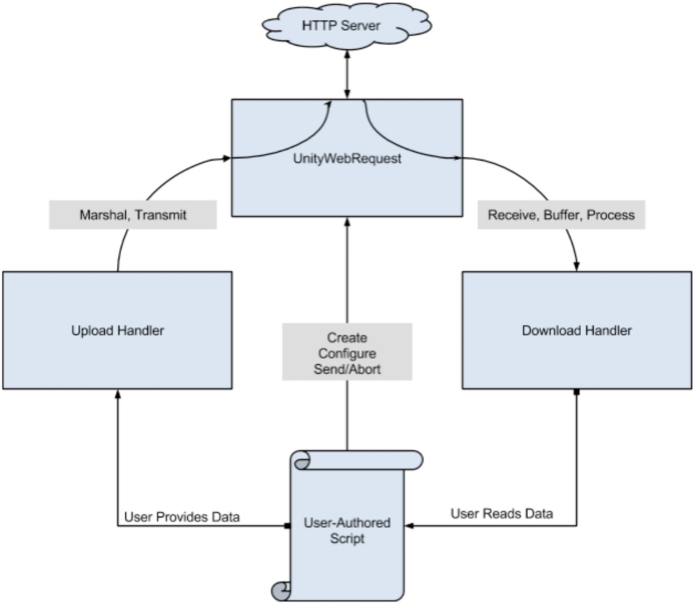

# UnityWebRequest

- UnityWebRequest 提供了一套标准的系统模块，来完成Http请求和Http相应，它的基本目标就是满足Unity端与web后端服务的交互，也支持一些Http高级的功能(chunked http请求————数据分块传输，流式POST/PUT操作，以及操作Http包头和其他的http行为，比如 delete，get 等)。 

---
## 1. API 组成

- 高级API（HLAPI High Level API）：它封装了低级API的接口。
- 低级API（LLAPI Low Level API）
- 支持所有的Unity Editor 平台和所有的独立运行的应用。

---
## 2. 系统组成结构

- UnityWeb将一个Http请求的事务分解成三个不同的操作：
  - 向服务器提供数据
  - 从服务器获取数据
  - Http流控制（重定向，错误捕捉等）
- UnityWeb将这些操作封装到各自所属的对象里面：
  - UploadHandler 负责向服务器发送数据
  - DownloadHandler 负责接收，缓存和处理服务器接收的数据
  - UnityWebRequest 负责管理其它的两个对象，并且实现Http流的控制操作。在这个对象中，可以自定义Headers信息，URLs，以及存储错误和重定向信息。

---
## 3. 一个Http请求事务的代码流程

- 创建一个Web请求对象。
- 配置Web请求对象：设置自定的 Headers ，设置 Http 行为比如 GET，POST，HEADER（自定义行为除了安卓平台，其他平台都支持），然后设置请求的 URL。
- <操作> 创建一个Upload Handler 并且和 Web Request 绑定：提供请求的参数数据，或者提供要提交的表单数据。
- <操作> 创建一个Download Handler 并且和 Web Request绑定。
- 发送Web Request，如果是在一个协程中，你需要yield Send()方法的结果，然后等待请求的完成。
- <操作> 读取从Download Handler中接收的数据。
- <操作> 从UnityWebRequest对象中读取错误信息，Http状态码以及响应的包头信息。

---
