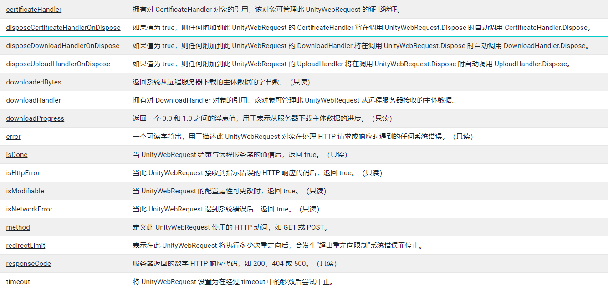

# UnityWebRequest类型参考

---

## 1. UnityWebRequest

- UnityWebRequest 对象用于与 Web 服务器进行通信。

- UnityWebRequest 处理 HTTP 与 Web 服务器进行通信的流程。
- 其他对象，特别是 DownloadHandler 和 UploadHandler 分别管理数据的下载和上传。

> 注意：UnityWebRequest 通过调用 SendWebRequest 方法开始与远程服务器进行通信后，UnityWebRequest 对象的大部分属性将无法更改。

> 注意：代理设置应在操作系统级别上配置。UnityWebRequest 会采用这些设置。

---
### 1.1 Const_Fields
```csharp
//分别对应 HTTP 方法请求的动词
public const string kHttpVerbGET = "GET";
public const string kHttpVerbHEAD = "HEAD";
public const string kHttpVerbPOST = "POST";
public const string kHttpVerbPUT = "PUT";
public const string kHttpVerbCREATE = "CREATE";
public const string kHttpVerbDELETE = "DELETE";
```
---
### 1.2 Fields




---
### 1.3 Public Method
---
#### Abort
- 如果 UnityWebRequest 在进行中，请尽快停止。

- 此方法可以在任何时候调用。如果 UnityWebRequest 尚未完成，UnityWebRequest 将尽快停止上传或下载数据。中止的 UnityWebRequest 被视为发生系统错误。isNetworkError 或 isHttpError 属性都会返回 true，error 属性的状态将为"用户中止"。

- 如果在调用 Send 之前调用了此方法，则 UnityWebRequest 将在 Send 调用之后立即中止。

- 此 UnityWebRequest 遇到另一个错误或成功结束与远程服务器的通信之后，调用此方法将无效。
---
#### Dispose

- 表示不再使用此 UnityWebRequest，并且应清理它使用的所有资源。

- 使用完 UnityWebRequest 对象后，无论请求成功还是失败，您都必须调用 Dispose。

- 安全起见，通常最好的做法是采用 using statement 确保正确清理 [UnityWebRequest]，以防存在未捕获的异常。

```csharp
using UnityEngine;
using UnityEngine.Networking;
using System.Collections;

public class MyExampleBehaviour : MonoBehaviour
{
    public IEnumerator Start()
    {
        using (UnityWebRequest request = UnityWebRequest.Get("http://my-website.com"))
        {
            yield return request.SendWebRequest();
            Debug.Log("Server responded: " + request.downloadHandler.text);
        }
    }
}
```
---
#### GetRequestHeader

```csharp
public string GetRequestHeader (string name);

string HeaderV = www.GetRequestHeader(HeaderName)
//检索自定义 HeaderName 标头的值。未匹配返回空
```
 
---
#### GetResponseHeader

```csharp
public string GetResponseHeader (string name);
//从收到的最新 HTTP 响应中检索响应标头的值。

//如果此 UnityWebRequest 收到多个响应（例如在重定向期间），则仅检查最新（或最终）请求中的标头。
```
---
#### GetResponseHeaders

```csharp
public Dictionary<string,string> GetResponseHeaders ();
//检索包含着此 UnityWebRequest 在最新 HTTP 响应中收到的所有响应标头的字典。

//如果 UnityWebRequest 收到多个响应（例如在重定向期间），则仅包含最新/最终响应中的标头。
```
---
#### SendWebRequest
```csharp
public Networking.UnityWebRequestAsyncOperation SendWebRequest ();

yield return www.SendWebResquest()
```
>表示开始与远程服务器通信。

- 调用此方法后，UnityWebRequest 将执行 DNS 解析（如有必要），将一个 HTTP 请求传输到位于目标 URL 的远程服务器，并处理该服务器的响应。

- 在任何给定的 UnityWebRequest 对象上，此方法只能调用一次。

- 调用此方法后，您无法更改任何 UnityWebRequest 的属性。在调用 SendWebRequest 之后，便无法更改 UnityWebRequest 属性。

- 此方法将返回 WebRequestAsyncOperation 对象。在协程内部生成 WebRequestAsyncOperation 将导致协程暂停，直到 UnityWebRequest 遇到系统错误或结束通信为止。
---
#### SetRequestHeader
```csharp
public void SetRequestHeader (string name, string value);

//将Http 请求标头设置为自定义值
```
---
### 1.4 Static Method

---
#### ClearCookieCache
```csharp
public static void ClearCookieCache ();

//清除缓存中存储的 Cookie。
```
---
#### Delete
```csharp
public static Networking.UnityWebRequest Delete (string uri);

//创建针对 HTTP DELETE 进行配置的 UnityWebRequest。

//此方法可创建一个 UnityWebRequest，将动词设置为 DELETE，并将目标 URL 设置为字符串参数 /uri/。此方法不设置自定义标志或标头。

//此方法不会将 DownloadHandler 或 UploadHandler 附加到 UnityWebRequest。
```
---
#### EscapeURL
```csharp
public static string EscapeURL (string s);
public static string EscapeURL (string s, Encoding e);

//对字符串中的字符进行转义以确保其支持 URL。

//某些文本字符在 URL 中出现时具有特殊含义。如果您需要在 URL 参数中包含这些字符，则必须用转义序列来表示它们。

//建议您在将用户提供的任何文本作为 URL 参数传递之前在文本上使用此函数。这将确保恶意用户无法操纵 URL 的内容来攻击 Web 服务器。

 string escName = UnityWebRequest.EscapeURL("Fish &amp; Chips");
```
---
#### UnEscapeURL
```csharp
public static string UnEscapeURL (string s);
public static string UnEscapeURL (string s, Encoding e);

//将支持 URL 的转义序列转换回正常文本。

//某些文本字符在 URL 中出现时具有特殊含义。

string plainName = UnityWebRequest.UnEscapeURL("Fish+%26+Chips");
```

---
#### GenerateBoundary
```csharp
public static byte[] GenerateBoundary ();

//生成一个随机的 40 字节数组byte[]来用作多部分表单边界。
```

---
#### Get
```csharp
public static Networking.UnityWebRequest Get (string uri);
public static Networking.UnityWebRequest Get (Uri uri);

//为 HTTP GET 创建 UnityWebRequest。

//使用该方法创建 UnityWebRequest。使用 string 或 Uri 参数将目标 URL 设置为 /uri/。不会设置任何自定义标志或标头。
```
---
```csharp
using UnityEngine;
using UnityEngine.Networking;
using System.Collections;

// UnityWebRequest.Get example

// Access a website and use UnityWebRequest.Get to download a page.
// Also try to download a non-existing page. Display the error.

public class Example : MonoBehaviour
{
    void Start()
    {
        // A correct website page.
        StartCoroutine(GetRequest("https://www.example.com"));

        // A non-existing page.
        StartCoroutine(GetRequest("https://error.html"));
    }

    IEnumerator GetRequest(string uri)
    {
        using (UnityWebRequest webRequest = UnityWebRequest.Get(uri))
        {
            // Request and wait for the desired page.
            yield return webRequest.SendWebRequest();

            string[] pages = uri.Split('/');
            int page = pages.Length - 1;

            if (webRequest.isNetworkError)
            {
                Debug.Log(pages[page] + ": Error: " + webRequest.error);
            }
            else
            {
                Debug.Log(pages[page] + ":\nReceived: " + webRequest.downloadHandler.text);
            }
        }
    }
}
```
---
#### Head
```csharp
public static Networking.UnityWebRequest Head (string uri);

//UnityWebRequest 经配置可传输 HTTP HEAD 请求的 UnityWebRequest。UnityWebRequest 经配置可传输 HTTP HEAD 请求的 UnityWebRequest。
```
---
#### Post
```csharp
public static Networking.UnityWebRequest Post (string uri, string postData);
//postData	表单主体数据。将在传输之前进行 URL 编码。
public static Networking.UnityWebRequest Post (string uri, WWWForm formData);
//formData	封装在 WWWForm 对象中的表单字段或文件，用于格式化并传输到远程服务器。
Post (string uri, List<IMultipartFormSection> multipartFormSections);
Post (string uri, List<IMultipartFormSection> multipartFormSections, byte[] boundary);
//multipartFormSections	要进行格式化并传输到远程服务器的表单字段或文件的列表。
//boundary	唯一边界字符串，将在多部分表单中分隔表单字段时使用。如果未提供，系统将为您生成边界。
Post (string uri, Dictionary<string,string> formFields);
//formFields	用于表示表单字段的键和值的字符串。将自动格式化为经过 URL 编码的表单主体。

//--------------------------------------------
//UnityWebRequest 经配置可通过 POST 向 uri 发送表单数据的 UnityWebRequest。

//此方法可创建一个 UnityWebRequest，将 url 设置为字符串 uri 参数，并将 method 设置为 POST。Content-Type 标头将默认被设置为 application/x-www-form-urlencoded。

//注意： 许多服务器后端语言无法正确处理带有 Content-Type 标头的 POST 请求，设置为对 application/x-www-form-urlencoded 或 multipart/form-data 之外的其他标头进行编码。

//此方法将一个 DownloadHandlerBuffer 附加到 UnityWebRequest。这是为方便起见，因为我们预计大部分用户将使用 DownloadHandler 检查服务器的回复，尤其是对于 REST API 来说。

//postData 中的数据将进行转义，然后通过 System.Text.Encoding.UTF8 解释为字节流。生成的字节流将存储在 UploadHandlerRaw 中，且上传处理程序将被附加到此 UnityWebRequest。
```
---
#### Put
```csharp
public static Networking.UnityWebRequest Put (string uri, byte[] bodyData);
public static Networking.UnityWebRequest Put (string uri, string bodyData);

//创建一个经配置可通过 HTTP PUT 将原始数据上传到远程服务器的 UnityWebRequest。

//此方法可创建一个 UnityWebRequest，将目标 URL 设置为字符串 uri 参数，并将 method 设置为 PUT。此方法还将 Content-Type 标头设置为 application/octet-stream。

//此方法将一个标准 DownloadHandlerBuffer 附加到 UnityWebRequest。这是为了在开发过程中提供方便，以及便于应用程序在 HTTP 响应主体中返回关于上传数据的状态信息。

//此方法将输入的上传数据存储在一个 UploadHandlerRaw 对象中，并将该对象附加到 UnityWebRequest。UploadHandlerRaw 将输入的数据复制到缓冲区。因此，调用此方法后执行的对 bodyData 数组的更改将不会反映在发送到服务器的数据中。
```
#### SerializeFormSections 
```csharp
public static byte[] SerializeFormSections (List<IMultipartFormSection> multipartFormSections, byte[] boundary);


//multipartFormSections	IMultipartFormSection 对象的列表。
//boundary	用于分隔表单各部分的唯一边界字符串。

//将 IMultipartFormSection 对象列表转换为包含原始多部分表单数据的字节数组。
```

#### SerializeSimpleForm

```csharp
public static byte[] SerializeSimpleForm (Dictionary<string,string> formFields);

// formFields	包含要序列化的表单键和值的字典。

//将字符串字典序列化为包含经过 URL 编码的 UTF8 字符的字节数组。

//此方法将对字符串进行 URL 编码，然后将它们连接在一起，就像它们在 HTTP 查询字符串中一样。键和值将用等号 (=) 进行分隔，不同的键-值对将用与号 (&) 进行分隔。

---

## 2. 
