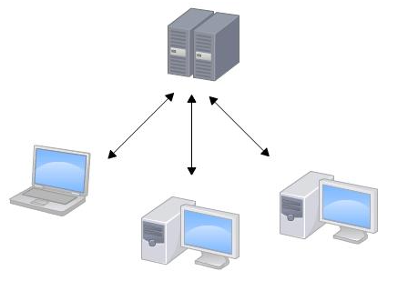
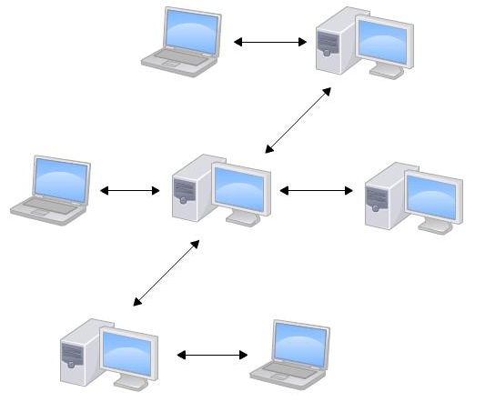
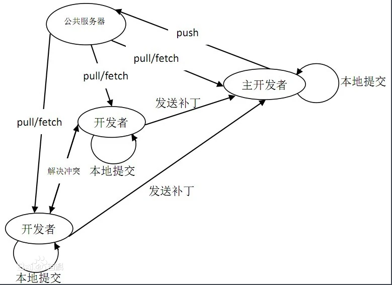
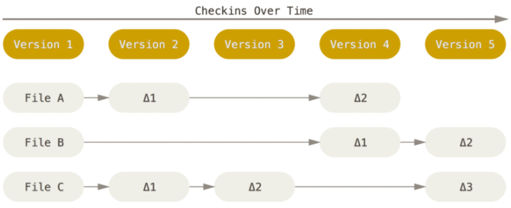
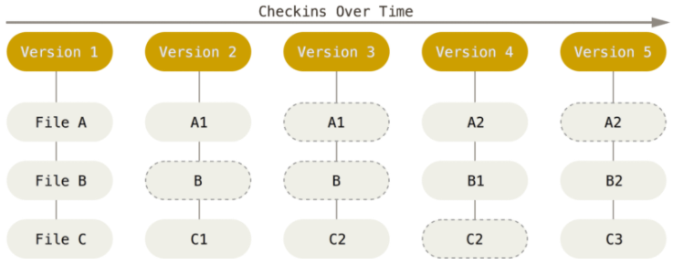
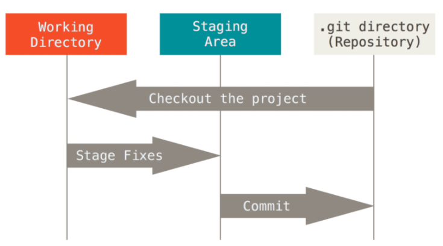
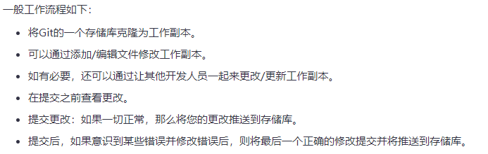
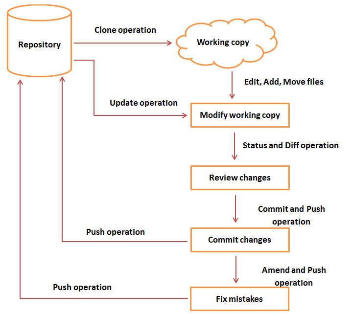

# Git分布式版本控制系统

---

## 1> GIT分布式版本控制系统介绍

- Git 是一个开源的分布式版本控制系统，可以有效、高速地处理从很小到非常大的项目版本管理。由Linus Torvalds为了帮助管理Linux内核开发而开发的一个开放源码的版本控制软件。
- Git 是用于Linux内核开发的版本控制工具。与常用的版本控制工具 CVS, Subversion 等不同，它采用了**分布式版本库**的方式，不必服务器端软件支持。使源代码的发布和交流极其方便。 Git 的速度很快，这对于诸如 Linux kernel 这样的大项目来说自然很重要。 Git 最为出色的是它的合并跟踪（merge tracing）能力。

---

## 2> 集中式与分布式

>CVS及SVN都是集中式的版本控制系统，而Git是分布式版本控制系统，集中式和分布式版本控制系统有什么区别呢？

---

### 2.1集中式版本控制（Centralized Version Control ）

- 开发者之间的合作方式是共用一个仓库（repository），无论这个仓库是在本地还是在远端，只要是所有成员都共同存取同一个仓库，那么这种方式就是集中式（centralized）版本控制。

- 

---

### 2.2 集中式版控的特点

- 集中式的版本控制系统其实有三大重点，即同步、追溯、以及档案的备份。
  - 同步是为了让所有开发者对档案所做的变更都能够同步，最终得到相同的档案内容。
  - 追溯，是能够回到受控档案在变化历史中的任何一个版本，并且明白每个版本间变化的原因、以及究竟做了什么变动。
  - 档案的备份，无庸置疑的，就是让所有的受控档案集中保管于仓库中，作为备份也利于备份。不但能取得最新的版本，也能够取出任意时间点上的版本。
- 从集中式版本控制系统的设计观点来看，它主要是维持开发者之间保持同步的状态。若是根据保持同步的手段再细分，又能衍生出两种模式：一种是锁定模式，另一种是合并模式。
  - 锁定模式下，当开发者想要修改某档案、签出该档案后，该档案便会进入锁定状态，其他开发成员便无法加以修改，这种方法造成了开发者对于档案修改的互斥效应，大大降低了开发效率。
  - 在合并模式下，允许多位开发者同时针对同一档案进行修改，当他们分别将档案提交回仓库时，若发生冲突的情况，便会自动进行合并，而若自动合并失败，再要求人工合并。

---

### 2.3 集中式版控的缺点

- 集中式版本控制系统最大的毛病就是必须联网才能工作，网络不佳的情况下会导致整体开发效率低下

---

### 2.4分布式版本控制（Distributed Version Control）

- 对分散式版本控制系统来说，其核心不在于维持不同开发者间的同步，而在于让每个开发者拥有各自独立的变更集合，且开发者之间可分享自己的变更集合。
- 每个开发者都拥有独立的档案库，所以可以直接对自己的档案库进行操作。在离线环境中，开发者既可以连续工作，也可以持续修改，和本地档案库进行交互（比如管理版本、查询修改历史、回溯、提交、……）

- 

---

### 2.5 GIT分布式版控的特点

- 分布式相比于集中式的最大区别在于开发者可以提交到本地，每个开发者通过克隆（git clone），在本地机器上拷贝一个完整的Git仓库。

>经典Git开发过程

- 

- 从一般开发者的角度来看，git有以下功能：
  - 从服务器上克隆完整的Git仓库（包括代码和版本信息）到单机上。
  - 在自己的机器上根据不同的开发目的，创建分支，修改代码。
  - 在单机上自己创建的分支上提交代码。
  - 在单机上合并分支。
  - 生成补丁（patch），把补丁发送给主开发者。
  - 看主开发者的反馈，如果主开发者发现两个一般开发者之间有冲突（他们之间可以合作解决的冲突），就会要求他们先解决冲突，然后再由其中一个人提交。如果主开发者可以自己解决，或者没有冲突，就通过。
  - 一般开发者之间解决冲突的方法，开发者之间可以使用pull 命令解决冲突，解决完冲突之后再向主开发者提交补丁。
- 从主开发者的角度（假设主开发者不用开发代码）看，git有以下功能：
  - 查看邮件或者通过其它方式查看一般开发者的提交状态。
  - 打上补丁，解决冲突（可以自己解决，也可以要求开发者之间解决以后再重新提交，如果是开源项目，还要决定哪些补丁有用，哪些不用）。
  - 向公共服务器提交结果，然后通知所有开发人员。

---

### 2.6 Git的优缺点

>优点

- 适合[分布式开发](https://baike.baidu.com/item/%E5%88%86%E5%B8%83%E5%BC%8F%E5%BC%80%E5%8F%91?fileGuid=V6gTqjqWG9VPvW8h)，强调个体。
- 公共服务器压力和数据量都不会太大。
- 速度快、灵活。
- 任意两个开发者之间可以很容易的解决冲突。
- 离线工作。

>缺点

- 代码保密性差，一旦开发者把整个库克隆下来就可以完全公开所有代码和版本信息。
- 不符合常规思维。

---

## 3> Git原理

---

### 3.1 直接记录快照，而非差异比较

- Git 和其它版本控制系统(包括 Subversion 和近似工具)的主要差别在于 Git 对待数据的方法。 概念上来区分，其它大部分系统以文件变更列表的方式存储信息。
- 这类系统(CVS、Subversion、Perforce、Bazaar 等等)将它们保存的信息看作是一组基本文件和每个文件随时间逐步累积的差异。
  
>存储每个文件与初始版本的差异：

- 

- Git 更像是把数据看作是对小型文件系统的一组快照。 每次你提交更新，或在 Git 中保存项目状态时，它主要对当时的全部文件制作一个快照并保存这个快照的索引。
- 为了高效，如果文件没有修改，Git 不再重新存储该文件，而是只保留一个链接指向之前存储的文件。

>Git 对待数据更像是一个 快照流

- 

---

### 3.2 Git保证完整性

- Git 中所有数据在存储前都计算校验和，然后以校验和来引用。 这意味着不可能在 Git 不知情时更改任何文件内容或目录内容。
- Git 用以计算校验和的机制叫做 SHA-1 散列(hash，哈希)。 这是一个由 40 个十六进制字符(0-9 和 a-f)组成字符串，基于 Git 中文件的内容或目录结构计算出来。

- 
  
---

### 3.3 Git 的三种状态

>Git 有三种状态，你的文件可能处于其中之一：已提交(committed)、已修改(modified)和已暂存(staged)。

- 已提交表示数据已经安全的保存在本地数据库中。
- 已修改表示修改了文件，但还没保存到数据库中。
- 已暂存表示对一个已修改文件的当前版本做了标记，使之包含在下次提交的快照中。

>Git 项目的三个工作区域的概念：Git 仓库、工作目录以及暂存区域

- 

- Git 仓库目录是 Git 用来保存项目的元数据和对象数据库的地方。 这是 Git 中最重要的部分，从其它计算机克隆仓库时，拷贝的就是这里的数据。

- 工作目录是对项目的某个版本独立提取出来的内容。 这些从 Git 仓库的压缩数据库中提取出来的文件，放在磁盘上供你使用或修改。

- 暂存区域是一个文件，保存了下次将提交的文件列表信息，一般在 Git 仓库目录中。 有时候也被称作‘索引’，不过一般说法还是叫暂存区域。

---

## 4> Git 工作流程

- 

---

- 

---
