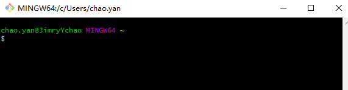

# Git安装

---

## 1> 在Linux上安装Git

1. 在Debian与Ubuntu Linux上，通过”sudo apt-get install git“（老版本更改为“sudo apt-get install git-core”）直接完成Git的安装
2. 其他Linux版本，直接在Git官网下载源码，解压之后依次输入“./config”，“make”，“sudo make install”这几个命令安装就好了。

---

## 2> MacOS X上安装Git

1. 安装homebrew，然后通过homebrew安装Git，具体方法请参考homebrew的文档：[http://brew.sh/](http://brew.sh/?fileGuid=3kKctCcXvj98wDYT)。
2. 直接从AppStore安装Xcode，Xcode集成了Git，不过默认没有安装，需要运行Xcode，选择菜单“Xcode”->“Preferences”，在弹出窗口中找到“Downloads”，选择“Command Line Tools”，点“Install”就可以完成安装了。

---

## 3> 在Win上安装Git

- 从Git官网直接[下载安装程序](https://git-scm.com/downloads?fileGuid=3kKctCcXvj98wDYT)，然后按默认选项安装即可。
- 安装完成后，在开始菜单里找到“Git”->“Git Bash”，蹦出一个类似命令行窗口的东西，就说明Git安装成功！

- 

 >在命令行输入

```-
-----
  $ git config --global user.name "Your Name"
  $ git config --global user.email "email@example.com"
```

- 用来设置该版控机器的User和Email
- 因为Git是分布式版本控制系统，所以，每个机器都必须自报家门。

---
