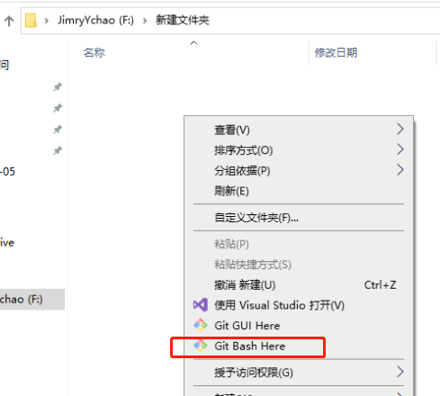
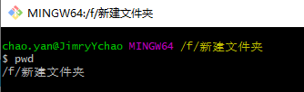
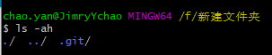

# 创建Git版本库

---

## 1>版本库介绍

- 版本库又名仓库，英文名**repository**，这个目录里面的所有文件都可以被Git管理起来，每个文件的修改、删除，Git都能跟踪，以便任何时刻都可以追踪历史，或者在将来某个时刻可以“还原”。

---

## 2> 创建一个空目录

- 在一个合适的地方创建一个空目录

- 
- 输入pwd命令用于显示当前目录

```shell
-----
$ pwd
```

- 

- 通过git init命令把这个目录变成Git可以管理的仓库：

```shell
-----
$ git init
Initialized empty Git repository in /f/新建文件夹
```

---

## 3> 查看创建好Git库的目录

- ls -ah 指令（不是is，小写L）

- 

---

## 4> 把文件添加到版本库

- 所有的版本控制系统，其实只能跟踪文本文件的改动，比如TXT文件，网页，所有的程序代码等等，Git也不例外。
- 而图片、视频这些二进制文件，虽然也能由版本控制系统管理，但没法跟踪文件的变化，只能把二进制文件每次改动串起来，也就是只知道图片从100KB改成了120KB。

>千万不要使用Windows自带的**记事本**编辑任何文本文件。原因是Microsoft开发记事本的团队使用了一个非常弱智的行为来保存UTF-8编码的文件，他们自作聪明地在每个文件开头添加了0xefbbbf（十六进制）的字符

- 下载[Notepad++](http://notepad-plus-plus.org/?fileGuid=Qq9w6XDJWwT6qDPv)代替记事本，不但功能强大，而且免费！记得把Notepad++的默认编码设置为UTF-8 without BOM即可：

---

>开始添加文件

- 编写的文件需要放在库文件目录下或者子文件夹下
- 用命令 git add添加到仓库。需要将添加的文件名称写入。

```shell
-----
$ git add readme.txt
```

- 用命令git commit告诉Git，把文件提交到仓库：

```shell
-----
$ git commit -m "wrote a readme file"
[master (root-commit) eaadf4e] wrote a readme file
 1 file changed, 2 insertions(+)
 create mode 100644 readme.txt
```

>其中 -m 后面输入本次提交的说明，用于记录历史和版本信息。
>执行成功后会返回库中文件的修改信息。

- 可以多次add后一次性commit提交。用ls或者dir命令查看当前目录的文件

---
