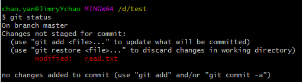
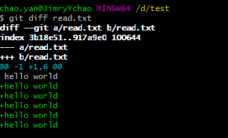
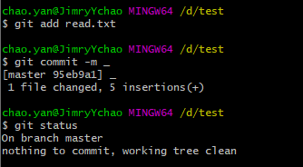
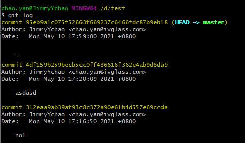
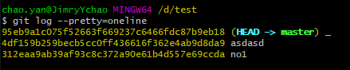
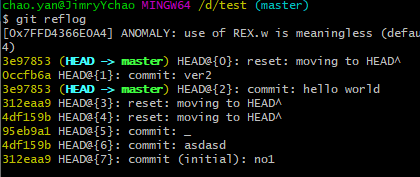
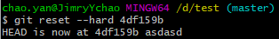
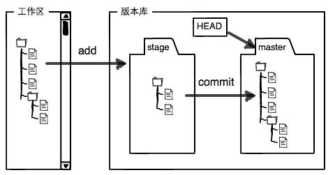
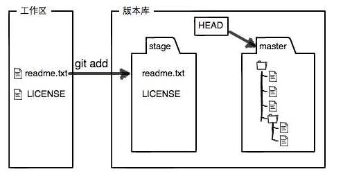
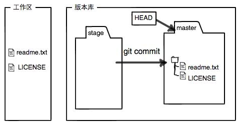

# Git版本回退，管理与修改

---

## 1> 修改read.txt文件并查看Git status返回信息

- 修改之前上传到Git库的txt文本，使用命令git status查看结果

- 

- 提示文件被修改，git status命令可以让我们时刻掌握仓库当前的状态，上面的命令输出告诉我们，readme.txt被修改过了，但还没有准备提交的修改。

---

## 2> 查看被修改信息

- git diff \<file>返回被修改的信息，当已经提交修改后则看不到修改的地方

- 

---

## 3> 提交修改

- git add重新提交申请并git commit上传。
- 再次status查看状态信息返回

- \

---

## 4> 版本回退

- git log 可以返回显示从最近到最远的提交日志

- 

- 包括作者和时间信息，提交日志记录

>git log --pretty=oneline 用16进制数一行存储修改信息。Git就会把它们自动串成一条时间线，返回commit信息，前7位记录Commit ID

- 

- git reset用于回退版本
  - 格式：$ git reset --hard HEAD^
  - HEAD^表示上一个版本
  - HEAD^^表示上上个版本
  - HEAD~100表示返回上100个版本
- git reset --hard \<commit ID> 用于继续回溯到特定ID的版本。

---

## 5> 版本撤销回退

- git reflog用来记录你的每一次命令，git reflog 查看命令历史，以便确定要回到未来的哪个版本。

- 
- 使用git reset --hard \<ID>更新到某个commit id版本

- 

---

## 6> Git工作区与暂存区

- 工作区（Working Directory）
  - 当前工作区所在文件夹里能看到的目录
- 版本库（Repository）
  - 工作区有一个隐藏目录.git，这个不算工作区，而是Git的版本库。
  - Git的版本库里存了很多东西，其中最重要的就是称为stage（或者叫index）的暂存区，还有Git为我们自动创建的第一个分支master，以及指向master的一个指针叫HEAD。

- 

>git add 将内容存储在暂存区
>git commit 将暂存区的内容存储到当前master库分支，master为当前唯一分支，git commit只修改master分支

- 

- 

---

## 7> 管理修改

- Git 跟踪和管理的就是文件的修改与变动，在使用 git add 的时候，Git 会将工作区的内容放到暂存区，再次进行修改时未进行 add 操作时，commit 命令只会将暂存区的内容存放到 Git 库中。
提交后，用 git diff HEAD --\<file> 命令可以查看工作区和版本库里面最新版本的区别。
因此修改后需要将工作区的内容通过Add添加到暂存区，再通过commit存放到库中。

---

## 8> 撤销修改

- 在工作区进行修改后，可以用git checkout --\<file>撤销工作区的修改（此修改未add到暂存区），并用最近一次add或commit上传的版本。
撤销暂存区的修改，使用git reset Head \<file>将暂存区的修改撤销掉，并把当前本地库的内容恢复到工作区。

---

## 9> 删除文件

- rm \<file> 用于删除工作区某个文件，status可以查看工作区与版本库的区别。
删除版本库中的file：git rm \<flie> ，并且commit命令保存修改。
误删文件，git checkout --\<file>，撤销对file的修改。

---
