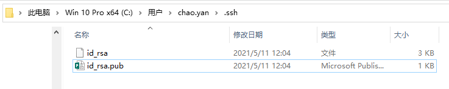
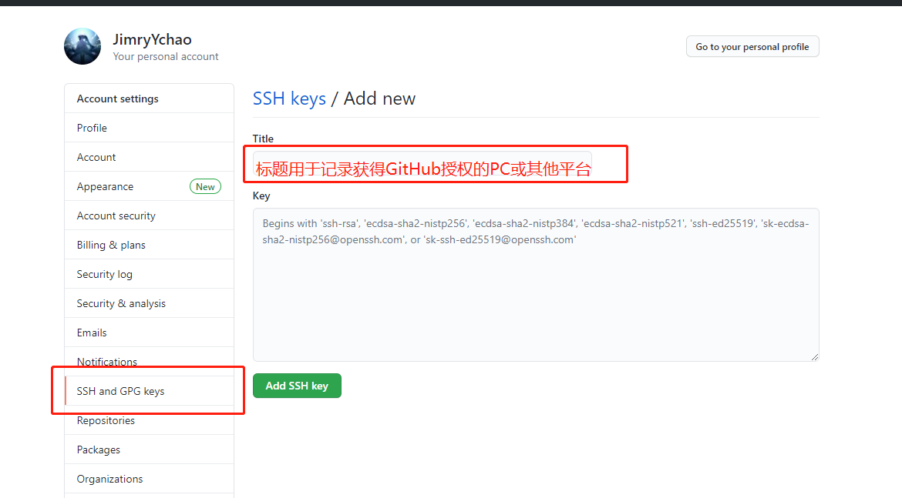
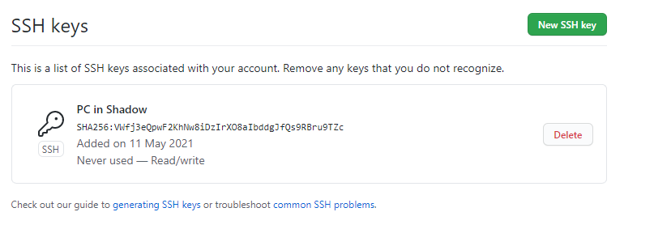
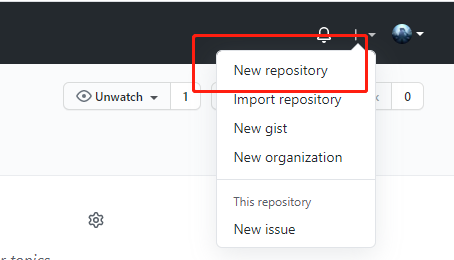
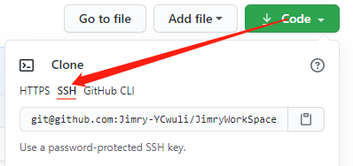
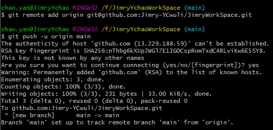
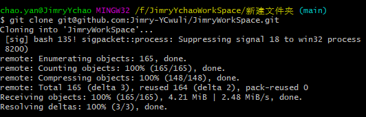

# Git 远程仓库——创建GitHub连接

---

## 1> 获取本地的 id_rsa.pub

- 在 GitHub 上注册账号
- 在 Hub 远程库中添加本地库的 SHH Key。
- 获取用户主目录下的 .ssh 目录中查看里面有id_rsa 和 id_rsa.pub 两个文件，这两个就是 SSH Key 的秘钥对，id_rsa 是私钥，不能泄露出去，id_rsa.pub 是公钥，可以放心地告诉任何人。
- 
- 不存在时可以通过 ssh 指令创建，一路 Enter 即可。

```-
-----
$ ssh-keygen -t rsa -C "youremail@example.com"
```

- 复制 id_rsa.pub 指令添加到 GitHub

- 

- 将指令添加后提交到 Key。

- 

---

## 2> 与 GitHub 远程库建立连接

- 创建 GitHub new Repo。

- 

- 复制当前远程库的 SSH 信息

- 

- 在本地当前库的 Git base 中输入$ git remote add origin \<GitHub SSH>，其他的远程库原理相似。

- 

- 表示当前本地的 main 分支已经和远程 origin 关联。
- $ git push -u origin main 指令表示：
  - 由于远程库是空的，我们第一次推送 master 分支时，加上了-u 参数，Git 不但会把本地的 master 分支内容推送的远程新的 master 分支，还会把本地的 master 分支和远程的 master 分支关联起来，在以后的推送或者拉取时就可以简化命令。

---

## 3> 本地库提交到远程库

- $ git push origin \<main> 表示将本地库上传到连接的 Github 上。

---

## 4> 删除远程库

- 使用 $ git remote -v 指令查看远程库信息

- 
- $ git remote rm origin此处根据名字删除，删除了本地与远程的绑定关系
  
>要关联一个远程库，使用命令 git remote add origin git@server-name:path/repo-name.git；
>关联一个远程库时必须给远程库指定一个名字，origin 是默认习惯命名；
>关联后，使用命令 git push -u origin master 第一次推送 master 分支的所有内容；
>此后，每次本地提交后，只要有必要，就可以使用命令 git push origin master 推送最新修改；

---

## 5> 克隆远程库

- Git 支持多种协议，默认的 git://使用 ssh，但也可以使用 https 等其他协议。
- 使用 git clone <远程 SSH 协议>，用来克隆远程库中的文件

- 

---
