# Git 分支管理

---

## 1> 创建和合并分支

* 在[版本回退](https://www.liaoxuefeng.com/wiki/896043488029600/897013573512192?fileGuid=gtCxPX3C3VGgxTxP)里，每次提交，Git 都把它们串成一条时间线，这条时间线就是一个分支。截止到目前，只有一条时间线，在 Git 里，这个分支叫主分支，即 master 分支。HEAD 严格来说不是指向提交，而是指向 master，master 才是指向提交的，所以，HEAD 指向的就是当前分支。

---

### 1.1 Git 分支运作原理

* 一开始的时候，master 分支是一条线，Git 用 master 指向最新的提交，再用 HEAD 指向 master，就能确定当前分支，以及当前分支的提交点：
* 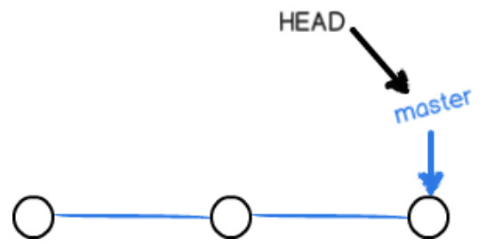
* 每次提交，master 分支都会向前移动一步，这样，随着你不断提交，master 分支的线也越来越长。当我们创建新的分支，例如 dev 时，Git 新建了一个指针叫 dev，指向 master 相同的提交，再把 HEAD 指向 dev，就表示当前分支在 dev 上：

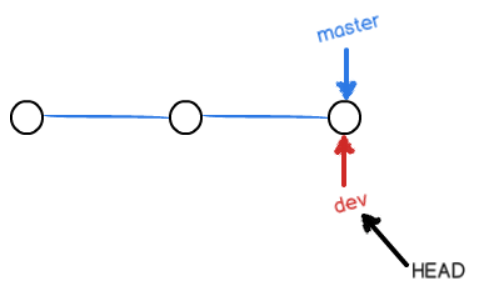

* 对工作区的修改和提交就是针对 dev 分支了，比如新提交一次后，dev 指针往前移动一步，而 master 指针不变：

* 假如我们在 dev 上的工作完成了，就可以把 dev 合并到 master 上。Git 怎么合并呢？最简单的方法，就是直接把 master 指向 dev 的当前提交，就完成了合并：

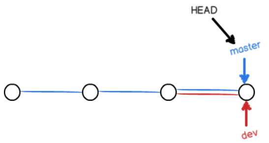

* 合并完分支后，甚至可以删除 dev 分支。删除 dev 分支就是把 dev 指针给删掉，删掉后，我们就剩下了一条 master 分支：

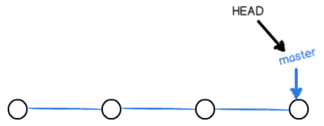

---

### 1.2 创建分支

* $ git checkout -b \<dev>  用于创建一个 dev 分支
* 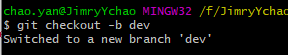

---

### 1.3 查看所有分支

* $ git branch 用于查看当前本地库的所有分支，并标记当前 head 指向的分支名称。
* 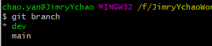

---

### 1.4 跳转分支

* $ git checkout \<main> 跳回名为 main 的分支
* 
* 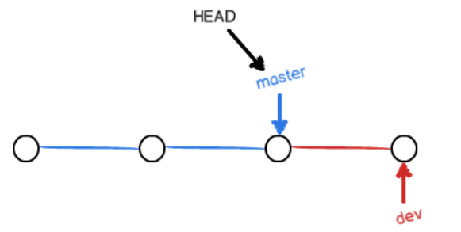

---

### 1.5 合并分支

* $ git merge <分支名> 用于将指定分支合并到当前 HEAD 指向分支

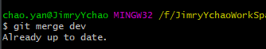

---

### 1.6 删除分支

* $ git branch -d <分支名> 用于删除指定分支
* 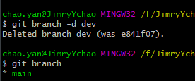
* 再次查看后 dev 分支已被删除。

---

### 1.7 switch 新语法

* 新版本的 Git 支持 switch，$ git switch -c \<dec>
* 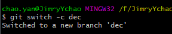
* $ git switch \<main> 同样用于切换分支
* 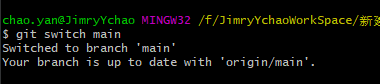

---

* 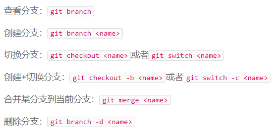

---

## 2> 解决冲突

---

### 2.1 冲突的产生

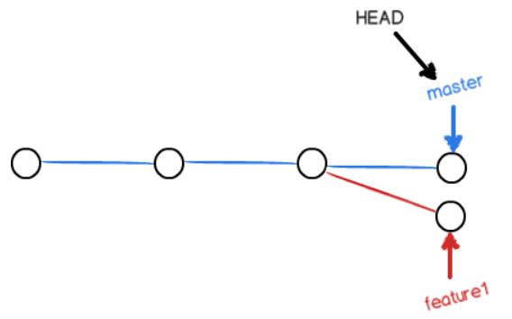

* 当在同一个节点创建不同分支，各个分支有着不同的提交进度，试图合并时就会产生冲突
  
>试图合并时：

* git status 可以告诉我们冲突的文件

---

### 2.2 查看冲突文件，修改提交

* 发生冲突的文件可以在该文件中查看冲突的内容，git 会标记出来
* 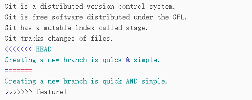

>修改后提交后分支会变成：

* 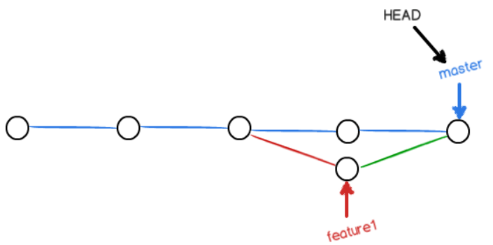

---

### 2.3 查看分支合并

* $ git log --graph --pretty=oneline --abbrev-commit
* 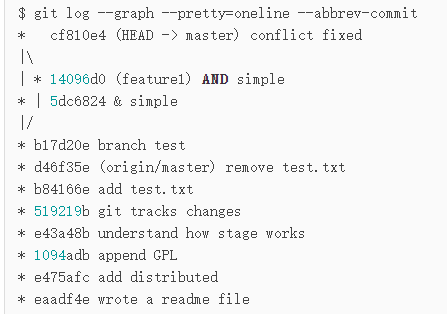

>最后删除不需要的分支即可

* $git log --graph命令可以看到分支合并图。
  
---

## 3> 分支管理策略

* 通常，合并分支时，如果可能，Git 会用**Fast forward**模式，但这种模式下，删除分支后，会丢掉分支信息。
* 若要保留分支信息，可以禁用 FF 模式，并在合并分支时创建一个新的 commit id
* $ git merge --no-ff -m "massage" <被合并分支名>
* 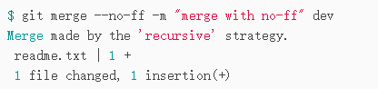

---

### 3.1 分支策略

* 在实际开发中，我们应该按照几个基本原则进行分支管理：
  * 首先，master 分支应该是非常稳定的，也就是仅用来发布新版本，平时不能在上面干活；
  * 那在哪干活呢？干活都在 dev 分支上，也就是说，dev 分支是不稳定的，到某个时候，比如 1.0 版本发布时，再把 dev 分支合并到 master 上，在 master 分支发布 1.0 版本；
  * 团队中每个人都在 dev 分支上干活，每个人都有自己的分支，时不时地往 dev 分支上合并就可以了。
* 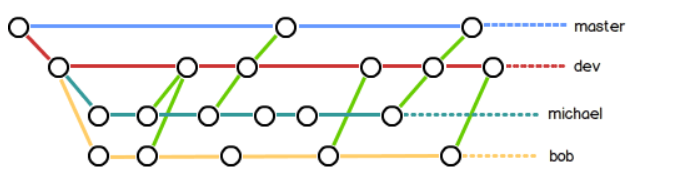

---

## 4> bug 分支管理

* 当在 dev 分支上工作时，但 dev 上的工作没有提交，此时接到 master 上需要修复一个101 的 bug 的任务时，很自然地，你想创建一个分支 issue-101 来修复它，然后合并并删除临时分支。
* 此时需要将 dev 工作区的内容存储起来，等恢复现场后完成任务再提交。

>$ git stash

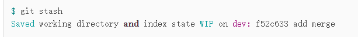

* 此时可以跳转到带有 bug 的分支，创建临时分支后修改完 bug 后再合并当前分支，并删除临时分支
* 重新回到自己的工作分支：
  * 使用 git stash list查看存储的工作现场信息
  * 一是用 git stash apply 恢复，但是恢复后，stash 内容并不删除，你需要用 git stash drop 来删除；
  * 另一种方式是用 git stash pop，恢复的同时把 stash 内容也删了：

---

### 4.1 其他 commit 修正相同 bug

* 获取修正 bug 的分支提交的 commit id。
* 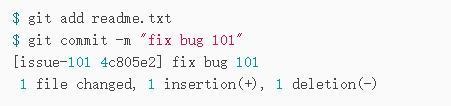
* 此 bug 出现在 master 分支，dev 分支是从 master 分支衍生出来，dev 上可能会出现相同 bug。
* 同样的 bug，要在 dev 上修复，我们只需要把  4c805e2 fix bug 101  这个提交所做的修改“复制”到 dev 分支。注意：我们只想复制  4c805e2 fix bug 101  这个提交所做的修改，并不是把整个 master 分支 merge 过来。
* git cherry-pick \<commit id>复制一个特定的提交到当前分支。

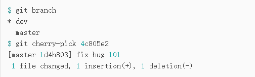

---

>修复 bug 时，我们会通过创建新的 bug 分支进行修复，然后合并，最后删除；
>当手头工作没有完成时，先把工作现场 git stash 一下，然后去修复 bug，修复后，再 git stash pop，回到工作现场；
>在 master 分支上修复的 bug，想要合并到当前 dev 分支，可以用 git cherry-pick \<commit>命令，把 bug 提交的修改“复制”到当前分支，避免重复劳动。

---

## 5> Feature分支

* 软件开发中，总有无穷无尽的新的功能要不断添加进来。
* 添加一个新功能时，不希望因为一些实验性质的代码，把主分支搞乱了，所以，每添加一个新功能，最好新建一个feature分支，在上面开发，完成后，合并，最后，删除该feature分支。

---

### 5.1 feature演示

* 获取添加Vulcan功能的任务后，创建feature分支
* 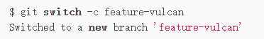
* 完成功能开发后上传提交
* 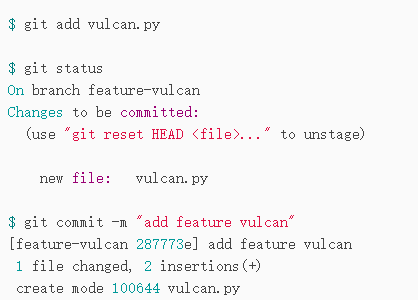
* 切回dev，准备merge或rebase合并，但是需求取消又要求删除新建功能
* 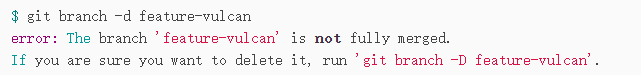
* feature-vulcan分支还没有被合并，如果删除，将丢失掉修改，如果要强行删除，需要使用大写的-D参数。
* 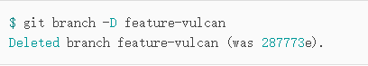

---

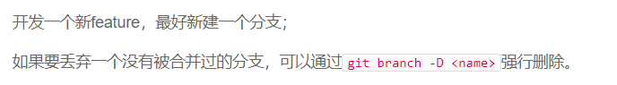

---

## 6> 多人合作

* 从远程仓库克隆时，实际上Git自动把本地的master分支和远程的master分支对应起来了，并且，远程仓库的默认名称是origin。
  
>查看远程库信息：

* 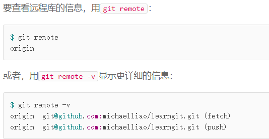
  
>推送分支

* 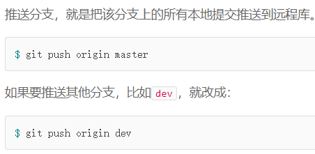
  
>抓取分支

* 多人协作时，都会从master和dev分支上推送各自的修改。
* 其他分支的目录下克隆：git clone \<SSH>
* 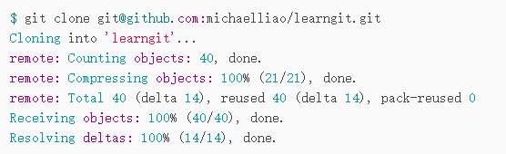

---

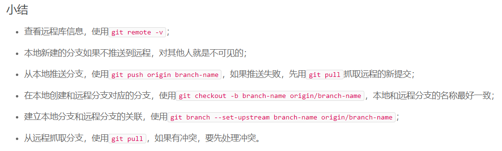

---

## 7> ReBase

* 多人在同一分支上协作时，容易出现冲突，当push分支不同时，总是要先pull到本地库，在本地合并，然后才能push成功。
* 提交周期变长时会出现逐渐分支提交过多的现象：
* 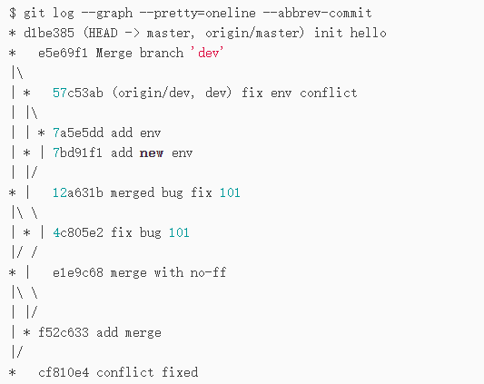
* 可以通过rebase指令将分支的提交变成直线

---

### 7.1 merge分支提交转变为rebase提交

>在当前master上分支提交了远程库，本地分支比远程分支快两个提交

* 
  
>此时其他协作者提前于我们推送了远程分支。此时使用git status查看状态

* 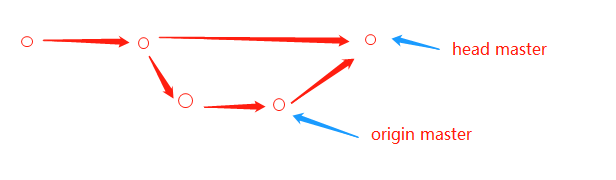
  
>此时查看状态，并上刚才的提交，本体分支比远程分支超前多个分支提交,
>使用git rebase \<remote> 合并

---
