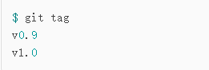
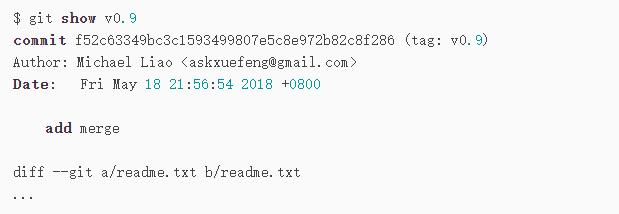
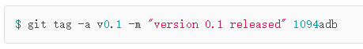
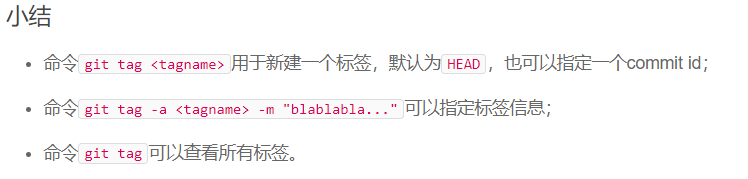
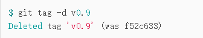
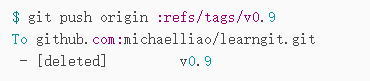
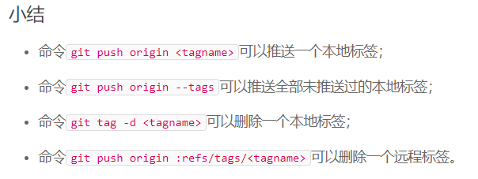

# Git标签管理

* Git的标签是版本库的快照，其实它就是指向某个commit的指针。
* 可以通过标签快速查找对应的commit

---

## 1> 创建标签

* 切换到要打标签的分支，git tag \<name> name为标签的名字，通过此指令可以为当前分支commit创建tag
* 对某次操作commit id 打标签：git tag \<newtagname> \<commit id>
  
>git tag 可以查看所有标签

* 
  
>git show \<tagname> 查看标签信息：

* 
  
>带说明并指定commit的标签
>$ git tag -a \<tagname> -m "massage"
>在git show \<tagname> 中会显示出来

* 
  
>注意：标签总是和某个commit挂钩。如果这个commit既出现在master分支，又出现在dev分支，那么在这两个分支上都可以看到这个标签。

---

* 

---

## 2> 操作标签

* 删除标签：git tag -d \<tagname> // -d Delected 表示删除

---

* 推送标签到远程：git push origin \<tagname>
* 一次性推送全部未推送标签：git push origin --tags

---

* 删除远程标签：先删除本地，后通过push指令删除
* 
* $ git push origin :refs/tags/tagname
* 
  
---

* 

---
