# Gi 常见命令汇总


---


## 1> git config


---


### 1.1 配置用户名和密码

* 当安装 Git 后首先要做的事情是设置用户名称和 e-mail 地址。这是非常重要的，因为每次 Git 提交都会使用该信息。它被永远的嵌入到了你的提交中：
```shell
$ git config --global user.name "userName" 
$ git config --global user.email "email@Example.email"
```
>读取时，默认情况下从系统，全局和存储库本地配置文件读取这些值，而选项--system，--global，--local 和--file <filename>可用于告知命令从只有那个位置设置和读取。
* 当不希望全局都使用 name，email 时可以去掉--global
```shell
$ git config user.name "userName" 
$ git config user.email "email@Example.email"
```

---


### 1.2 配置编辑器

* 可以配置默认的文本编辑器，Git 在需要你输入一些消息时会使用该文本编辑器。如果想使用一个不同的文本编辑器，例如：VIM，可以按照如下操作：
```shell
$ git config --global core.editor vim
```

---


### 1.3 配置比较工具

* 配置 diff 工具用来解决合并时的冲突。vimdiff
```shell
$ git config --global merge.tool vimdiff
```

---


### 1.4 检查配置

* 如果想检查你的设置，可以使用 git config --list 命令来列出 Git 可以在该处找到的所有的设置:
```shell
$ git config --list
```

---


### 1.5 添加/删除配置项

>添加配置项
* 参数：--add
* 格式：git config [–local|–global|–system] –add section.key value
```shell
$ git config --add site.name _Name
```
>删除配置项
* 参数：--unset
* 格式：git config [–local|–global|–system] –unset section.key
```shell
$ git config --local -–unset site.name 
```

---


### 1.6 获取帮助

* 如果在使用 Git 时需要帮助，有三种方法可以获得任何 git 命令的手册页(manpage)帮助信息
```shell
$ git help <verb> 
$ git <verb> --help 
$ man git-<verb>
```
>例如,有关 git config 如何使用
```shell
$ git help config
```
* 会跳转到相关 verb 的 manpage 手册

---


## 2> git help

```shell
git help [-a|--all] [-g|--guide] 
         [-i|--info|-m|--man|-w|--web] [COMMAND|GUIDE]
```
* 没有选项，没有给出任何命令或指导，git 命令的概要和最常用的 Git 命令的列表打印在标准输出上。
* 如果给出--all 或-a 选项，则所有可用的命令都将打印在标准输出上。
* 如果给出了--guide 或-g 选项，那么在标准输出中也会列出有用的 Git 指南。
* 如果给出了命令或指南，则会提出该命令或指南的手册页。该程序默认用于此目的，但这可以被其他选项或配置变量覆盖。
>注意，git --help ...与 git help 相同，因为前者被内部转换为后者。
* 要显示 git 手册页，请使用命令：git help git。

---


## 3> git init

* git init 命令创建一个空的 Git 仓库或重新初始化一个现有仓库。
```shell
$ cd /path/to/my/codebase 
$ git init #(1) 
$ git add . #(2) 
$ git commit . -m "a commit message" #(3)
```
(1). 创建一个/path/to/my/codebase/.git 目录。
(2). 将所有现有文件添加到索引。

(3). 将原始状态记录为历史的第一个提交。


---


## 4> git add

* git add 命令将文件内容添加到索引(将修改添加到暂存区)。也就是将要提交的文件的信息添加到索引库中。
>基本用法：
```shell
git add <path>
```
* 通常是通过 git add <path>的形式把<path>添加到索引库中，<path>可以是文件也可以是目录。
```shell
$ git add . # 将所有修改添加到暂存区 
$ git add * # Ant 风格添加修改 
$ git add *Controller # 将以 Controller 结尾的文件的所有修改添加到暂存区 
$ git add Hello* # 将所有以 Hello 开头的文件的修改添加到暂存区 例如:HelloWorld.txt,Hello.java,HelloGit.txt ... 
$ git add Hello? # 将以 Hello 开头后面只有一位的文件的修改提交到暂存区 例如:Hello1.txt,HelloA.java 如果是 HelloGit.txt 或者 Hello.java 是不会被添加的
```
>git add -u [<path>]
* 把<path>中所有跟踪文件中被修改过或已删除文件的信息添加到索引库。它不会处理那些不被跟踪的文件。省略<path>表示 . ,即当前目录。
>git add -A [<path>]
* 表示把中所有跟踪文件中被修改过或已删除文件和所有未跟踪的文件信息添加到索引库。省略<path>表示 . ,即当前目录。
>git add -i [<path>] 打开暂存区索引
* 可以通过 git add -i [<path>]命令查看中被所有修改过或已删除文件但没有提交的文件，并通过其 revert 子命令可以查看<path>中所有未跟踪的文件，同时进入一个子命令系统。

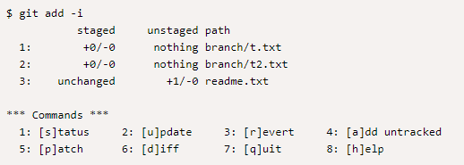

    * t.txt 和 t2.txt 表示已经被执行了 git add，待提交。即已经添加到索引库中。
    * readme.txt 表示已经处于 tracked 下，它被修改了，但是还没有执行 git add。即还没添加到索引库中。

---


## 5> git clone

>git clone 命令将存储库克隆到新目录中。
* 将存储库克隆到新创建的目录中，为克隆的存储库中的每个分支创建远程跟踪分支(使用**git branch -r**可见)，并从克隆检出的存储库作为当前活动分支的初始分支。
* 在克隆之后，没有参数的普通 git 提取将更新所有远程跟踪分支，并且没有参数的**git pull**将另外将远程主分支合并到当前主分支(如果有的话)。
* 此默认配置通过在**refs/remotes/origin**下创建对远程分支头的引用，并通过初始化**remote.origin.url 和 remote.origin.fetch**配置变量来实现
>执行远程克隆
```shell
$ git clone <版本库的网址>
```
* 该命令会在本地主机生成一个目录，与远程主机的版本库同名。如果要指定不同的目录名，可以将目录名作为**git clone**命令的第二个参数。
```shell
$ git clone <版本库的网址> <本地目录名> 
# 支持多种格式
$ git clone http[s]://example.com/path/to/repo.git 
$ git clone http://git.oschina.net/yiibai/sample.git 
$ git clone ssh://example.com/path/to/repo.git 
$ git clone git://example.com/path/to/repo.git 
$ git clone /opt/git/project.git  
$ git clone file:///opt/git/project.git 
$ git clone ftp[s]://example.com/path/to/repo.git 
$ git clone rsync://example.com/path/to/repo.git
```
* 通常来说，Git 协议下载速度最快，SSH 协议用于需要用户认证的场合。
>常见应用场景示例
1. 从上游克隆下来：
```shell
$ git clone git://git.kernel.org/pub/scm/.../linux.git mydir 
$ cd mydir 
$ make # 执行代码或其它命令
```
2. 在当前目录中使用克隆，而无需检出：
```shell
$ git clone -l -s -n . ../copy 
$ cd ../copy 
$ git show-branch
```
3. 从现有本地目录借用从上游克隆：
```shell
$ git clone --reference /git/linux.git git://git.kernel.org/pub/scm/.../linux.git mydir 
$ cd mydir
```
4. 创建一个裸存储库以将您的更改发布给公众：
```plain
$ git clone --bare -l /home/proj/.git /pub/scm/proj.git
```

---


## 6> git status

* **git status**命令用于显示工作目录和暂存区的状态。使用此命令能看到那些修改被暂存到了, 哪些没有, 哪些文件没有被**Git tracked**到。
* **git status**不显示已经**commit**到项目历史中去的信息。看项目历史的信息要使用**git log**.
```shell
git status [<options>…​] [--] [<pathspec>…​]
```
* 在每次执行**git commit**之前先使用**git status**检查文件状态是一个很好的习惯, 这样能防止你不小心提交了您不想提交的东西。
* 通过**git status -uno**可以只列出所有已经被 git 管理的且被修改但没提交的文件。

---


### 6.1 status 描述

* 显示索引文件和当前 HEAD 提交之间的差异，在工作树和索引文件之间有差异的路径以及工作树中没有被 Git 跟踪的路径。
* 第一个是通过运行 git commit 来提交的;
* 第二个和第三个是你可以通过在运行 git commit 之前运行 git add 来提交的。
>git status 相对来说是一个简单的命令，它简单的展示状态信息。输出的内容分为 3 个分类/组。

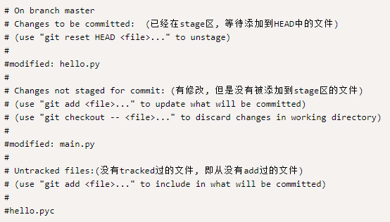


---


### 6.2 忽略文件（untracked 文件）

* 没有 tracked 的文件分为两类. 一是已经被放在工作目录下但是还没有执行 git add 的, 另一类是一些编译了的程序文件(如.pyc, .obj, .exe 等)。当这些不想 add 的文件一多起来, git status 的输出简直没法看, 一大堆的状态信息怎么看?
* 可以通过<vim .gitignore>创建一个 gitignore 文件。
* 基于这个原因。Git 让我们能在一个特殊的文件.gitignore 中把要忽略的文件放在其中， 每一个想忽略的文件应该独占一行, *这个符号可以作为通配符使用。例如在项目根目录下的**.gitignore**文件中加入下面内容能阻止.pyc 和.tmp 文件出现在 git status 中:
```plain
*.pyc
*.tmp
```

---


## 7> git diff

* **git diff**命令用于显示提交和工作树等之间的更改。此命令比较的是工作目录中当前文件和暂存区域快照之间的差异,也就是修改之后还没有暂存起来的变化内容。
* 在工作树和索引或树之间显示更改，索引和树之间的更改，两个树之间的更改，两个对象之间的更改或两个文件在磁盘上的更改。
>示例
```shell
$ git diff <file> # 比较当前文件和暂存区文件差异 
$ git diff git diff <id1><id1><id2> # 比较两次提交之间的差异 $ git diff <branch1> <branch2> # 在两个分支之间比较 
$ git diff --staged # 比较暂存区和版本库差异 
$ git diff --cached # 比较暂存区和版本库差异 
$ git diff --stat # 仅仅比较统计信息
```
>检查工作树的几种方式
```shell
$ git diff #(1) 
$ git diff --cached #(2) 
$ git diff HEAD #(3)
```
1. 工作树中的更改尚未分段进行下一次提交。
2. 索引和最后一次提交之间的变化; 查看已经 git add，但没有 git commit 的改动。
3. 自上次提交以来工作树中的更改；如果运行“git commit -a”，查看将会提交什么。

---


### 7.1 查看尚未暂存的文件更新了哪些部分

```shell
$ git diff
```
* 此命令比较的是工作目录(Working tree)和暂存区域快照(index)之间的差异
* 也就是修改之后还没有暂存起来的变化内容。

---


### 7.2 查看已经暂存起来的文件(staged)和上次提交时的快照之间(HEAD)的差异

>显示的是下一次提交时会提交到 HEAD 的内容(不带-a 情况下)
```shell
$ git diff --cached
$ git diff --staged
```
>显示工作版本(Working tree)和 HEAD 的差别
```shell
$ git diff HEAD
```

---
### 

### 7.3 直接将两个分支上最新的提交做 diff

>输出自**topic**和**master**分别开发以来，**master**分支上的变更
```shell
$ git diff topic master #或  
$ git diff topic..master
```
>显示当前分支与另一个 branch 的区别
```shell
$ git diff <branch>
```
>比较上次提交和上上次提交
```shell
$ git diff HEAD^ HEAD
```
>比较两个历史版本的差异
```shell
$ git diff SHA1 SHA2
```
* 提示：SHA1，SHA2 是类似 COMMIT ID 的 32 位长度的值。
>显示当前目录下的 lib 目录和上次提交之间的差别(更准确的说是在当前分支下)
```shell
$ git diff HEAD -- ./lib
```

---


## 8> git commit

* git commit 命令将索引的当前内容与描述更改的用户和日志消息一起存储在新的提交中。
>要添加的内容可以通过以下几种方式指定：
1. 在使用 git commit 命令之前，通过使用 git add 对索引进行递增的“添加”更改(注意：修改后的文件的状态必须为“added”);
2. 通过使用 git rm 从工作树和索引中删除文件，再次使用 git commit 命令;
3. 通过将文件作为参数列出到 git commit 命令(不使用--interactive 或--patch 选项)，在这种情况下，提交将忽略索引中分段的更改，而是记录列出的文件的当前内容(必须已知到 Git 的内容) ;
4. 通过使用带有-a 选项的 git commit 命令来自动从所有已知文件(即所有已经在索引中列出的文件)中添加“更改”，并自动从已从工作树中删除索引中的“rm”文件 ，然后执行实际提交;
5. 通过使用--interactive 或--patch 选项与 git commit 命令一起确定除了索引中的内容之外哪些文件或 hunks 应该是提交的一部分，然后才能完成操作。
>如果您提交，然后立即发现错误，可以使用 git reset 命令恢复。

---


### 7.1 提交已经被 git add 进来的改动。

```shell
$ git add .  # 或者~ $ git add newfile.txt 
$ git commit -m "the commit message" # 
$ git commit -a # 会先把所有已经 track 的文件的改动`git add`进来，然后提交(有点像 svn 的一次提交,不用先暂存)。对于没有 track 的文件,还是需要执行`git add <file>` 命令。 
$ git commit --amend # 增补提交，会使用与当前提交节点相同的父节点进行一次新的提交，旧的提交将会被取消。
```
* 录制自己的工作时，工作树中修改后的文件的内容将临时存储到使用 git add 命名为“索引”的暂存区域。
* 一个文件只能在索引中恢复，而不是在工作树中，使用**git reset HEAD - <file>**进行上一次提交的文件，这有效地恢复了 git 的添加，并阻止了对该文件的更改，以参与下一个提交在使用这些命令构建状态之后，git commit(没有任何 pathname 参数)用于记录到目前为止已经进行了什么更改。

---


## 9> git reset

* git reset 命令用于将当前 HEAD 复位到指定状态。一般用于撤消之前的一些操作(如：git add,git commit 等)。
* 在 git 的一般使用中，如果发现错误的将不想暂存的文件被 git add 进入索引之后，想回退取消，则可以使用命令：git reset HEAD <file>
>git reset [--hard|soft|mixed|merge|keep] [<commit>或 HEAD]
* 将当前的分支重设(reset)到指定的<commit>或者 HEAD(默认，如果不显示指定<commit>，默认是 HEAD，即最新的一次提交)，并且根据[mode]有可能更新索引和工作目录。mode 的取值可以是 hard、soft、mixed、merged、keep。
    * **--hard**：重设(reset) 索引和工作目录，**自从<commit>以来在工作目录中的任何改变都被丢弃，并把 HEAD 指向<commit>**。

---


### 9.1 回滚添加操作<无 mode>

```shell
$ edit    file1.c file2.c   # (1) 
$ git add file1.c file1.c   # (1.1) 添加两个文件到暂存 
$ mailx                     # (2)  
$ git reset                 # (3)  
$ git pull git://info.example.com/ nitfol    # (4)
```
(1). 编辑文件 file1.c, file2.c，做了些更改，并把更改添加到了暂存区。
(2). 查看邮件，发现某人要您执行 git pull，有一些改变需要合并下来。

(3). 然而，您已经把暂存区搞乱了，因为暂存区同 HEAD commit 不匹配了，但是即将 git pull 下来的东西不会影响已经修改的 file1.c 和 file2.c，因此可以 revert 这两个文件的改变。在 revert 后，那些改变应该依旧在工作目录中，因此执行 git reset。

(4). 然后，执行了 git pull 之后，自动合并，file1.c 和 file2.c 这些改变依然在工作目录中。


---


### 9.2 回滚最近一次提交<--soft>

```shell
$ git commit -a -m "这是提交的备注信息" 
$ git reset --soft HEAD^     #(1) 
$ edit code                  #(2) 编辑代码操作 
$ git commit -a -c ORIG_HEAD #(3)
```
(1) 当提交了之后，发现代码没有提交完整，或者想重新编辑一下提交的信息，
* 可执行**git reset --soft HEAD^**，让工作目录还跟 reset 之前一样，不作任何改变。
* HEAD^表示指向 HEAD 之前最近的一次提交。

(2) 对工作目录下的文件做修改，比如：修改文件中的代码等。

(3) 然后使用 reset 之前那次提交的注释、作者、日期等信息重新提交。

* **<ORIG_HEAD>**注意，当执行 git reset 命令时，git 会把老的 HEAD 拷贝到文件.git/ORIG_HEAD 中，在命令中可以使用**ORIG_HEAD**引用这个提交。
* **<-a>**git commit 命令中 -a 参数的意思是告诉 git，自动把所有修改的和删除的文件都放进暂存区，未被 git 跟踪的新建的文件不受影响。
* <**-c>**commit 命令中-c <commit> 或者 -C <commit>意思是拿已经提交的对象中的信息(作者，提交者，注释，时间戳等)提交，那么这条 git commit 命令的意思就非常清晰了，**把所有更改的文件加入暂存区，并使用上次的提交信息重新提交。**

---


### 9.3 回滚最近几次提交，并把这几次提交放到指定分支中<--hard>

* 回滚最近几次提交，并把这几次提交放到叫做 topic/wip 的分支上去。
```shell
$ git branch topic/wip (1) 
$ git reset --hard HEAD~3 (2) 
$ git checkout topic/wip (3)
```
(1) 假设已经提交了一些代码，但是此时发现这些提交还不够成熟，不能进入 master 分支，希望在新的 branch 上暂存这些改动。因此执行了 git branch 命令在当前的 HEAD 上建立了新的叫做 topic/wip 的分支。
(2)<--hard> 然后回滚 master 分支上的最近三次提交。HEAD~3 指向当前 HEAD-3 个提交，**git reset --hard HEAD~3，即删除最近的三个提交(删除 HEAD, HEAD^, HEAD~2)，将 HEAD 指向 HEAD~3。**


---


### 9.4 永久删除最后几个提交

```shell
$ git commit ## 执行一些提交 
$ git reset --hard HEAD~3   (1)
```
* 最后三个提交(即 HEAD,  HEAD^和 HEAD~2)提交有问题，想永久删除这三个提交。

---


### 9.5 回滚 merge 和 pull 操作

```shell
$ git pull (1)
Auto-merging nitfol CONFLICT (content): Merge conflict in nitfol
Automatic merge failed; fix conflicts and then commit the result.
$ git reset --hard (2)
$ git pull . topic/branch (3)
Updating from 41223... to 13134...
Fast-forward
$ git reset --hard ORIG_HEAD (4)
```
(1) 从**origin**拉取下来一些更新，但是产生了很多冲突，但您暂时没有这么多时间去解决这些冲突，因此决定稍候有空的时候再重新执行 git pull 操作。
(2) 由于 git pull 操作产生了冲突，因此所有拉取下来的改变尚未提交，仍然再暂存区中，这种情况下 git reset --hard 与 git reset --hard HEAD 意思相同，即都是清除索引和工作区中被搞乱的东西。

(3) 将 topic/branch 分支合并到当前的分支，这次没有产生冲突，并且合并后的更改自动提交。

(4) 但是此时又发现将 topic/branch 合并过来为时尚早，因此决定退滚合并，执行 git reset --hard ORIG_HEAD 回滚刚才的 pull/merge 操作。

>说明：前面讲过，执行 git reset 时，git 会把 reset 之前的 HEAD 放入.git/ORIG_HEAD 文件中，命令行中使用 ORIG_HEAD 引用这个提交。同样的，执行 git pull 和 git merge 操作时，git 都会把执行操作前的 HEAD 放入 ORIG_HEAD 中，以防回滚操作。

---


### 9.6 在污染的工作区中回滚合并或者拉取<--merge>

```shell
$ git pull      (1)  
Auto-merging nitfol  
Merge made by recursive.  
nitfol                |   20 +++++----  ...  
$ git reset --merge ORIG_HEAD      (2)
```
(1) 即便你已经在本地更改了工作区中的一些东西，可安全的执行**git pull**操作，前提是要知道将要**git pull**下面的内容不会覆盖工作区中的内容。
(2)**git pull**完后，发现这次拉取下来的修改不满意，想要回滚到**git pull**之前的状态，

* 从前面的介绍知道，我们可以执行**git reset --hard ORIG_HEAD**，但是这个命令有个副作用就是清空工作区，即丢弃本地未使用**git add**的那些改变。
* 为了避免丢弃工作区中的内容，可以使用**git reset --merge ORIG_HEAD**，注意其中的**--hard**换成了**--merge**，这样就可以避免在回滚时清除工作区。
>pull 且 merge，不改变工作区未提交修改

---


### 9.7 中断的工作流程处理<--soft>

* 当前分支工作区内容不足以提交 commit，但是另一条分支的紧急 bug 需要修复，直接 checkout <branch>会提示当前分支工作区内容未提交------解决方案，可以提交一次临时状态 commit，切换分支修复 bug 后，切换回来通过 reset 回滚《9.3》
```shell
$ git checkout feature ; # you were working in "feature" branch and 
$ work work work ;       # got interrupted 
$ git commit -a -m "snapshot WIP" (1) 
$ git checkout master 
$ fix fix fix 
$ git commit ;# commit with real log 
$ git checkout feature 
$ git reset --soft HEAD^ ;# go back to WIP state (2) 
$ git reset (3)
```
(1) 这次属于临时提交，因此随便添加一个临时注释即可。
(2) 这次 reset 删除了 WIP commit，并且把工作区设置成提交 WIP 快照之前的状态。

(3) 此时，在索引中依然遗留着“snapshot WIP”提交时所做的未提交变化，git reset 将会清理索引成为尚未提交”snapshot WIP“时的状态便于接下来继续工作。


---


### 9.8 重置单独的一个文件

* 假设你已经添加了一个文件进入索引，但是而后又不打算把这个文件提交，此时可以使用 git reset 把这个文件从索引中去除。
```shell
$ git reset -- frotz.c (1) 
$ git commit -m "Commit files in index" (2) 
$ git add frotz.c (3)
```
(1) 把文件 frotz.c 从索引中去除，
(2) 把索引中的文件提交

(3) 再次把 frotz.c 加入索引


---


### 9.9 保留工作区并丢弃一些之前的提交<--keep>

* 假设你正在编辑一些文件，并且已经提交，接着继续工作，
* 但是现在你发现当前在工作区中的内容应该属于另一个分支，与之前的提交没有什么关系。
* 此时，可以开启一个新的分支，并且保留着工作区中的内容。
```shell
$ git tag start
$ git checkout -b branch1
$ edit
$ git commit ... (1)
$ edit
$ git checkout -b branch2 (2)
$ git reset --keep start (3)
```
(1) 这次是把在 branch1 中的改变提交了。
(2) 此时发现，之前的提交不属于这个分支，此时新建了 branch2 分支，并切换到了 branch2 上。

(3) 此时可以用 reset --keep 把在 start 之后的提交清除掉，但是保持工作区不变。

>reset --keep 取消在当前分支的提交但是不更改工作区的内容，切换分支同时保持工作区状态

---


## 10> git rm

* git rm 命令用于从工作区和索引中删除文件。
```shell
git rm [-f | --force] [-n] [-r] [--cached] [--ignore-unmatch] [--quiet] [--] <file>…
```
1. 从索引中删除文件，或从工作树和索引中删除文件。**git rm**不会从您的工作目录中删除文件。 (没有任何选项只能从工作树中删除文件，并将其保留在索引中;)
2. 要删除的文件必须与分支的提示相同，并且在索引中不能对其内容进行更新，尽管可以使用-f 选项覆盖(默认行为)。
3. 当给出**--cached**时，暂存区内容必须与分支的提示或磁盘上的文件相匹配，从而**仅将文件从索引中删除。**(此行为不会将相应文件从工作区删除，只删除索引)
>rm 与 git rm
* 使用 git rm 来删除文件，同时还会将这个删除操作记录下来；
* 而使用 rm 来删除文件，仅仅是删除了物理文件，没有将其从 git 的记录中剔除。
    * 直观的来讲，git rm 删除过的文件，执行 git commit -m "commit message or mark" 提交时，会自动将删除该文件的操作提交上去。
    * 而对于用 rm 命令直接删除的文件，执行 git commit -m "commit message or mark"提交时，则不会将删除该文件的操作提交上去。
* 即使你已经通过 rm 将某个文件删除掉了，也可以再通过 git rm 命令重新将该文件从 git 的记录中删除掉，这样的话，在执行 git commit -m "commit message or mark" 以后，也能将这个删除操作提交上去。
>如果之前不小心用 rm 命令删除了一大批文件呢？如此时用 git rm 逐个地再删除一次就显得相当卵痛了。可如下的方式做提交：git commit -am "commit message or mark"
```shell
git commit -am "commit message or mark
```

---


### 10.1 rm 常见用法

>在 git 中我们可以通过 git rm 命令把一个文件删除，并把它从 git 的仓库管理系统中移除。但是注意最后要执行 git commit 才真正提交到 git 仓库。
* 删除text1.txt 文件，并把它从 git 的仓库管理系统中移除。
```shell
$ git rm text1.txt
```
* 删除文件夹：mydir，并把它从 git 的仓库管理系统中移除。
```shell
$ git rm -r mydir
```
* add 添加到索引库，但是仅 rm 掉 git 索引库里的文件
```shell
$ git add 10.txt 
$ git add -i 
          staged unstaged path 
1:   +0/-0   nothing 10.txt 
2:   +0/-0   nothing branch/t.txt 
3:   +0/-0   nothing branch/t2.txt 
*** Commands ***
  1: [s]tatus   2: [u]pdate   3: [r]evert   4: [a]dd untracked 
  5: [p]atch    6: [d]iff     7: [q]uit     8: [h]elp 
What now> 7 
Bye. 
$ git rm --cached 10.txt rm '10.txt' 
$ ls 10.txt 2 3.txt 5.txt readme.txt 
$ git add -i 
           staged unstaged path 
1:   +0/-0   nothing branch/t.txt 
2:   +0/-0   nothing branch/t2.txt 
*** Commands *** 
  1: [s]tatus    2: [u]pdate    3: [r]evert  4: [a]dd untracked 
  5: [p]atch     6: [d]iff      7: [q]uit    8: [h]elp
```
* 在通过 git add 10.txt 命令把文件 10.txt 添加到索引库中后，又通过 git rm --cached 10.txt 把文件 10.txt 从 git 的索引库中移除,但是对文件 10.txt 本身并不进行任何操作。
* 另外对于已经被 git rm 删除掉(还没被提交)的文件或目录，如果想取消其操作的话，可以首先通过 git add -i 的子命令 revert 从索引库中把它们剔除，然后用 git checkout <文件> 命令来达到取消的目

---


>删除某个目录下及其子文件下的索引中删除指定类型的文件
```shell
$ git rm Documentation/\*.txt
```
* 从 Documentation 目录及其任何子目录下的索引中删除所有.txt 文件。
```shell
$ git rm -f git-*.sh
```
* 因为这个例子让 shell 扩展星号(即显式列出文件)，它不会删除子目录中的文件，如：subdir/git-foo.sh 文件不会被删除

---


## 11> git mv

* git mv 命令用于移动或重命名文件，目录或符号链接。
```shell
git mv <options>… <args>…
```

---


### 11.1 移动或重命名文件，目录或符号链接

```shell
git mv [-v] [-f] [-n] [-k] <source> <destination>
git mv [-v] [-f] [-n] [-k] <source> ... <destination directory>
```
* 在第一种形式中，它将重命名<source>为<destination>，<source>必须存在，并且是文件，符号链接或目录。
* 在第二种形式中，最后一个参数必须是现有的目录; 给定的源(<source>)将被移动到这个目录中。
>索引在成功完成后更新，但仍必须提交更改。

---


* 把一个文件：*text.txt*移动到*mydir*，可以执行以下操作
```shell
$ git mv text.txt mydir
```
* 运行上面的 git mv 其实就相当于运行了 3 条命令：
```shell
$ mv test.txt mydir/
$ git rm test.txt
$ git add mydir
```
* 索引在成功完成后更新，但仍必须提交更改。

---


## 12> git branch

>git branch 命令用于列出，创建或删除分支。
* 如果给出了--list，或者如果没有非选项参数，则列出现有的分支; 当前分支将以星号突出显示。
* 选项-r 导致远程跟踪分支被列出。
* 选项-a 显示本地和远程分支。

---


### 12.1 查看当前有哪些分支

```shell
$ git branch 
  master 
* wchar_support
```
* 上面显示结果中，当前有两个分支：*master*和*wchar_support*，当前在*wchar_support*分支上，它前面有个星号(`*`)。

---


### 12.2 新建一个分支

```shell
$ git branch dev2
```
* 命令将创建一个分支：*dev2*

---


### 12.3 切换到指定分支

* 下面命令将切换到指定分支：*dev2*
```shell
$ git checkout dev2 
$ # 再次查看分支 
$ git branch 
* dev2   
  master   
  wchar_support
```

---
### 

### 12.4 查看本地和远程分支

```shell
$ git branch -a 
* dev2  
  master  
  wchar_support   
  remotes/origin/HEAD -> origin/master   
  remotes/origin/master   
  remotes/origin/wchar_support
```

---


### 12.5 将更改添加到新建分支上

```shell
$ git status
$ git add newfile.txt
$ git commit newfile.txt -m "commit a new file: newfile.txt"
$ git push origin dev2
```

---


### 12.6 修改分支的名字

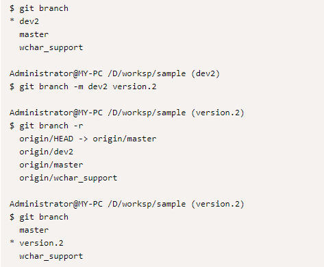

```shell
git branch
git branch -m <branchname> <newbranchname>
```

---


### 12.7 删除远程分支

```shell
$ git branch -r
$ git branch origin --delete <branch>
```
>删除一个名称为：dev2 的远客

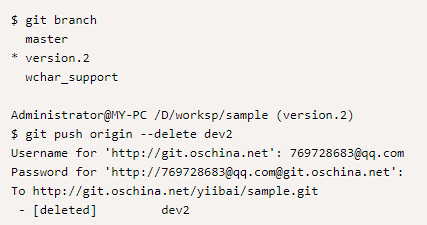

---


### 12.8 合并某个分支到当前分支

```shell
$ git branch
$ git checkout master
$ git status
$ git merge <another branch>
```
>合并分支：version.2 到当前分支(master)

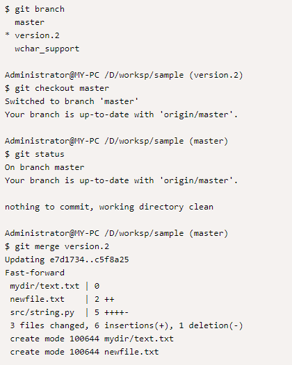


---


## 13> git checkout

* git checkout 命令用于切换分支或恢复工作树文件。git checkout 是 git 最常用的命令之一，同时也是一个很危险的命令，因为这条命令会重写工作区。
* 更新工作树中的文件以匹配索引或指定树中的版本。如果没有给出路径 git checkout 还会更新 HEAD，将指定的分支设置为当前分支。

---


### 13.1 示例

* 示例一：
>以下顺序检查主分支，将 Makefile 还原为两个修订版本，错误地删除 hello.c，并从索引中取回。
```shell
$ git checkout master #(1)
$ git checkout master~2 Makefile #(2)
$ rm -f hello.c
$ git checkout hello.c #(3)
```
(1) 切换分支
(2) 从另一个提交中取出文件

(3) 从索引中恢复 hello.c

防止存在分支名为 hello.c，规范写法 $ git checkout -- hello.c

>$ git checkout -- filename 表示从索引中牵出，并恢复到工作区

---


* 示例二：
>在错误的分支工作后，想切换到正确的分支，则使用：
```shell
$ git checkout mytopic
```
>“错误”分支和正确的“mytopic”分支可能会在在本地修改的文件中有所不同，在这种情况下，上述检出将会失败：
```shell
$ git checkout mytopic 
error: You have local changes to 'frotz'; not switching branches.
```
>可以将-m 标志赋给命令，这将尝试三路合并：
```shell
$ git checkout -m mytopic
Auto-merging frotz
```
* git diff 可以查看更改

---


* 示例三：
>当使用-m 选项切换分支时发生合并冲突时，会看到如下所示
```shell
$ git checkout -m mytopic 
Auto-merging frotz 
ERROR: Merge conflict in frotz 
fatal: merge program failed
```
>使用 git diff 显示冲突位置，编辑并解决冲突，并 add 标记给索引
```shell
$ edit frotz # 编辑 frotz 文件中内容，然后重新添加 
$ git add frotz
```

---


```plain
$ git checkout master 
#//取出 master 版本的 head。 
$ git checkout tag_name 
#//在当前分支上 取出 tag_name 的版本 
$ git checkout master file_name 
#//放弃当前对文件 file_name 的修改 
$ git checkout commit_id file_name 
#//取文件 file_name 的 在 commit_id 是的版本。commit_id 为 git commit 时的 sha 值。 
$ git checkout -b dev/1.5.4 origin/dev/1.5.4 
# 从远程 dev/1.5.4 分支取得到本地分支/dev/1.5.4 
$ git checkout -- hello.rb 
# 这条命令把 hello.rb 从 HEAD 中签出
$ git checkout . 
# 这条命令把 当前目录所有修改的文件 从 HEAD 中签出并且把它恢复成未修改时的样子. 
# 注意：在使用 git checkout 时，如果其对应的文件被修改过，那么该修改会被覆盖掉。
```

---


## 14> git merge

* git merge 命令用于将两个或两个以上的开发历史加入(合并)一起。
* 将来自命名提交的更改(从其历史从当前分支转移到当前分支之后)。 该命令由 git pull 用于合并来自另一个存储库的更改，可以手动使用将更改从一个分支合并到另一个分支。

---


>合并分支branch1 和 branch2 在当前分支的顶部，使它们合并：
```shell
$ git merge branch1 branch2
```
>合并 obsolete 分支到当前分支，使用 ours 合并策略
```shell
$ git merge -s ours obsolete
```
>将分支 maint 合并到当前分支中，但不要自动进行新的提交
```shell
$ git merge --no-commit maint
```
* 当您想要对合并进行进一步更改时，可以使用此选项，或者想要自己编写合并提交消息。
* 应该不要滥用这个选项来潜入到合并提交中。
* 小修补程序，如版本名称将是可以接受的。
>将分支 dev 合并到当前分支中，自动进行新的提交：
```shell
$ git merge dev
```

---


## 15> git mergetool

>git mergetool 命令用于运行合并冲突解决工具来解决合并冲突。
```shell
git mergetool [--tool=<tool>] [-y | --[no-]prompt] [<file>…]
```
* git mergetool 命令用于运行合并冲突解决工具来解决合并冲突。使用 git mergetool 运行合并实用程序来解决合并冲突。它通常在 git 合并后运行。
* 需要提前配置

---


### 15.1 git 设置 mergetool 可视化工具

* 可以设置*BeyondCompare*,*DiffMerge*等作为 git 的比较和合并的可视化工具,方便操作。
* 先下载并安装 BeyondCompare,DiffMerge 等，这里以*BeyondCompare*为例。
* 设置 git 配置,设置 BeyondCompare 的 git 命令如下:
```shell
#difftool 配置   
$ git config --global diff.tool bc4   
$ git config --global difftool.bc4.cmd "\"c:/program files (x86)/beyond compare 4/bcomp.exe\" \"$LOCAL\" \"$REMOTE\""   
#mergeftool 配置   
$ git config --global merge.tool bc4 
$ git config --global mergetool.bc4.cmd  "\"c:/program files (x86)/beyond compare 4/bcomp.exe\" \"$LOCAL\" \"$REMOTE\" \"$BASE\" \"$MERGED\""   
$ git config --global mergetool.bc4.trustExitCode true  
#让 git mergetool 不再生成备份文件(*.orig)   
$ git config --global mergetool.keepBackup false
```

---


>使用方法
* diff 使用方法:
```shell
$ git difftool HEAD  #// 比较当前修改情况 
```
* merge 使用方法
```shell
$ git mergetool
```

---


## 16> git log

* git log 命令用于显示提交日志信息。

---


>显示整个提交历史记录，但跳过合并
```shell
$ git log --no-merges
```
>显示自 master 以来所有提交更改 include/scsi 或 drivers/scsi 子目录中的任何文件的所有提交
```shell
$ git log master include/scsi drivers/scsi 
```
>显示最近两周的更改文件 gitk。 “--”是必要的，以避免与名为 gitk 的分支混淆
```shell
$ git log --since="2 weeks ago" --gitk
# 当前目录下的文件 gitk
```
>显示“test”分支中尚未在“release”分支中的提交，以及每个提交修改的路径列表
```shell
$ git log --name-status release..test
```
>显示更改 builtin/rev-list.c 的提交，包括在**文件被赋予其现有名称之前发生**的提交
```shell
$ git log --follow builtin/rev-list.c
```
>显示在任何本地分支中的所有提交，但不包括任何远程跟踪分支机构的起始点(origin 不具有)。
```shell
$ git log --branches --not --remotes=origin 
```
>显示本地主服务器中的所有提交，但不显示任何远程存储库主分支。
```shell
$ git log master --not --remotes=*/master
```
>显示历史，包括变化差异，但仅从“主分支”的角度来看，忽略来自合并分支的提交，并显示合并引入的变化的完全差异。只有当遵守在一个整合分支上合并所有主题分支的严格策略时，这才有意义。
```shell
$ git log -p -m --first-parent
```
>显示文件 main.c 中的函数 main( )随着时间的推移而演变
```shell
$ git log -L '/int main/',/^}/:main.c
```
>将显示最近三次的提交
```shell
$ git log -3
```
>根据提交 ID 查询日志
```shell
$ git log commit_id    
# 查询 ID(如：6bab70a)之前的记录，包含 commit 
$ git log commit1_id commit2_id 
# 查询 commit1 与 commit2 之间的记录，包括 commit1 和 commit2 
$ git log commit1_id..commit2_id 
# 查询 commit1 与 commit2 之间的记录，但是不包括 commit1
```

---


## 17> git stash

* git stash 命令用于将更改储藏在脏工作目录中。
* 当要记录工作目录和索引的当前状态，但想要返回到干净的工作目录时，则使用 git stash。 该命令保存本地修改，并恢复工作目录以匹配 HEAD 提交。
* 这个命令所储藏的修改可以
    * 使用**git stash list**列出，
    * 使用**git stash show**进行检查
    * 使用**git stash apply**恢复(可能在不同的提交之上)。
* 调用没有任何参数的**git stash**相当于**git stash save**。 默认情况下，储藏列表为“分支名称上的 WIP”，但您可以在创建一个消息时在命令行上给出更具描述性的消息。
>创建的最新储藏存储在 refs/stash 中;
>这个引用的反垃圾邮件中会发现较旧的垃圾邮件，并且可以使用通常的 reflog 语法命名
>(例如，stash@{0}是最近创建的垃圾邮件，stash@{1}是 stash@{2.hours.ago}之前也是可能的)。
>也可以通过指定存储空间索引(例如整数 n 相当于储藏 stash@{n})来引用锁存。

---


### 17.1 拉取到一棵肮脏的树

* 当你处于某种状态的时候，你会发现有一些上游的变化可能与正在做的事情有关。当您的本地更改不会与上游的更改冲突时，简单的 git pull 将让您向前。
* 但是，有些情况下，本地更改与上游更改相冲突，git pull 拒绝覆盖您的更改。 在这种情况下，您可以将更改隐藏起来，执行 git pull，然后解压缩，如下所示：
```shell
$ git stash
$ git pull
$ git stash pop
```

---


### 17.2 工作流中断

* 当你处于某种状态的时候，比如你的老板进来，要求立即开会或处理非常紧急的事务。
* 传统上，应该提交一个临时分支来存储您的更改，并返回到原始(original)分支进行紧急修复。
```shell
# ... hack hack hack ... 
$ git checkout -b my_wip 
$ git commit -a -m "WIP" 
$ git checkout master 
$ edit emergency fix # 编辑内容 
$ git commit -a -m "Fix in a hurry" 
$ git checkout my_wip 
$ git reset --soft HEAD^ 
# ... continue hacking ...
```
>上面过程可以使用 git stash 来简化上述操作
```shell
# ... hack hack hack ... 
$ git stash 
$ edit emergency fix 
$ git commit -a -m "Fix in a hurry" 
$ git stash pop 
# ... continue hacking ...
```

---


### 17.3 测试部分提交

* 当要从工作树中的更改中提交两个或多个提交时，可以使用 git stash save --keep-index，并且要在提交之前测试每个更改：
```shell
# ... hack hack hack ... 
$ git add --patch foo 
# add just first part to the index 
$ git stash save --keep-index 
# save all other changes to the stash 
$ edit/build/test first part 
$ git commit -m 'First part' 
# commit fully tested change 
$ git stash pop 
# prepare to work on all other changes 
# ... repeat above five steps until one commit remains ... 
$ edit/build/test remaining parts 
$ git commit foo -m 'Remaining parts'
```

---


### 17.4 恢复被错误地清除/丢弃的垃圾

* 如果你错误地删除或清除了垃圾，就不能通过正常的安全机制来恢复。 但是，您可以尝试以下命令来获取仍在存储库中但仍无法访问的隐藏列表：
```shell
$ git fsck --unreachable | grep commit | cut -d\ -f3 | xargs git log --merges --no-walk --grep=WIP
```

---


### 17.5 储藏你的工作

* 在暂存区保存有未提交 commit 本地库的中间状态，可以通过 status 查看，使用 stash 可以存储当前暂存区的状态，但是未追踪的文件不会被存储，并将当前本地的 HEAD reset 到工作区。
* 可以使用 git stash list 查看存储列表
* **git stash apply**用于提取存储的某次暂存区状态，但是不会从列表中删除
* **git stash pop**用于弹出列表中最新 stash 的中间状态恢复到工作区，并且将自身从 list 列表中删除。
* git stash apply/pop <stash@{n}> 用于调出指定索引的 stash 状态。

---


### 17.6 移除某个储存

```shell
$ git stash drop <stash@{n}>
```

---


### 17.7 取消储存

>在某些情况下，可能想应用储藏的修改，在进行了一些其他的修改后，又要取消之前所应用储藏的修改。
```shell
$ git stash show -p stash@{0} | git apply -R
```
>如果沒有指定具体的某个储藏，Git 会选择最近的储藏
```shell
$ git stash show -p | git apply -R
```
>可能会想要新建一个別名，在你的 Git 里增加一个 stash-unapply 命令，这样更有效率
```shell
$ git config --global alias.stash-unapply '!git stash show -p | git apply -R' 
$ git stash apply $ 
#... work work work 
$ git stash-unapply
```

---


## 18> git tag

* git tag 命令用于创建，列出，删除或验证使用 GPG 签名的标签对象。

---


### 18.1 列显已有的标签

* 列出现有标签的命令非常简单，直接运行 git tag 即可
* 显示的标签按字母顺序排列，所以标签的先后并不表示重要程度的轻重
>我们可以用特定的搜索模式列出符合条件的标签。在 Git 自身项目仓库中，有着超过 240 个标签，如果只对 1.4.2 系列的版本感兴趣，可以运行下面的命令：
```shell
$ git tag -l 'v1.4.2.*'
v1.4.2.1
v1.4.2.2
v1.4.2.3
v1.4.2.4
```

---


### 18.2 创建标签

* Git 使用的标签有两种类型：轻量级的(lightweight)和含附注的(annotated)。
    * **轻量级标签**就像是个不会变化的分支，实际上它就是个指向特定提交对象的引用。
    * **含附注标签**，实际上是存储在仓库中的一个独立对象，它有自身的校验和信息，包含着标签的名字，电子邮件地址和日期，以及标签说明，标签本身也允许使用 GNU Privacy Guard (GPG) 来签署或验证。

---


>创建一个含附注类型的标签非常简单，用 -a (译注：取 annotated 的首字母)指定标签名字即可，-m 选项则指定了对应的标签说明，Git 会将此说明一同保存在标签对象中。如果没有给出该选项，Git 会启动文本编辑软件供你输入标签说明。
```shell
$ git tag -a v1.4 -m 'my version 1.4' 
$ git tag 
v0.1 
v1.3 
v1.4
```

---


>git show <tagname>查看相应标签的版本信息，并连同显示打标签时的提交对象.
```shell
$ git show v1.4
tag v1.4
Tagger: Scott Chacon <schacon@gee-mail.com>
Date: Mon Feb 9 14:45:11 2009 -0800
my version 1.4
commit 15027957951b64cf874c3557a0f3547bd83b3ff6
Merge: 4a447f7... a6b4c97...
Author: Scott Chacon <schacon@gee-mail.com>
Date: Sun Feb 8 19:02:46 2009 -0800
Merge branch 'experiment'
```
* 我们可以看到在提交对象信息上面，列出了此标签的提交者和提交时间，以及相应的标签说明。

---


### 18.3 删除标签

>想要名称删除名称为：v1.0 的标签，可以执行以下操作：
```shell
$ git tag -d v1.0
```

---


### 18.4 轻量级标签

* 直接给出标签名字即可
```shell
$ git tag v1.4-lw
```
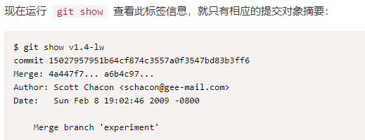

---


### 18.5 后期加注标签

```shell
$ git tag [-a][-m] tagname <commit> 
```
* 为已经提交的 commit 打上标签

---


### 18.6 分享标签

* 默认情况下，git push 并不会把标签传送到远端服务器上，只有通过显式命令才能分享标签到远端仓库。其命令格式如同推送分支，运行 git push origin [tagname] 即可
```shell
$ git push origin v1.5 # 推送指定 tag
$ git push origin --tags # 推送本地所有新增的 tag
```

---


## 19> git fetch

* git fetch 命令用于从另一个存储库下载对象和引用。
* 从一个或多个其他存储库中获取分支和/或标签(统称为“引用”)以及完成其历史所必需的对象。
* 远程跟踪分支已更新(Git 术语叫做 commit)，需要将这些更新取回本地，这时就要用到 git fetch 命令。

---


### 19.1 更新远程跟踪分支

```shell
$ git fetch origin
```
* 上述命令从远程 refs/heads/命名空间复制所有分支，并将它们存储到本地的 refs/remotes/ origin/命名空间中，除非使用分支.<name>.fetch 选项来指定非默认的 refspec。
```shell
$ git fetch origin master:tmp
```
* 表示从远程 master 获取到本地的 tmp

---


### 19.2 明确使用 refspec

```shell
$ git fetch origin +pu:pu maint:tmp
```
* 此更新(或根据需要创建)通过从远程存储库的分支(分别)pu 和 maint 提取来分支本地存储库中的 pu 和 tmp。

---


### 19.3 在远程分支上窥视，无需在本地存储库中配置远程

```shell
$ git fetch git://git.kernel.org/pub/scm/git/git.git maint 
$ git log FETCH_HEAD
```
* 第一个命令从 git://git.kernel.org/pub/scm/git/git.git 从存储库中获取 maint 分支，
* 第二个命令使用 FETCH_HEAD 来检查具有 git-log 的分支。

---


### 19.4 将某个远程主机的更新

* 更新某个远程主机的全部取回到本地
```shell
$ git fetch <远程主机名>
```
* 要更新所有分支，命令可以简写为：
```shell
$ git fetch
```
* 上面命令将某个远程主机的更新，全部取回本地。默认情况下，git fetch 取回所有分支的更新

---


* 只想取回特定分支的更新，可以指定分支名
```shell
$ git fetch <远程主机名> <分支名>
```
>取回 origin 主机的 master 分支。$ git fetch origin master
>所取回的更新，在本地主机上要用”远程主机名/分支名”的形式读取。比如 origin 主机的 master 分支，就可以用 origin/master 读取。

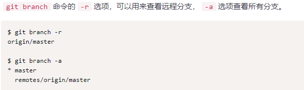

* 上面命令表示，本地主机的当前分支是 master，远程分支是 origin/master。

---


* 此外，也可以使用 git merge 命令或者 git rebase 命令，在本地分支上合并远程分支。
```shell
$ git merge origin/master
# 或者
$ git rebase origin/master
```
* 上面命令表示在当前分支上，合并 origin/master。

---


## 20> git pull

* git pull 命令用于从另一个存储库或本地分支获取并集成(整合)。git pull 命令的作用是：取回远程主机某个分支的更新，再与本地的指定分支合并，它的完整格式稍稍有点复杂。
```shell
git pull [options] [<repository> [<refspec>…]]
```
* 将远程存储库中的更改合并到当前分支中。在默认模式下，git pull 是 git fetch 后跟 git merge FETCH_HEAD 的缩写。
* git pull 使用给定的参数运行 git fetch，并调用 git merge 将检索到的分支头合并到当前分支中。 使用--rebase，它运行 git rebase 而不是 git merge。

---


### 20.1 下拉分支并合并

>要取回 origin 主机的 next 分支，与本地的 master 分支合并
```shell
$ git pull <远程主机名> <远程分支名>:<本地分支名>
# -------------------------------------------
$ git pull origin next:master
```
* 上面命令实质上是先做 git fetch 然后开始做 git merge
```shell
$ git fetch origin 
$ git merge origin/next
```

---


### 20.2 当本地与远程之间存在追踪关系时


---


#### 20.2.1 建立追踪关系

* 在 git clone 的时候，所有本地分支默认与远程主机的同名分支，建立追踪关系，也就是说，本地的 master 分支自动”追踪”origin/master 分支。
>手动建立追踪关系
```shell
$ git branch <存在的分支名> --set-upstream-to origin/master
# origin\master 可以换成本地某分支名
```
* 上面命令表示将现有的分支与远程某分支建立追踪关系
* 或者换成本地分支名建立本地追踪关系。
>创建新分支建立追踪关系
```shell
$ git branch --track <newbranch> <ExistBranch>  
```
* 上面命令创建一个 newbranch 并与某个远程或者本地分支建立追踪关系

---


#### 20.2.2 从追踪分支上下拉更新

* 如果当前分支与远程分支存在追踪关系，git pull 就可以省略远程分支名。
```shell
$ git pull origin [<远程分支名>]
```
* 若当前分支只有一个追踪分支，可以省略远程主机名
```shell
$ git pull
```
* 当不采用默认 pull 中的 merge 步骤时，可以采用 rebase 的方式
```shell
$ git pull --rebase <远程主机名> <远程分支名>:<本地分支名>
```

---


### 20.3 git fetch 和 git pull 的区别

>*git fetch*：相当于是从远程获取最新版本到本地，不会自动合并。
```shell
$ git fetch origin master 
$ git log -p master..origin/master 
$ git merge origin/master
```
* 上面命令的含义:
    * 首先从远程的 origin 的 master 主分支下载最新的版本到 origin/master 分支上
    * 然后比较本地的 master 分支和 origin/master 分支的差别
    * 最后进行合并
* 上述过程其实可以用以下更清晰的方式来进行：
```shell
$ git fetch origin master:tmp 
$ git diff tmp 
$ git merge tmp
```
>*git pull*：相当于是从远程获取最新版本并 merge 到本地
```shell
git pull origin master
```
* 上述命令其实相当于 git fetch 和 git merge
* 在实际使用中，git fetch 更安全一些，因为在 merge 前，我们可以查看更新情况，然后再决定是否合并。

---


## 21> git push

* git push 命令用于将本地分支的更新，推送到远程主机。它的格式与 git pull 命令相似。
```shell
$ git push <远程主机名> <本地分支名>:<远程分支名>
```
* 使用本地引用更新远程引用，同时发送完成给定引用所需的对象。可以在每次推入存储库时，通过在那里设置挂钩触发一些事件。

---


### 21.1 push 的常见用法

>将本地的 master 分支推送到 origin 主机的 master 分支。如果 master 不存在，则会被新建。
```shell
$ git push origin master
```
* 如果省略本地分支名，则表示删除指定的远程分支，因为这等同于推送一个空的本地分支到远程分支。

---


```shell
$ git push origin :master 
# 等同于 
$ git push origin --delete master
```
* 上面命令表示删除 origin 主机的 master 分支。如果当前分支与远程分支之间存在追踪关系，则本地分支和远程分支都可以省略。

---


```shell
$ git push origin
```
* 上面命令表示，将当前分支推送到 origin 主机的对应分支。如果当前分支只有一个追踪分支，那么主机名都可以省略。
```shell
$ git push
```
>如果当前分支与多个主机存在追踪关系，则可以使用-u 选项指定一个默认主机，这样后面就可以不加任何参数使用 git push。
```shell
$ git push -u origin master
```

---


### 21.2 push all

* 一种情况，就是不管是否存在对应的远程分支，将本地的所有分支都推送到远程主机，这时需要使用–all选项。
```shell
$ git push --all origin
```
>如果远程主机的版本比本地版本更新，推送时 Git 会报错，要求先在本地做 git pull 合并差异，然后再推送到远程主机。这时，如果你一定要推送，可以使用–force选项。
```shell
$ git push --force origin
```
**!!!**使用-–force选项，结果导致在远程主机产生一个”非直进式”的合并(non-fast-forward merge)。除非你很确定要这样做，否则应该尽量避免使用–-force选项。

---


### 21.3 pull tags

* git push 不会推送标签(tag)，除非使用–tags选项。
```shell
$ git push origin --tags
```

---


### 21.4 将当前分支推送到远程的同名的简单方法

```shell
$ git push origin HEAD
```
* 将当前分支推送到源存储库中的远程引用匹配主机。 这种形式方便推送当前分支，而不考虑其本地名称。
```shell
$ git push origin HEAD:master
```

---


### 21.5 其他示例

>推送本地分支 lbranch-1 到新远程分支 rbranch-1
```shell
$ git push origin lbranch-1:refs/rbranch-1
```
>推送 lbranch-2 到已有的 rbranch-1，用于补充 rbranch-1：
```shell
$ git checkout lbranch-2
$ git rebase rbranch-1
$ git push origin lbranch-2:refs/rbranch-1
```
>用本地分支 lbranch-3 覆盖远程分支 rbranch-1
```shell
$ git push -f origin lbranch-2:refs/rbranch-1
# 或
$ git push origin :refs/rbranch-1 //删除远程的 rbranch-1 分支
$ git push origin lbranch-1:refs/rbranch-1
```
>查看 push 的结果
```shell
$ gitk rbranch-1
```
>推送 tag
```shell
$ git push origin tag_name
```
>删除远程标签
```shell
$ git push origin :tag_name
```

---


## 22> git remote

* git remote 命令管理一组跟踪的存储库。
* 要参与任何一个 Git 项目的协作，必须要了解该如何管理远程仓库。
* 远程仓库是指托管在网络上的项目仓库，可能会有好多个，其中有些你只能读，另外有些可以写。
* 同他人协作开发某 个项目时，需要管理这些远程仓库，以便推送或拉取数据，分享各自的工作进展。
* 管理远程仓库的工作，包括添加远程库，移除废弃的远程库，管理各式远程库分支，定义是否跟踪这些分支等等。

---


### 22.1 查看当前的远程库

* 要查看当前配置有哪些远程仓库,可以用 git remote 命令,它会列出每个远程库的简短名字.在克隆完某个项目后,至少可以看到一个名为 origin 的远程库, git 默认使用这个名字来标识你所克隆的原始仓库:
```shell
$ git remote origin
```
* git remote -v | --verbose 列出详细信息，在每一个名字后面列出其远程 url
* 此时， -v 选项(译注:此为 –verbose 的简写,取首字母),显示对应的克隆地址:
```shell
$ git remote -v（或 --verbose）
origin  git@github.com:Jimry-YCwuli/JimryWorkSpace.git (fetch)
origin  git@github.com:Jimry-YCwuli/JimryWorkSpace.git (push)
```

---


### 22.2 添加一个新的远程，抓取，并从它检出一个分支

```shell
$ git remote                  # 查看远程主机
$ git branch -r               # 查看远程主机及其仓库
$ git remote add <new 远程库> <git_SSH> # 远程 SSH
$ git remote rm <远程库 name>            # 删除对应远程主机
$ git fetch <new 远程库>      # 表示建立本地与新库的关联
$ git checkout -b <newbranch> <远程库/远程分支>   # 创建一个新分支与远程新分支建立关联
```

---


## 23> git show

* git show 命令用于显示各种类型的对象。
```shell
git show [options] <object>…​
```
* 显示一个或多个对象(blobs，树，标签和提交)。
    * 对于提交 commit，它显示日志消息和文本差异。 它还以 git diff-tree --cc 生成的特殊格式呈现合并提交。
    * 对于标签 tag，它显示标签消息和引用对象。
    * 对于树 tree，它显示的名称(相当于使用 git ls-tree 和--name-only 选项)。
    * 对于简单的 blobs，它显示了普通的内容。
* 该命令采用适用于 git diff-tree 命令的选项来控制如何显示提交引入的更改

---


### 23.1 显示范例

>1.显示标签 v1.0.0，以及标签指向的对象
```shell
$ git show v1.0.0
```
>2.显示标签 v1.0.0 指向的树
```shell
$ git show v1.0.0^{tree}
```
>3.显示标签 v1.0.0 指向的提交的主题
```shell
$ git show -s --format=%s v1.0.0^{commit}
```
>4.显示 Documentation/README 文件的内容，它们是 next 分支的第 10 次最后一次提交的内容
```shell
$ git show next~10:Documentation/README
```
>5.将 Makefile 的内容连接到分支主控的头部
```shell
$ git show master:Makefile master:t/Makefile
```

---


## 24> git shortlog

* git shortlog 命令用于汇总 git 日志输出。
* 适当包含在发布公告中的格式汇总 git 日志输出。每个提交将按作者和标题分组。
```shell
$ git shortlog [-s][-n]
```
* 这个命令会返回这个 git repository 底下每个用户进行 commit 的次数，以及每次 commit 的注释。
    * -s 参数省略每次 commit 的注释，仅仅返回一个简单的统计。
    * -n 参数按照 commit 数量从多到少的顺利对用户进行排序

---


## 25> git describe

* git describe 命令显示离当前提交最近的标签。
```shell
$ git describe [--all] [--tags] [--contains] [--abbrev=<n>] [<commit-ish>…​] 
$ git describe [--all] [--tags] [--contains] [--abbrev=<n>] --dirty[=<mark>]
```
* 该命令查找从提交可访问的最新标记。 如果标签指向提交，则只显示标签。
* 否则，它将标记名称与标记对象之上的其他提交数量以及最近提交的缩写对象名称后缀。
* 默认情况下(不包括--all 或--tags)git 描述只显示注释标签。

---


>如果符合条件的 tag 指向最新提交则只是显示 tag 的名字，否则会有相关的后缀来描述该 tag 之后有多少次提交以及最新的提交 commit id。不加任何参数的情况下，git describe 只会列出带有注释的 tag
```shell
$ git describe --tags tag1-2-g026498b
```
* 2:表示自打 tag tag1 以来有 2 次提交(commit)
* g026498b：g 为 git 的缩写，在多种管理工具并存的环境中很有用处；

---


## 26> git rebase

* git rebase 命令在另一个分支基础之上重新应用，用于把一个分支的修改合并到当前分支。
```shell
$ git rebase [-i | --interactive] [options] [--exec <cmd>] [--onto <newbase>] [<upstream> [<branch>]]
$ git rebase [-i | --interactive] [options] [--exec <cmd>] [--onto <newbase>] --root [<branch>]
$ git rebase --continue | --skip | --abort | --quit | --edit-todo
```

---


### 26.1 git rebase 与 git merge

>1. 假设你现在基于远程分支”origin“，创建一个叫”mywork“的分支。
```plain
$ git checkout -b mywork origin
```
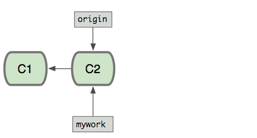

>2. 现在我们在这个分支(*mywork*)做一些修改，然后生成两个提交(commit).
```shell
$ vi file.txt 
$ git commit 
$ vi otherfile.txt 
$ git commit ... ...
```
>3. 但是与此同时，有些人也在”origin“分支上做了一些修改并且做了提交了，这就意味着”origin“和”mywork“这两个分支各自”前进”了，它们之间”分叉”了。

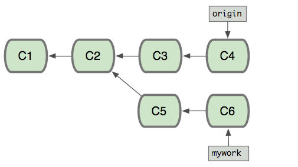

>4. 在这里，你可以用”pull“命令把”origin“分支上的修改拉下来并且和你的修改合并； 结果看起来就像一个新的”合并的提交”(merge commit):

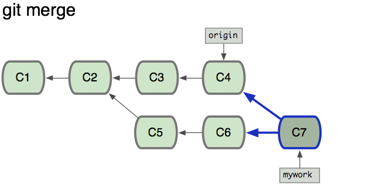

>5. 但是，如果你想让”mywork“分支历史看起来像没有经过任何合并一样，也可以用 git rebase，如下所示：
```shell
$ git checkout mywork 
$ git rebase origin
```
>6. 这些命令会把你的”mywork“分支里的每个提交(commit)取消掉，并且把它们临时 保存为补丁(patch)(这些补丁放到”.git/rebase“目录中),
>然后把”mywork“分支更新 到最新的”origin“分支，最后把保存的这些补丁应用到”mywork“分支上。

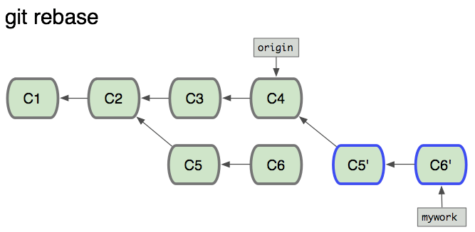

>7. 当’mywork‘分支更新之后，它会指向这些新创建的提交(commit),而那些老的提交会被丢弃。 如果运行垃圾收集命令(pruning garbage collection), 这些被丢弃的提交就会删除.

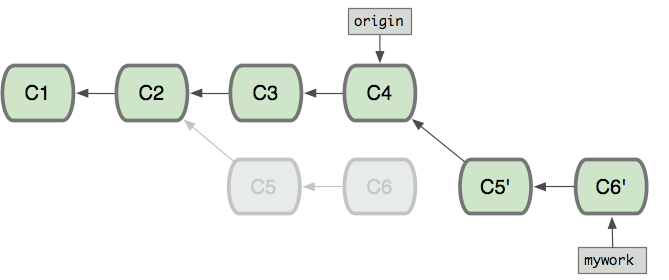

>8. 现在我们可以看一下用合并(merge)和用 rebase 所产生的历史的区别：

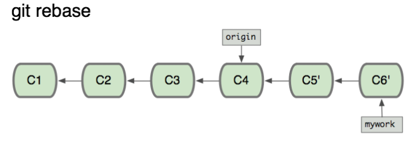
>9. 在 rebase 的过程中，也许会出现冲突(conflict)。在这种情况，Git 会停止 rebase 并会让你去解决冲突；
>在解决完冲突后，用”git add“命令去更新这些内容的索引(index), 然后，你无需执行 git commit,只要执行:
```shell
$ git rebase --continue
```
>10. 在任何时候，可以用--abort 参数来终止 rebase 的操作，并且”mywork“ 分支会回到 rebase 开始前的状态。
```shell
$ git rebase --abort
```

---


