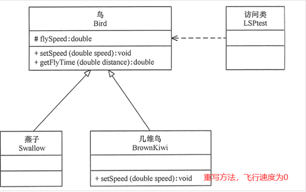
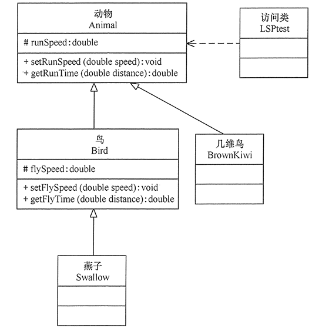
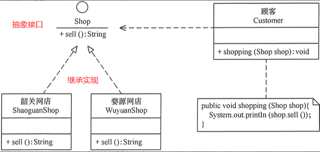
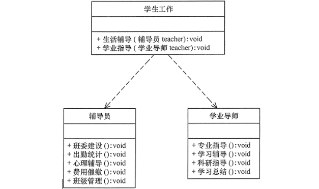
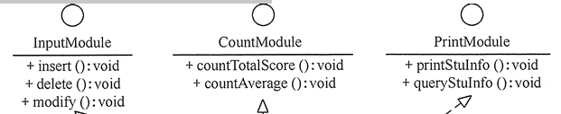
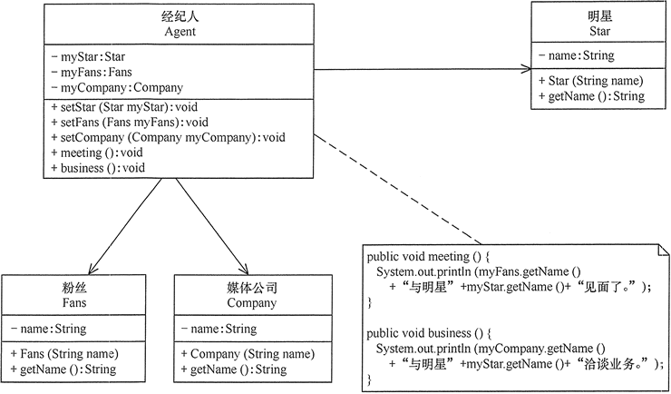
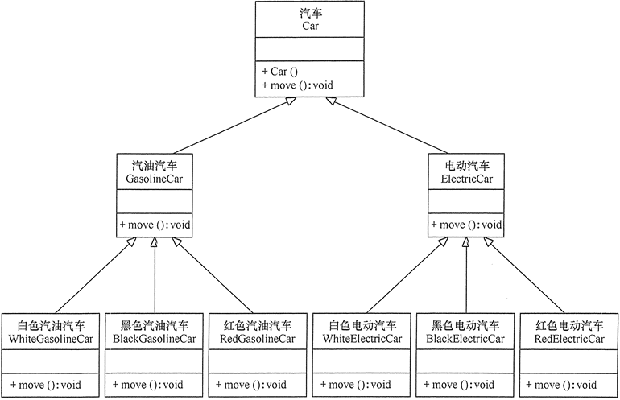
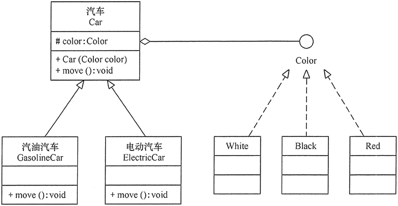

# 面向对象的设计原则

---

- 软件的可维护性和可复用性是用于衡量软件质量的质量属性，软件的可维护性是指软件能够被理解、改正、适用以及扩展的难易程度，软件的可复用性是指软件能够被复用的难易程度。

## 1> 开闭原则（OCP）

- 开闭原则（Open Closed Principle，OCP），

- 开闭原则的含义是：当应用的需求改变时，在不修改软件实体的源代码或者二进制代码的前提下，可以扩展模块的功能，使其满足新的需求。

---

### 1.1 开闭原则的作用

- 开闭原则是面向对象程序设计的终极目标，它使软件实体拥有一定的适应性和灵活性的同时具备稳定性和延续性。
  - **对软件测试的影响**：软件遵守开闭原则的话，软件测试时只需要对扩展的代码进行测试就可以了，因为原有的测试代码仍然能够正常运行。
  - **可以提高代码的可复用性**：粒度越小，被复用的可能性就越大；在面向对象的程序设计中，根据原子和抽象编程可以提高代码的可复用性。
  - **可以提高软件的可维护性**：遵守开闭原则的软件，其稳定性高和延续性强，从而易于扩展和维护。

---

### 1.2 开闭原则的实现方法

- 可以通过“抽象约束、封装变化”来实现开闭原则，即通过接口或者抽象类为软件实体定义一个相对稳定的抽象层，而将相同的可变因素封装在相同的具体实现类中。

- 因为抽象灵活性好，适应性广，只要抽象的合理，可以基本保持软件架构的稳定。而软件中易变的细节可以从抽象派生来的实现类来进行扩展，当软件需要发生变化时，只需要根据需求重新派生一个实现类来扩展就可以了。

---

## 2> 里氏替换原则（LSP）

- 里氏替换原则（Liskov Substitution Principle，LSP）

- 里氏替换原则主要阐述了有关继承的一些原则，也就是什么时候应该使用继承，什么时候不应该使用继承，以及其中蕴含的原理。里氏替换原是继承复用的基础，它反映了基类与子类之间的关系，是对开闭原则的补充，是对实现抽象化的具体步骤的规范。

---

### 2.1 里氏替换原则的作用

- 里氏替换原则的主要作用如下。
  - 里氏替换原则是实现开闭原则的重要方式之一。
  - 它克服了继承中重写父类造成的可复用性变差的缺点。
  - 它是动作正确性的保证。即类的扩展不会给已有的系统引入新的错误，降低了代码出错的可能性。
  - 加强程序的健壮性，同时变更时可以做到非常好的兼容性，提高程序的维护性、可扩展性，降低需求变更时引入的风险。

---

### 2.2 里氏替换原则的实现方法

- 里氏替换原则通俗来讲就是：子类可以扩展父类的功能，但不能改变父类原有的功能。也就是说：子类继承父类时，除添加新的方法完成新增功能外，尽量不要重写父类的方法。
  - 子类可以实现父类的抽象方法，但不能覆盖父类的非抽象方法
  - 子类中可以增加自己特有的方法
  - 当子类的方法重载父类的方法时，方法的前置条件（即方法的输入参数）要比父类的方法更宽松
  - 当子类的方法实现父类的方法时（重写/重载或实现抽象方法），方法的后置条件（即方法的的输出/返回值）要比父类的方法更严格或相等

---

### 2.3 关于里氏替换原则的例子

- 最有名的是“正方形不是长方形”。

- 当然，生活中也有很多类似的例子，例如，
  - 企鹅、鸵鸟和几维鸟从生物学的角度来划分，它们属于鸟类；但从类的继承关系来看，由于它们不能继承“鸟”会飞的功能，所以它们不能定义成“鸟”的子类。
  - 同样，由于“气球鱼”不会游泳，所以不能定义成“鱼”的子类；
  - “玩具炮”炸不了敌人，所以不能定义成“炮”的子类等。

---

> **示例**：鸟一般都会飞行，如燕子的飞行速度大概是每小时 120 千米。但是新西兰的几维鸟由于翅膀退化无法飞行。假如要设计一个实例，计算这两种鸟飞行 300 千米要花费的时间。

- 

>**分析**：显然，拿燕子来测试这段代码，结果正确，能计算出所需要的时间；但拿几维鸟来测试，结果会发生“除零异常”或是“无穷大”。

---

>**重新设计方案**：取消几维鸟原来的继承关系，定义鸟和几维鸟的更一般的父类，如动物类，它们都有奔跑的能力。几维鸟的飞行速度虽然为 0，但奔跑速度不为 0，可以计算出其奔跑 300 千米所要花费的时间。

- 

---

## 3>依赖倒置原则（DIP）

- 依赖倒置原则（Dependence Inversion Principle，DIP）

- 依赖倒置原则的原始定义为：高层模块不应该依赖低层模块，两者都应该依赖其抽象；抽象不应该依赖细节，细节应该依赖抽象。其核心思想是：要面向接口编程，不要面向实现编程。

- 依赖倒置原则是实现开闭原则的重要途径之一，它降低了客户与实现模块之间的耦合。

- 由于在软件设计中，细节具有多变性，而抽象层则相对稳定，因此以抽象为基础搭建起来的架构要比以细节为基础搭建起来的架构要稳定得多。这里的抽象指的是接口或者抽象类，而细节是指具体的实现类。

- 使用接口或者抽象类的目的是制定好规范和契约，而不去涉及任何具体的操作，把展现细节的任务交给它们的实现类去完成。

---

### 3.1 依赖、倒置原则的作用

- 依赖倒置原则可以降低类间的耦合性。
- 依赖倒置原则可以提高系统的稳定性。
- 依赖倒置原则可以减少并行开发引起的风险。
- 依赖倒置原则可以提高代码的可读性和可维护性。

---

### 3.2 依赖倒置原则的实现方法

- 依赖倒置原则的目的是通过要面向接口的编程来降低类间的耦合性，所以我们在实际编程中只要遵循以下4点，就能在项目中满足这个规则。
  - 每个类尽量提供接口或抽象类，或者两者都具备。
  - 变量的声明类型尽量是接口或者是抽象类。
  - 任何类都不应该从具体类派生。
  - 使用继承时尽量遵循里氏替换原则。

---

### 3.3 依赖倒置原则在“顾客购物程序”中的应用

- 

---

## 4>单一职责原则（SRP）

- 单一职责原则（Single Responsibility Principle，SRP）又称单一功能原则：单一职责原则规定一个类应该有且仅有一个引起它变化的原因，否则类应该被拆分

- 该原则提出对象不应该承担太多职责，如果一个对象承担了太多的职责，至少存在以下两个缺点：
  - 一个职责的变化可能会削弱或者抑制这个类实现其他职责的能力；
  - 当客户端需要该对象的某一个职责时，不得不将其他不需要的职责全都包含进来，从而造成冗余代码或代码的浪费。

---

### 4.1 单一职责原则的优点

- 单一职责原则的核心就是控制类的粒度大小、将对象解耦、提高其内聚性。如果遵循单一职责原则将有以下优点：
  - 降低类的复杂度。一个类只负责一项职责，其逻辑肯定要比负责多项职责简单得多。
  - 提高类的可读性。复杂性降低，自然其可读性会提高。
  - 提高系统的可维护性。可读性提高，那自然更容易维护了。
  - 变更引起的风险降低。变更是必然的，如果单一职责原则遵守得好，当修改一个功能时，可以显著降低对其他功能的影响。

---

### 4.2 单一职责原则的实现方法

- 单一职责原则是最简单但又最难运用的原则，需要设计人员发现类的不同职责并将其分离，再封装到不同的类或模块中。而发现类的多重职责需要设计人员具有较强的分析设计能力和相关重构经验。

### 4.3 大学学生工作管理程序

- 大学学生工作主要包括学生生活辅导和学生学业指导两个方面的工作，其中生活辅导主要包括班委建设、出勤统计、心理辅导、费用催缴、班级管理等工作，学业指导主要包括专业引导、学习辅导、科研指导、学习总结等工作。如果将这些工作交给一位老师负责显然不合理，正确的做 法是生活辅导由辅导员负责，学业指导由学业导师负责

- 

---

## 5>接口隔离原则（ISP）

- 接口隔离原则（Interface Segregation Principle，ISP）要求程序员尽量将臃肿庞大的接口拆分成更小的和更具体的接口，让接口中只包含客户感兴趣的方法。

- “接口隔离原则”的定义是：客户端不应该被迫依赖于它不使用的方法（该原则还有另外一个定义：一个类对另一个类的依赖应该建立在最小的接口上）。

- 接口隔离原则和单一职责都是为了提高类的内聚性、降低它们之间的耦合性，体现了封装的思想，但两者是不同的：
  - 单一职责原则注重的是职责，而接口隔离原则注重的是对接口依赖的隔离.
  - 单一职责原则主要是约束类，它针对的是程序中的实现和细节；接口隔离原则主要约束接口，主要针对抽象和程序整体框架的构建。

---

### 5.1 接口隔离原则的优点

- 接口隔离原则是为了约束接口、降低类对接口的依赖性，遵循接口隔离原则有以下 5 个优点。
  - 将臃肿庞大的接口分解为多个粒度小的接口，可以预防外来变更的扩散，提高系统的灵活性和可维护性。
  - 接口隔离提高了系统的内聚性，减少了对外交互，降低了系统的耦合性。
  - 如果接口的粒度大小定义合理，能够保证系统的稳定性；但是，如果定义过小，则会造成接口数量过多，使设计复杂化；如果定义太大，灵活性降低，无法提供定制服务，给整体项目带来无法预料的风险。
  - 使用多个专门的接口还能够体现对象的层次，因为可以通过接口的继承，实现对总接口的定义。
  - 能减少项目工程中的代码冗余。过大的大接口里面通常放置许多不用的方法，当实现这个接口的时候，被迫设计冗余的代码。

---

### 5.2 接口隔离原则的实现方法

- 在具体应用接口隔离原则时，应该根据以下几个规则来衡量。
  - 接口尽量小，但是要有限度。一个接口只服务于一个子模块或业务逻辑。
  - 为依赖接口的类定制服务。只提供调用者需要的方法，屏蔽不需要的方法。
  - 了解环境，拒绝盲从。每个项目或产品都有选定的环境因素，环境不同，接口拆分的标准就不同深入了解业务逻辑。
  - 提高内聚，减少对外交互。使接口用最少的方法去完成最多的事情。

---

### 5.3 学生成绩管理程序

- 学生成绩管理程序一般包含插入成绩、删除成绩、修改成绩、计算总分、计算均分、打印成绩信息、査询成绩信息等功能，如果将这些功能全部放到一个接口中显然不太合理，正确的做法是将它们分别放在输入模块、统计模块和打印模块等 3 个模块中

- 

---

## 6>迪米特法则（LoD）

- 迪米特法则（Law of Demeter，LoD）又叫作最少知识原则（Least Knowledge Principle，LKP)

- **迪米特法则的定义是**：只与你的直接朋友交谈，不跟“陌生人”说话（Talk only to your immediate friends and not to strangers）。其含义是：如果两个软件实体无须直接通信，那么就不应当发生直接的相互调用，可以通过第三方转发该调用。其目的是降低类之间的耦合度，提高模块的相对独立性。

- **迪米特法则中的“朋友”是指**：当前对象本身、当前对象的成员对象、当前对象所创建的对象、当前对象的方法参数等，这些对象同当前对象存在关联、聚合或组合关系，可以直接访问这些对象的方法。

---

### 6.1 迪米特法则的优点

- 迪米特法则要求限制软件实体之间通信的宽度和深度，正确使用迪米特法则将有以下两个优点。
  - 降低了类之间的耦合度，提高了模块的相对独立性。
  - 由于亲合度降低，从而提高了类的可复用率和系统的扩展性。

- 但是，过度使用迪米特法则会使系统产生大量的中介类，从而增加系统的复杂性，使模块之间的通信效率降低。所以，在釆用迪米特法则时需要反复权衡，确保高内聚和低耦合的同时，保证系统的结构清晰。

---

### 6.2 迪米特法则的实现方法

- 从迪米特法则的定义和特点可知，它强调以下两点：
  - 从依赖者的角度来说，只依赖应该依赖的对象。
  - 从被依赖者的角度说，只暴露应该暴露的方法。

- 所以，在运用迪米特法则时要注意以下 6 点。
  - 在类的划分上，应该创建弱耦合的类。类与类之间的耦合越弱，就越有利于实现可复用的目标。
  - 在类的结构设计上，尽量降低类成员的访问权限。
  - 在类的设计上，优先考虑将一个类设置成不变类。
  - 在对其他类的引用上，将引用其他对象的次数降到最低。
  - 不暴露类的属性成员，而应该提供相应的访问器（set 和 get 方法）。
  - 谨慎使用序列化（Serializable）功能。

---

### 6.3 明星与经纪人的关系实例

- 明星由于全身心投入艺术，所以许多日常事务由经纪人负责处理，如与粉丝的见面会，与媒体公司的业务洽淡等。这里的经纪人是明星的朋友，而粉丝和媒体公司是陌生人，所以适合使用迪米特法则

- 

---

## 7>合成复用原则（CRP）

- 合成复用原则（Composite Reuse Principle，CRP）又叫组合/聚合复用原则（Composition/Aggregate Reuse Principle，CARP）

- 它要求在软件复用时，要尽量先使用组合或者聚合等关联关系来实现，其次才考虑使用继承关系来实现。

- 如果要使用继承关系，则必须严格遵循里氏替换原则。合成复用原则同里氏替换原则相辅相成的，两者都是开闭原则的具体实现规范。

---

### 7.1 合成复用原则的重要性

- 通常类的复用分为继承复用和合成复用两种，继承复用虽然有简单和易实现的优点，但它也存在以下缺点。
  - 继承复用破坏了类的封装性。因为继承会将父类的实现细节暴露给子类，父类对子类是透明的，所以这种复用又称为“白箱”复用。
  - 子类与父类的耦合度高。父类的实现的任何改变都会导致子类的实现发生变化，这不利于类的扩展与维护。
  - 它限制了复用的灵活性。从父类继承而来的实现是静态的，在编译时已经定义，所以在运行时不可能发生变化。

- 采用组合或聚合复用时，可以将已有对象纳入新对象中，使之成为新对象的一部分，新对象可以调用已有对象的功能，它有以下优点。
  - 它维持了类的封装性。因为成分对象的内部细节是新对象看不见的，所以这种复用又称为“黑箱”复用。
  - 新旧类之间的耦合度低。这种复用所需的依赖较少，新对象存取成分对象的唯一方法是通过成分对象的接口。
  - 复用的灵活性高。这种复用可以在运行时动态进行，新对象可以动态地引用与成分对象类型相同的对象。

---

### 7.2 合成复用原则的实现方法

- 合成复用原则是通过将已有的对象纳入新对象中，作为新对象的成员对象来实现的，新对象可以调用已有对象的功能，从而达到复用。

### 7.3 汽车分类管理程序为例来介绍合成复用原则的应用

> 汽车按“动力源”划分可分为汽油汽车、电动汽车等；按“颜色”划分可分为白色汽车、黑色汽车和红色汽车等。如果同时考虑这两种分类，其组合就很多。

- 

> 可以看出用继承关系实现会产生很多子类，而且增加新的“动力源”或者增加新的“颜色”都要修改源代码，这违背了开闭原则，显然不可取。但如果改用组合关系实现就能很好地解决以上问题。

- 

---
