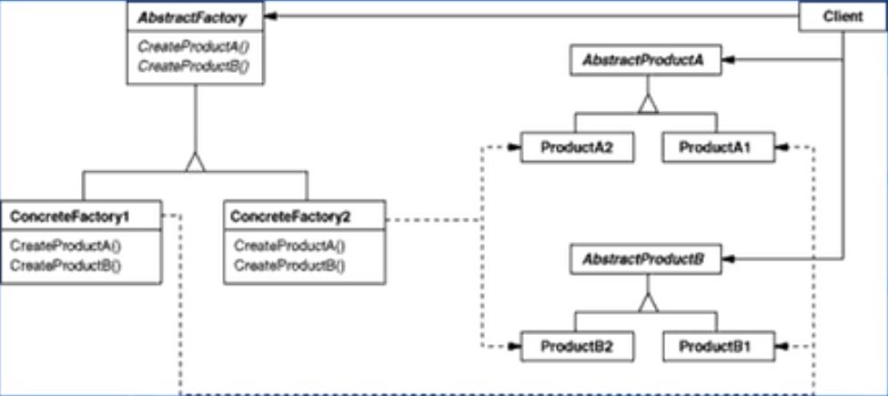

# 抽象工厂模式（创建型模式）

---

## 1> new 的问题

- 常规的对象创建方法:

```csharp
//创建一个Road对象
Road road=new Road();
```

- new的问题：实现依赖，不能应对“具体实例化类型的变化。
- 解决思路：**封装变化点一哪里变化，封装哪里**。潜台词：如果没有变化，当然不需要额外的封装。

---

## 2> 工厂模式的缘起

- 变化点在“对象创建”，因此就封装“对象创建”
- 面向接口编程——依赖接口，而非依赖实现
- 最简单的解决方法:

```csharp
  class RoadF actory 
  {
      public static Road CreateRoad()
      {
          retum new Road0; 
      }
  }
 //--------------------------------------------------
//创建一一个Road对象，客户程序
  Road road = roadFactory.CreateRoad();
```

---

### 2.1 创建一系列相互依赖的对象

- 假设一个游戏开发场景: 我们需要构造"道路"、“房屋”、“地道”、“丛林”等等对象。

```csharp
Road road = roadFactory.CreateRoadl();
Building building = roadFactory.CreateBuilding();
-------------------------------------------------------------
 class RoadFactory
        {
            public static Road CreateRoad()
            {
                retum new Road();
            }
            public static Building CreateBuilding()
            {
                retum new Building()
            }
            public static Tunnel CreateTunnel()
            {
                retum new Tunnel()
            }
            public static Jungle CreateJungle()
            {
                retum new Jungle();
            }
        }
```

---

### 2.2 简单工厂的问题

- **不能应对“不同系列对象”的变化**。比如有不同风格的游戏场景——对应不同风格的道路、房屋、地道

- 如何解决——使用面向对象的技术来“封装”变化点。

---

### 2.3 动机

- 在软件系统中，经常面临着**一系列相互依赖的对象**的创建工作；同时，由于需求的变化，往往存在更多系列对象的创建工作。

- 如何应对这种变化？如何绕过常规的对象创建方法(new)，提供一种“封装机制”来避免客户程序和这种“多系列具体对象创建工作”的紧耦合?

---

### 2.4 意图

- 提供一个接口，让该接口负责创建一系列“相关或者相互依赖的对象”，无需指定它们具体的类。

---

### 2.5 抽象工厂模式结构

- 

---

## 3> 一个简单的工厂模式运用

```csharp
    public abstract class Road
    {
       public abstract void FuncRoad();
    }
    //房屋
    public abstract class Building
    {
        public abstract void FunBuilding();
    }
    //地道
    public abstract class Tunnel
    {
        public abstract void FuncTunnel();
    }
    //丛林
    public abstract class Jungle
    {
        public abstract void FuncJungle();
    }
    abstract class FacilitiesFactory//抽象的工厂
    {
        public abstract Road CreateRoad();
        public abstract Building CreateBuilding();
        public abstract Tunnel CreateTunnel();
        public abstract Jungle CreateJungle();
    }
```

- 客户程序只通过一个抽象工厂创造各建造类型的访问，不用每一个单独new创建。

```csharp
    class GameManager//客户程序 只依赖抽象工厂而不是各种抽象类
    {
        FacilitiesFactory facilitiesFactory;
        Road road;
        Building building;
        Tunnel tunnel;
        Jungle jungle;
        public GameManager(FacilitiesFactory facilitiesFactory)
        {
            this.facilitiesFactory = facilitiesFactory;//创建工厂对象
        }
        public void BuildGameFacilities()//执行工厂生产行为
        {
            road = facilitiesFactory.CreateRoad();
            building = facilitiesFactory.CreateBuilding();
            tunnel = facilitiesFactory.CreateTunnel();
            jungle = facilitiesFactory.CreateJungle();
        }
        public void Run()//执行产品功能
        {
            road.FuncRoad();
            building.FunBuilding();
            tunnel.FuncTunnel();
            jungle.FuncJungle();
        }
    }
```

---

## 4> 工厂模式简单拓展

```csharp
    //道路
    public abstract class Road
    {
       public abstract void FuncRoad();
    }
    //房屋
    public abstract class Building
    {
        public abstract void FunBuilding();
    }
    //地道
    public abstract class Tunnel
    {
        public abstract void FuncTunnel();
    }
    //丛林
    public abstract class Jungle
    {
        public abstract void FuncJungle();
    }
    abstract class FacilitiesFactory//抽象的工厂
    {
        public abstract Road CreateRoad();
        public abstract Building CreateBuilding();
        public abstract Tunnel CreateTunnel();
        public abstract Jungle CreateJungle();
    }//抽象工厂搭建，作为基础抽象类用来拓展不同的版本，实现多态和封装
//-------------------------------------------------------------
    //具体工厂实现————生产一套现代风格的对象
    public class ModernRoad : Road//继承Road创建现代风格的道路
    {
        public override void FuncRoad() { }
    }
    //房屋
    public class ModernBuilding : Building//继承Building创建现代风格的房屋
    {
        public override void FunBuilding() { }
    }
    //地道
    public class ModernTunnel : Tunnel//继承Tunnel创建现代风格的地道
    {
        public override void FuncTunnel() { }
    }
    //丛林
    public class ModernJungle : Jungle//继承Jungle创建现代风格的丛林
    {
        public override void FuncJungle() { }
    }
    class ModernFacilitiesFactory : FacilitiesFactory
    {
        public override Road CreateRoad()
        {
            return new ModernRoad();
        }
        public override Building CreateBuilding()
        {
            return new ModernBuilding();
        }
        public override Tunnel CreateTunnel()
        {
            return new ModernTunnel();
        }
        public override Jungle CreateJungle()
        {
            return new ModernJungle();
        }
    }
//----------------------------------------------------------
//客户程序不需要一直变化，只需要将不同的工厂类型传入即可，保证了客户程序的稳定性   
     class GameManager
    {
        FacilitiesFactory facilitiesFactory;
        Road road;
        Building building;
        Tunnel tunnel;
        Jungle jungle;
        public GameManager(FacilitiesFactory facilitiesFactory)
        {
            this.facilitiesFactory = facilitiesFactory;
        }
        public void BuildGameFacilities()
        {
            road = facilitiesFactory.CreateRoad();
            building = facilitiesFactory.CreateBuilding();
            tunnel = facilitiesFactory.CreateTunnel();
            jungle = facilitiesFactory.CreateJungle();
        }
        public void Run()
        {
            road.FuncRoad();
            building.FunBuilding();
            tunnel.FuncTunnel();
            jungle.FuncJungle();
        }
    }
```

---

## 5> 工厂模式调用模拟

```csharp
class test{
    static void Main(string[] args)
   {
      GameManager gm = new GameManager(ModernFacilitiesFactory);
      //创建一个现代风格的场景。
   }
}
```

---

## 6> Abstract Factory模式的几个要点

- 如果没有应对“多系列对象构建”的需求变化，则没有必要使用Abstract Factory模式，这时候使用简单的静态工厂完全可以。

    **即直接在类中实现工厂，而不需要再创建抽象工厂应对不同的变化。多新系列的变化会使用抽象工厂模式。**

- “系列对象”指的是这些对象之间有相互依赖、或作用的关系，例如游戏开发场景中的“道路”与"房屋”的依赖，“道路”与“地道”的依赖。

- Abstract Factory模式主要在于应对“新系列”的需求变动。其缺点在于难以应对“新对象”的需求变动。

- Abstract Factory模式经常和Factory Method模式共同组合来应对“对象创建”的需求变化。

---
