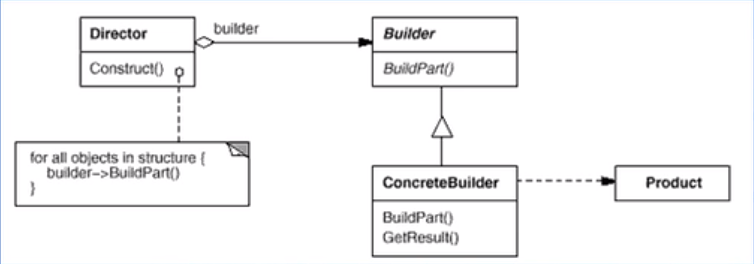
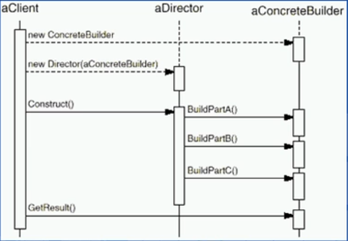

# 生成器模式（创建型模式）

---

## 1> Building模式的缘起

- 假设创建游戏中的一个房屋House设施，该房屋的构建由几个部分组成，且各个部分要富于变化。

- 如果使用最直观的设计方法，每一个房屋部分的变化，都将导致房屋构建的重新修正。

---

## 2> 设计目的

- 在软件系统中，有时候而临着“一个复杂对象”的创建工作，其通常由各个部分的子对象用一定的算法构成；由于需求的变化，这个复杂对象的各个部分经常面临着剧烈的变化，但是将它们组合在一起的算法却相对稳定。

- 如何应对这种变化?如何提供一种“封装机制”来隔离出“复杂对象的各个部分”的变化，从而保持系统中的“稳定构建算法”不随着需求改变而改变?

---

## 3> 意图

- 将一个复杂对象的构建与其表示相分离，使得同样的构建过程可以创建不同的表示。

---

## 4> 结构

- 

>- 协作

- 

---

## 5> 代码实现

```csharp
public abstract class House
//将房屋整体剥离出来，将其的各个部分由Builder负责生产，并得到房屋的整体
{
}
public abstract class Builder//房屋各部件生成器
{
    public abstract void BuildDoor();
    public abstract void BuildWall();
    public abstract void BuildWindows();
    public abstract void BuildFloor();
    public abstract void BuildHouseCeiling();
    public abstract House GetHouse();
} 
public class GameManager//房屋组装器,客户端
{
    public static House CreateHouse(Builder builder)
    {
        //这个方法内部去创造房子的部件
        builder.BuildDoor();
        builder.BuildDoor();
        builder.BuildWindows();
        builder.BuildWindows();
        builder.BuildWall();
        builder.BuildWall();
        
        builder.BuildFloor();
        builder.BuildHouseCeiling();
        return builder.GetHouse();
    }
}
```

---

### 5.1 换种风格的房屋具体实现

```csharp
public class RomanHouse : House//罗马风格的房屋
{
}
public class RomanHouseBuilder : Builder//房屋部件生成器
{
    public override void BuildDoor(){}
    public override void BuildFloor() {}
    public override void BuildHouseCeiling() {}
    public override void BuildWall() {}
    public override void BuildWindows() {}
    public override House GetHouse()
    {
        return new RomanHouse();//参考上节的抽象工厂模式
    }
}
```

---

### 5.2 生成房屋

```csharp
public class BuilderHouse
{
    static void Main(string[] args)
    {
        GameManager.CreateHouse(new RomanHouseBuilder());
    }
}
```

---

## 6> Builder模式的要点

1. Builder模式主要用于“分步骤构建一个复杂的对象”在这其中“分步骤”是一个稳定的算法，而复杂对象的各个部分则经常变化。
2. 变化点在哪里，封装哪里一一Builder模式主要在于应对“复杂对象各个部分”的频繁需求变动。其缺点在于难以应对“分步骤构建算法”的需求变动。
3. Abstract Factory模式解决“系列对象”的需求变化，Builder模式解决“对象部分”的需求变化（对象）。Builder模式通常和Composite模式组合使用。

---

## 7> 实现房屋建造的分工

> 完整代码参考

```csharp
using System.Collections;
using System.Collections.Generic;
using UnityEngine;
using System;


public class Test2
{
    static void Main(string[] args)
    {
        GameManager.CreateHouse(new RomanBuilder());
    }
}
public abstract class House
{

}
interface Door
{
    void BuildDoor();
}
interface Wall
{
    void BuildWall();
}
interface Windows
{
    void BuildWindows();
}
interface Floor
{
    void BuildFloor();
}
interface HouseCeiling
{
    void BuildHouseCeiling();
}
public class RomanDoor : Door
{
    public void BuildDoor() { }
}
public class RomanWall : Wall
{
    public void BuildWall() { }
}
public class RomanWindows : Windows
{
    public void BuildWindows() { }
}
public class RomanFloor : Floor
{
    public void BuildFloor() { }
}
public class RomanHouseCeiling : HouseCeiling
{
    public void BuildHouseCeiling() {}
}
public abstract class Builder:Door,Wall,Windows,Floor,HouseCeiling
{

    public abstract House GetHouse();
    public abstract void BuildDoor();
    public abstract void BuildWall();
    public abstract void BuildWindows();
    public abstract void BuildFloor();
    public abstract void BuildHouseCeiling();
   
}
public class RomanHouse : House
{

}
public class RomanBuilder : Builder
{
    private RomanDoor rmDoor
    {
        get;
        set;
    }
    private RomanWall rmWall
    {
        get;
        set;
    }
    private RomanWindows rmWindows
    {
        get;
        set;
    }
    private RomanFloor rmFloor
    {
        get;
        set;
    }
    private RomanHouseCeiling rmHouseCeiling
    {
        get;
        set;
    }

    public override void BuildDoor()
    {
        rmDoor.BuildDoor();
    }

    public override void BuildFloor()
    {
        rmFloor.BuildFloor();
    }

    public override void BuildHouseCeiling()
    {
        rmHouseCeiling.BuildHouseCeiling();
    }

    public override void BuildWall()
    {
        rmWall.BuildWall();
    }

    public override void BuildWindows()
    {
        rmWindows.BuildWindows();
    }

    public override House GetHouse()
    {
        return new RomanHouse();
    }
}
public class GameManager//客户端
{
    public static House CreateHouse(Builder builder)
    {
        //这个方法内部去创造房子的部件
        builder.BuildDoor();
        builder.BuildDoor();

        builder.BuildWindows();
        builder.BuildWindows();

        builder.BuildWall();
        builder.BuildWall();


        builder.BuildFloor();
        builder.BuildHouseCeiling();

        return builder.GetHouse();
    }
}


```

- 将房屋的各个部分拆分开成为各个单独的部件进行生产，分别进行维护，一键生成各式风格的房屋。

- 可以任意组合房屋的各个部分搭配，此方法并没有实现，扩展到使用配置表的方式，利用反射的方式生成。

---
