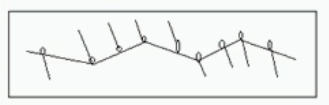
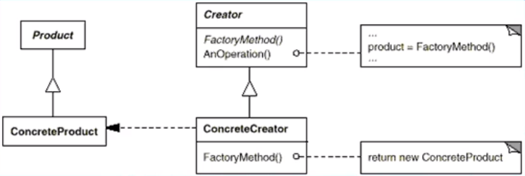

# 工厂生产模式（创建型模式）

---

## 1> 从耦合关系谈起

> 耦合关系直接决定着软件面对变化时的行为

- 模块与模块之间的紧耦合使得软件面对变化时，相关的模块都要随之更改

- 

- 模块与模块之间的松耦合使得软件面对变化时，一些模块更容易被替换或者更改，但其他模块保持不变

- 

---

## 2> 动机( Motivation)

- 在软件系统中，经常面临着“某个对象”的创建工作；**由于需求的变化，这个对象的具体实现经常面临着剧烈的变化，但是它却拥有比较稳定的接口。**（例如床需要床单，但是床单可以经常换，但是床不换）

- 如何应对这种变化？如何提供一种“封装机制"来隔离出“这个易变对象”的变化，**从而保持系统中“其他依赖该对象的对象"不随着需求改变而改变?（只改变床单而不需要修改床的变化）**

---

## 3> 意图(Intent)

- 定义一个用于创建对象的接口，让子类决定实例化哪一个类。FactoryMethod使得一个类的实例化延迟到子类。

---

## 4> 结构

- 

---

## 5> 创建一个汽车测试

---

### 5.1 抽象汽车构建

```csharp
   abstract class Car//构建车的不变，即抽象
    {
        public abstract void StartUp();
        public abstract void Run();
        public abstract void Turn(Direction direction);
        public abstract void Stop();
    }
    abstract class CarFactory//将车的构建剥离出来，工厂生产
    {
        public abstract Car CreateCar();
    }
    //Car和CarFactory之间是高耦合关系
     public class Direction//辅助类
    {
    }
```

---

### 5.2 创建具体汽车的具体对象

```csharp
    class HongqiCar : Car
    //Car的具体对象，当需求变化时只需要拓展一个新类继承Car和CarFactory
    {
        public override void Run()
        {
        }
        public override void StartUp()
        {
        }
        public override void Stop()
        {
        }
        public override void Turn(Direction direction)
        {
        }
    }
    class HongqiCarFactory : CarFactory
     //与HongqiCar高耦合，但是它们的变化并不会影响到两个对应基类
    {
        public override Car CreateCar()
        {
            return new HongqiCar();
        }
    }
```

---

### 5.3 搭建一个汽车性能测试的框架

```csharp
    class CarTestFramkWork
    {
        Car car;
        public void BuildTestContext(CarFactory carFactory)
        //将需要测试的车类型的数据传入
        {
            car = carFactory.CreateCar();//里氏替换
        }
        public void DoTest()//测试车的性能方法
        {
            car.StartUp();
            car.Run();
            car.Turn(new Direction());
            car.Stop();
        }
        public TestData GetTestData()
        {
            return new TestData();
        }
    }
    public class TestData//辅助类
    {
    }
```

---

### 5.4 App端具体测试

```csharp
 class TestApp
    {
        static void Main(string[] args)
        {
            CarTestFramkWork carTest = new CarTestFramkWork();
            //创建一个测试平台
            carTest.BuildTestContext(new HongqiCarFactory());
            //测试红旗车型的性能
        }
    }
```

---

## 6> Factory Method模式的要点

- Factory Method模式主要用于隔离类对象的使用者和具体类型之间的耦合关系。面对一个经常变化的具体类型，紧耦合关系会导致软件的脆弱。

- Factory Method模式通过面向对象的手法，将所要创建的具体对象工作延迟到子类，从而实现一种扩展(而非更改)的策略，较好地解决了这种紧耦合关系。

- FactoryMethod模式解决“单个对象”的需求变化，Abstract Factory模式解决“系列对象”的需求变化，Builder模式解决“对象部分”的需求变化。

- 工厂生产模式表示将对象的变种通过一个入口（生产的工厂）进入，进入的钥匙则是具体的对象变种（或者说是抽象对象的继承子类，即汽车下面的大众车，丰田车），而整体程序的主框架不会发生大的改变（对车的性能测试功能并没有进行太大的改动）。

---

## 7> 从分支易变到拓展

- 通过配置表的方式实现对象的变化，而解析配置表的方法就是构建对象变体的过程，但是配置表的格式要提前约定，才能保证解析配置到数据分配生产具体对象的过程不需要太大的变动。

---
