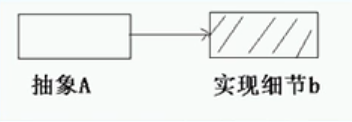
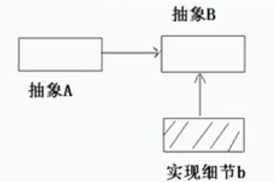
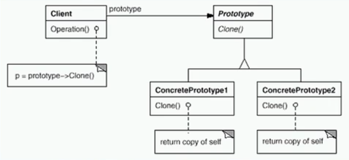

# 原型模式（创建型模式）

- Prototype原型模式

---

## 1>  依赖关系的倒置

- 抽象不应该依赖于实现细节，实现细节应该依赖于抽象。

- 抽象A直接依赖于实现细节b （人用陶瓷水杯喝水，人直接依赖于陶瓷水杯）

- 

- 抽象A依赖于抽象B，实现细节b依赖于抽象B（人A用杯子B喝水，杯子是陶瓷水杯b）

- 

---

## 2> 动机

- 在软件系统中，经常面临着“某些结构复杂的对象’的创建工作；由于需求的变化，这些对象经常面临着剧烈的变化，但是它们却拥有比较稳定一致的接口。

- 如何应对这种变化?如何向“客户程序(使用这些对象的程序)”隔离出“这些易变对象，从而使得“依赖这些易变对象的客户程序”不随着需求改变而改变?

---

## 3> 意图

- 使用**原型实例指定创建对象的种类**，**然后通过拷贝这些原型来创建新的对象**。

---

## 4> 结构

- 

---

## 5> 红警造兵的实例演示

---

### 5.1 兵种的抽象基类A块

```csharp
    public abstract class NormalActor
    {
        public abstract NormalActor Clone();
    }//动员兵
    public abstract class FlyActor
    {
        public abstract FlyActor Clone();
    }//飞行兵
    public abstract class WaterActor
    {
        public abstract WaterActor Clone();
    }//海军
```

---

### 5.2 具体兵种的分类实现

```csharp
 public class NormalActorA : NormalActor
    {
        public override NormalActor Clone()
        {
            return (NormalActor)this.MemberwiseClone();
            //浅拷贝：浅拷贝值类型和引用类型的地址
        }
    }
    public class NormalActorB : NormalActor
    {
        public override NormalActor Clone()
        {
            return (NormalActor)this.MemberwiseClone();
        }
    }
    public class FlyActor1 : FlyActor
    {
        public override FlyActor Clone()
        {
            return (FlyActor)this.MemberwiseClone();
        }
    }
    public class FlyActor2 : FlyActor
    {
        public override FlyActor Clone()
        {
            return (FlyActor)this.MemberwiseClone();
        }
    }
    public class WaterActor1 : WaterActor
    {
        public override WaterActor Clone()
        {
            return (WaterActor)this.MemberwiseClone();
        }
    }
    public class WaterActor2 : WaterActor
    {
        public override WaterActor Clone()
        {
            return (WaterActor)this.MemberwiseClone();
        }
    }
```

---

### 5.3 客户端兵种生产基地

```csharp
 class GameSystem//红警
    {
        public static void Run(
                  NormalActor normalactor, 
                  FlyActor flyActor, 
                  WaterActor waterActor)
        {
            NormalActor normalActor1 = normalactor.Clone();
            NormalActor normalActor2 = normalactor.Clone();
            NormalActor normalActor3 = normalactor.Clone();
            NormalActor normalActor4 = normalactor.Clone();
            NormalActor normalActor5 = normalactor.Clone();
            FlyActor flyActor1 = flyActor.Clone();
            FlyActor flyActor2 = flyActor.Clone();
            WaterActor waterActor1 = waterActor.Clone();
            WaterActor waterActor2 = waterActor.Clone();
        }
    }
```

---

### 5.4 用户选择兵种类型进行生产

```csharp
    class CreateActor
    {
        static void Main(string[] args)
        {
            GameSystem.Run(new NormalActorA(), 
                            new FlyActor2(), 
                             new WaterActor2());
        }
    }
```

---

## 6> 关于浅拷贝与序列化深拷贝的讨论

- 浅拷贝只会将类型的值类型和引用类型中的地址存储在新的类型中，当一个成员中引用类型发生改变，其他成员也会发生改变。

- 深拷贝是完全复制并与原型剥离开来。

- 参考设计模式板块的C#深浅拷贝的介绍

---

## 7> Prototype模式的几个要点

- Prototype模式同样用于隔离类对象的使用者和具体类型(易变类)之间的耦合关系，它同样要求这些“易变类”拥有“稳定的接口”

- Prototype模式对于“如何创建易变类的实体对象”采用“原型克隆”的方法来做，它使得我们可以非常灵活地动态创建“拥有某些稳定接口”的新对象——所需工作仅仅是注册一个新类的对象(即原型)，然后在任何需要的地方不断地Clone。

- Prototype模式中的Clone方法可以利用，NET中的Object类的MemberwiseClone()方法浅拷贝或者序列化来实现深拷贝。

---

## 8> 有关创建性模式的讨论

- Singleton模式解决的是实体对象个数的问题。除了Singleton之外，其他创建型模式解决的都是new所带来的耦合关系。
- Factory Method, Abstract Factory, Builder都需要一个额外的工厂类来负责实例化“易变对象”。
- Prototype则是通过原型(一个特殊的工厂类)来克隆“易变对象。
- 如果遇到“易变类”，起初的设计通常从Factory Method开始，当遇到更多的复杂变化时，再考虑重构为其他三种工厂模式( Abstract Factory，Builder，Prototype )。

---
