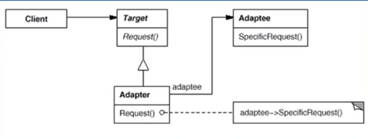
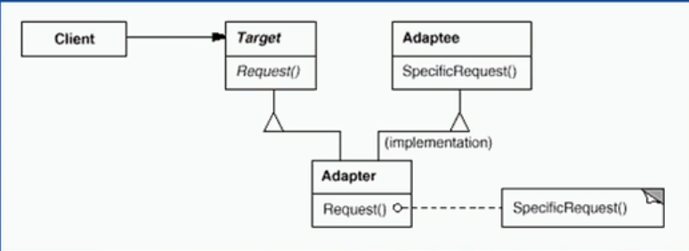

# 适配器模式（结构型模式）

---

## 1> 适配(转换)的概念无处不在

- 适配，即在不改变原有实现的基础上，将原先不兼容的接口转换为兼容的接口。

---

## 2> 动机

- 在软件系统中，由于应用环境的变化，常常需要将“一些现存的对象”放在新的环境中应用，但是新环境要求的接口是这些现存对象所不满足的。

- 如何应对这种"迁移的变化”?如何既能利用现有对象的良好实现，同时又能满足新的应用环境所要求的接口?

---

## 3> 意图(Intent)

- 将一个类的接口转换成客户希望的另一个接口。Adapter模式使得原本由于接口不兼容而不能一-起工作的那些类可以一起工作。

---

## 4> 结构一）——对象适配器

- 

- Target——Request()

```csharp
 interface IStack//客户期望的接口
    {
        object Peek();
        object Pop();
        void Push(object item);
        void Clear();
            
    }
```

- Adapter——Request()<适配器>与Adaptee<被适配器>

```csharp
    class MyIStack : IStack//适配的对象
    {
        ArrayList Array;//被适配的对象
        //一般采用对象适配方式，用Array作为接口接入ArrayList
        //而不采用继承ArrayList类，即类适配器
      
        public void Clear()
        {
            Array = null;
        }
        public object Peek()
        {
            return Array[Array.Count - 1];
        }
        public object Pop()
        {
            object _temp = Array[Array.Count - 1];
            Array.RemoveAt(Array.Count - 1);
            return _temp;
        }
        public void Push(object item)
        {
            Array.Add(item);
        }
    }
```

---

## 5> 结构二）——类适配器

- 类适配变成高耦合度关系

- 

- Target——Request

```csharp
    interface IStack//客户期望的接口
    {
        object Peek();
        object Pop();
        void Push(object item);
        void Clear();
            
    }
```

- Adapter与Adaptee

```csharp
    class MyIStack : ArrayList,IStack//适配的对象
    {    
        public void Clear()
        {
            this.Clear();
        }
        public object Peek()
        {
            return this[this.Count - 1];
        }
        public object Pop()
        {
            object _temp = this[this.Count - 1];
            this.RemoveAt(this.Count - 1);
            return _temp;
        }
        public void Push(object item)
        {
            this.Add(item);
        }
    }
```

---

## 6> Adapter模式的几个要点

- Adapter模式主要应用于“希望复用一些现存的类，但是接口又与复用环境要求不一致的情况”在遗留代码复用、类库迁移等方面非常有用。

- GoF23定义了两种Adapter模式的实现结构：对象适配器和类适配器。
  - **类适配器**采用“多继承”的实现方式，带来了不良的高耦合，所以一般不推荐使用。
  - **对象适配器**采用“对象组合”的方式， 更符合松耦合精神。

- Adapter模式可以实现的非常灵活，不必拘泥于Gof23中定义的两种结构。，例如，完全可以**将Adapter模式中的“现存对象”作为新的接口方法参数，来达到适配的目的**。

- Adapter模式本身要求我们尽可能地使用“**面向接口的编程**”风格，这样才能在后期很方便地适配。

---

## 7> Adapter模式接口适配实现

- 

---

### 7.1 创建实现客户各类需求的工具类SpecificRequest

```csharp
    class ExistingClass
    {
        public void SpecificRequest1() { }
        public void SpecificRequest2() { }
    }
```

---

### 7.2 创建接口对象提供Request

```csharp
    interface ITarget
    {
        void Request();
    }
```

---

### 7.3 应对客户的需求Target创建被适配对象

```csharp
    class Adapter1:ITarget//适配客户的第一种需求
    {
        ExistingClass adaptee;
        public void Request()
        {
            adaptee.SpecificRequest1();
        }
    }
    class Adapter2 : ITarget//适配客户的第二种需求
    {
        ExistingClass adaptee;
        public void Request()
        {
            adaptee.SpecificRequest2();
        }
    }
```

---

### 7.4 客户端实现需求的后台系统

```csharp
class MySystem//后台系统
{
public void Process(ITargettarget)
{
target.Request();
}
}
//接口适配的好处。继承接口的对象都可以作为对象适配，根据客户的需求灵活分        
                    //配，各适配器之间没有很高的耦合度
//而类适配器存在继承链，子对象适配器之间存在很高的耦合度，在满足客户需求的
                    //时候可能会出现适配大于需求的现象
```

---

### 7.5 客户提供需求

```csharp
    class client
    {
        static void Main(string[] args)
        {
            MySystem Target = new MySystem();
            Target.Process(new Adapter1());
            //Target.Process(new Adapter2());
        }
    }
```

---

## 8> .NET框架中的Adapter应用

**- 在.NET中复用COM对象:**

  1. COM对象不符合.NET对象的接口
  2. 使用tlbimp.exe来创建一个Runtime Callable Wrapper(RCW)以使其符合.NET对象的接口。

- **.NET数据访问类( Adapter变体) :**

  1. 各种数据库并没有提供DataSet接口
  2. 使用DbDataAdapter可以将任何各数据库访问/存取适配到一个DataSet对象上。

- **集合类中对现有对象的排序(Adapter变体)**

  1. 现有对象未实现IComparable接口
  2. 实现一个排序适配器(继承IComparer接口)，然后在其Compare方法中对两个对象进行比较。

---
