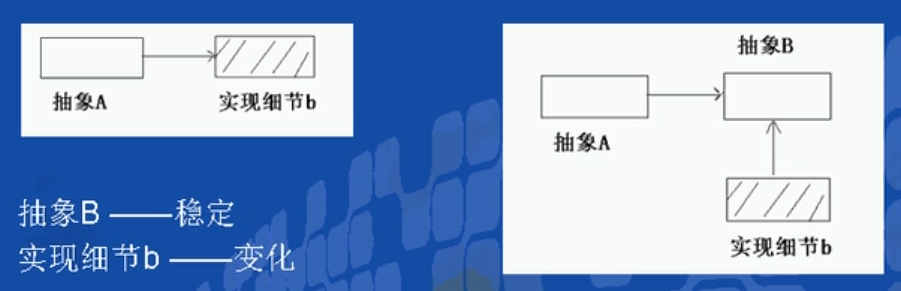
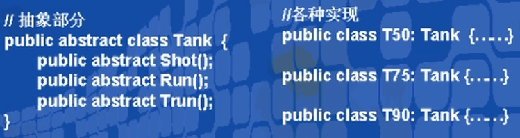
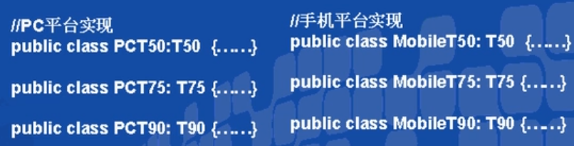
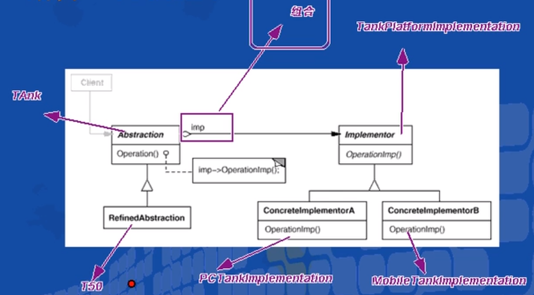

# 桥接模式（结构型模式）

---

## 1> 抽象与实现

- 抽象不应该依赖于实现细节，实现细节应该依赖于抽象。

- 

- 问题在于如果抽象B由于固有的原因，本身并不稳定，也有可能变化，怎么办?

---

## 2> 举例来说

- 假如我们需要开发一个同时支持PC和手机的坦克游戏，游戏在PC和手机上功能都一样，

- 都有同样的类型，面临同样的功能需求变化，比如坦克可能有多种不同的型号: T50,T75, T90

- 对于其中的坦克设计，我们可能很容易设计出来一个Tank的抽象基类，然后各种不同型号的Tank继承自该类:

- 

- 另外的变化原因

- 但是PC和手机上的图形绘制、声效、操作等实现完全不同——因此对于各种型号的坦克，都要提供各种不同平台上的坦克实现：

- 

- 这样的设计会带来很多问题:有很多重复代码，类的结构过于复杂，难以维护，最致命的是引入任何新平台，比如在TV上的Tank游戏，都会让整个类层级结构复杂化。

---

## 3> 动机( Motivation )

- 思考上述问题的症结：事实上由于Tank类型的固有逻辑，使得Tank类型具有了两个变化的维度：一个变化的维度为“平台的变化”，一个变化的维度为“型号的变化”。

- 如何应对这种“多维度的变化”?如何利用面向对象技术来使得Tank类型可以轻松地沿着“平台”和“型号”两个方向变化，而不引入额外的复杂度?

---

## 4> 意图（Intent）

- **将抽象部分与实现部分分离**，使它们都可以独立地变化。

---

## 5> 应对多平台变化的坦克大战

---

### 5.1 创建Tank的基类与平台桥接类

```csharp
public abstract  class Tank
    {
        protected TankPlatformImplementation tankPlatform;
        //继承Tank的各型号坦克在实现自身特征的时候，利用桥接的平台类可以应用多平台操作方式，绘制渲染等的不同。
        public Tank(TankPlatformImplementation tankPlatform)
        {
            this.tankPlatform = tankPlatform;
        }
        //坦克的行为描述
        public abstract void shot();
        public abstract void run();
        public abstract void stop();
    }
    public abstract class TankPlatformImplementation
    {
        //在不同平台上根据操作系统的不同，各坦克行为的实现和游戏的搭建不同，作为桥接的方式应对不同平台的变化。
        public abstract void MoveTankTo(Vector3 position);
        public abstract void DrawTank();
        public abstract void DoShot();
        public abstract void DoStop();
    }
```

---

### 5.2 不同平台的桥接方式的实现

- 多平台分别继承TankPlatformImplementation类，进行具体实现即可

- 将平台的实现剥离出来。

```csharp
 public class PCTankPlatformImplementation : TankPlatformImplementationP//PC端
    {
        public override void DoShot() { }
        public override void DrawTank() { }
        public override void MoveTankTo(Vector3 position) { }
        public override void DoStop() { }
    }
    public class MobileTankPlatformImplementation: TankPlatformImplementation//手机端
    {
        public override void DoShot() { }
        public override void DrawTank() { }
        public override void MoveTankTo(Vector3 position) { }
        public override void DoStop() { }
    }
    public class Vector3//辅助类
    {
    }
```

---

### 5.3 不同型号的Tank的实现

- 在满足多型号变化的同时继承Tank类，又将平台的变化桥接到具体的方法中。

```csharp
 public class T50 : Tank
    {
        public T50(TankPlatformImplementation tankPlatform) : base(tankPlatform)
        {
            tankPlatform.DrawTank();
        }
        public override void run()
        {
            tankPlatform.MoveTankTo(new Vector3());
        }
        public override void shot()
        {
            tankPlatform.DoShot();
        }   
        public override void stop()
        {
            tankPlatform.DoStop();
        }
        
    }
    //public class T75 : Tank { }
    //public class T90 : Tank { }
```

---

### 5.4 客户端

```csharp
 static void Main(string[] args)
 {
      //PC平台下的T50
      T50 t50 = new T50(new PCTankPlatformImplementation());
  }
```

---

## 6> 结构

- 

---

## 7> Bridge模式的几个要点

1. Bridge模式使用“对象间的组合关系”解耦了抽象和实现之间固有的绑定关系，使得抽象(Tank的型号)和实现(不同的平台)可以沿着各自的维度来变化。
2. 所谓抽象和实现沿着各自纬度的变化，即“子类化”它们，比如不同的Tank型号子类，和不同的平合子类)。得到各个子类之后，便可以任意组合它们，从而获得不同平合上的不同型号。
3. Bridge模式有时候类似于多继承方案，但是多继承方案往往违背单一职责原则(即一个类只有一个变化的原因)，复用性比较差。Bridge模式是比多继承方案更好的解决方法。(作为桥接成为类的成员或参数)
4. Bridge模式的应用一般在“两个非常强的变化维度”，有时候即使有两个变化的维度，但是某个方向的变化维度并不剧烈一换言之两个变化不会导致纵横交错的结果，并不一定要使用 Bridge模式。

---
