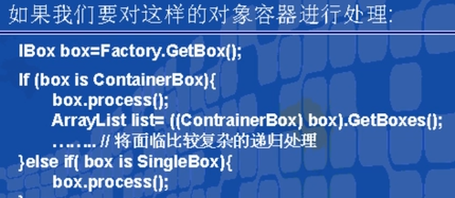
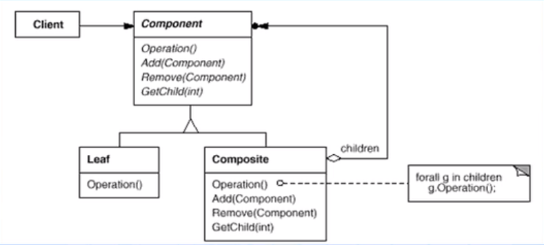

# 组合模式（结构型模式）

---

## 1> 对象容器的问题（俄罗斯套娃）

- 在面向对象系统中，我们常会遇到一类具有“容器”特征的对象——即它们在充当对象的同时，又是其他对象的容器。

- 

- 

---

## 2> 动机( Motivation )

- 上述描述的问题根源在于：客户代码过多地依赖干对象容器复杂的内部实现结构，对象容器内部实现结构(而非抽象接口)的变化将引起客户代码的频繁变化，带来了代码的维护性、扩展性等弊端。

- 如何将“客户代码与复杂的对象容器结构”解耦？让对象容器自己来实现自身的复杂结构，从而**使得客户代码就像处理简单对象一样来处理复杂的对象容器**?

---

## 3> 意图( Intent )

- 将对象组合成树形结构以表示“部分—整体” 的层次结构。Composite使得用户对单个对象和组合对象的使用具有一致性。

---

## 4> 结构（Structure）

- 

---

## 5> 俄罗斯套Box模式

- 将客户的一对多关系转换成同一的处理方式，而不需要考虑对象内部的细节复杂程度，采用相同的方式一致处理对象和对象容器，从而保护了对象的内部细节。

---

### 5.1 客户代码与纯粹的抽象接口发生依赖关系

```csharp
    public interface IBox//客户只需要和IBox发生依赖关系
    {
        void Process();
        void Add(IBox box);
        void Remove(IBox box);
    }
     public class Factory
    {
        public static IBox GetBox(IBox boxtype)
        {
            return boxtype;
        }
    }
//-----------------------------------------------------------------
     public class App
    {
        static void Main(string[] args)
        {
            IBox box = Factory.GetBox(new SingleBox());
            //客户代码与抽象接口进行耦合
            box.Process();
            //box.Add(); 
            //box.Remove();
        }
    }
```

---

### 5.2 IBox的内部细节实现，客户并不与这些对象发生依赖关系

```csharp
    public class SingleBox : IBox//单一Box具有自身的行为
    {
        public void Add(IBox box)
        {
            throw new Exception("UnSupported");
        }
        public void Process()
        {
            //Do SingleBox Process...
        }
        public void Remove(IBox box)
        {
            throw new Exception("UnSupported");
        }
    }
    public class ContainerBox : IBox//组合对象可能包含多个单一对象或组合嵌套
    {
        ArrayList list;
        public void Process()
        {
            //1. Do ContainerBox Process...
            //2. Do Process for the box in the list 
            // 内部实现递归
            if (list != null)
            {
                foreach (IBox box in list)
                {
                    box.Process();
                }
            }
        }
        public void Add(IBox box)
        {
            if (list == null)
            {
                list = new ArrayList();
            }
            list.Add(box);
        }
        public void Remove(IBox box)
        {
            if (list == null)
            {
                throw new Exception("The List is Null");
            }
            list.Remove(box);
        }
    }
```

---

## 6> Composite模式的几个要点

- Composite模式采用树形结构来实现普遍存在的对象容器，从而将“一对多的关系转化为“一对一”的关系，使得客户代码可以一致地处理对象和对象容器，无需关心处理的是单个的对象，还是组合的对象容器。

- 将“客户代码与复杂的对象容器结构”解耦是Composite模式的核心思想，解耦之后，客户代码将与纯粹的抽象接口——而非对象容器的复内部实现结构——发生依赖关系，从而更能“应对变化”。

- Composite模式中，是将“Add和Remove等和对象容器相关的方法”定义在“表示抽象对象的Component类”中，还是将其定义在“表示对象容器的Composite类"中，是一个关乎“透明性”和“安全性”的两难问题，需要仔细权衡。这里有可能违背面向对象的“单一职责原则”，但是对于这种特殊结构，这又是必须付出的代价。ASP .NET控件的实现在这方面为我们提供了一个很好的示范。

- Composite模式在具体实现中，可以让父对象中的子对象反向追朔：如果父对象有频繁的遍历需求，可使用缓存技巧来改善效率。

---
