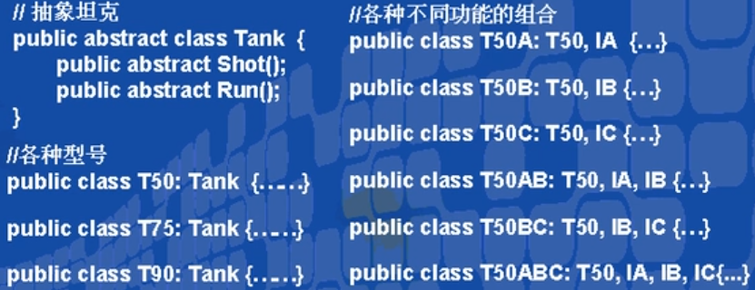
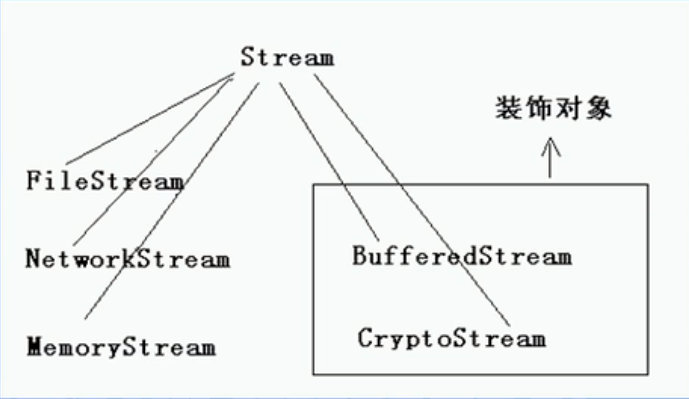

# 装饰模式（结构型模式）

---

## 1> 子类复子类，子类何其多

- 假如我们需要为游戏中开发一种坦克，除了各种不同型号的坦克外，我们还希望在不同场合中为其增加以下一种或多种功能：比如红外线夜视功能，比如水陆两栖功能，比如卫星定位功能等等。

- 

## 2> 动机(Motivation)

- 上述描述的问题根源在于我们“过度地使用了继承来扩展对象的功能”，由于继承为类型引入的静态特质，使得这种扩展方式缺乏灵活性；并且随着子类的增多(扩展功能的增多)，各种子类的组合(扩 展功能的组合)会导致更多子类的膨胀(多继承)

- 如何使“对象功能的扩展”能够根据需要来动态地实现？ 同时避免“扩展功能的增多’带来的子类膨胀问题?从而使得任何“功能扩展变化"所导致的影响将为最低?

## 3> 意图（Intent）

- 动态地给一个对象增加一些额外的职责。就增加功能而言, Decorator模式比生成子类更为灵活。

## 4> 结构（Structure）

- 

---

## 5> 为坦克的行为升级功能或者拓展

---

### 5.1 Tank基类与变种继承

```csharp
public abstract class Tank
{
    public abstract void Shot();
    public abstract void Run();
}
public class T50 : Tank//T50
{
public override void Run()
{
}
public override void Shot()
{
}
}
public class T90 : Tank//T90
{
public override void Run()
{
}
public override void Shot()
{
}
}
```

---

### 5.2 为坦克基类装饰方法

```csharp
public abstract class Decorator : Tank
    //专业修饰tank类，不是实体对象tank，作为修饰存在
{
    private Tank _tank;
    public Decorator(Tank tank)
    {
        this._tank = tank;
    }
    public override void Shot()
    {
        _tank.Shot();
    }
    public override void Run()
    {
        _tank.Run();
    }
}
public class DecoratorA : Decorator//功能拓展类A
{
    public DecoratorA(Tank tank) : base(tank) { }
    
    public override void Run()
    {
        //Do some extension//功能拓展
        //Do Run...
        base.Run();
    }
    public override void Shot()
    {
        //Do some extension
        //Do Shot...
        base.Shot();
    }
}public class DecoratorB : Decorator//功能拓展类B
{
public DecoratorB(Tank tank) : base(tank) { }

public override void Run()
{
//Do some extension//功能拓展
//Do Run...
base.Run();
}
public override void Shot()
{
//Do some extension
//Do Shot...
base.Shot();
}
}
```

---

### 5.3 App生产tank并添加新功能

```csharp
public class App
{
    static void Main(string[] args)
    {
        Tank tan50 = new T50();
        DecoratorA Tan50A = new DecoratorA(tan50);//对tan50拓展A功能
        DecoratorB Tan50AB = new DecoratorB(Tan50A);//对Tan50A拓展B功能
    }
}
```

---

## 6> Decorator模式的几个要点

- 通过采用组合、而非继承的手法，Decorator模式实现 了在运行时动态地扩展对象功能的能力，而且可以根据需要扩展多个功能。避免了单独使用继承带来的灵活性差”和“多子类衍生问题。

- Component类在Decorator模式中充当抽象接口的角色，不应该去现具体的行为。而且Decorator类对于Component类应该透明一换言之Component类无需知道Decorator类，Decorator类 是从外部来扩展Component类的功能。

- Decorator类在接口上表现为is-a Component的继承关系，即Decorator类继承了Component类所具有的接口。但在实现上又表现为拓展A功能的 Component的组合关系，即Decorator类 又使用了另外一个Component类。我们可以使用一个或者多个Decorator对象来“装饰”一个Component对象，且装饰后的对象仍然是一个Component对象。

- Decorator模式并非解决“多子类衍生的多继承”问题，Decorator模式应用的要点在于解决“主体类在多个方向上的扩展功能”是 为装饰的含义。

---

## 7> .NET框架中的Decorator应用

- 

---
