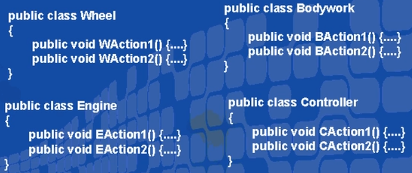
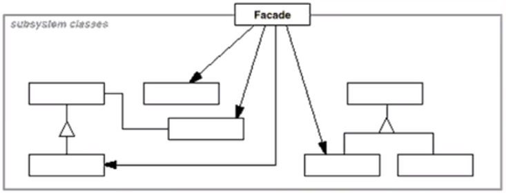

# 外观模式（结构型模式）

---

## 1> 系统的复杂度

》假设我们需要开发一个坦克模拟系统用于模拟坦克车在各种作战环境中的行为，其中坦克系统由引擎、控制器、车轮、车身等各子系统构成。

- 

---

## 2> 如何使用这样的系统

- 

》左侧方案系统内部系统和外部接口相耦合，复杂度提高。

》右侧方案组合只提供一个接口拓展外部接口，保护内部系统稳定。抵抗变化的能力比较大。

---

## 3> 动机（Motivation）

》上述A方案的问题在于组件的客户和组件中各种复杂的子系统有了过多的耦合，随着外部客户程序和各子系统的演化，这种过多的耦合面临很多变化的挑战。

》如何简化外部客户程序和系统间的交互接口？如何将外部客户程序的演化和内部子系统的变化之间的依赖相互解耦?

---

## 4> 意图（Intent）

》为子系统中的一组接口提供一个一致的界面，Facade模式定义了一个高层接口，这个接口使得这子系统更加容易使用。

---

## 5> 结构( Structure )

- 

---

## 6> tankFacade

》Tank各组件的耦合只在内部强耦合，在外部只有一个外部接口与外部功能相对接。

---

### 6.1 Tank内部细节

```c#
internal class Wheel
{
    public void WAction1() { }
    public void WAction2() { }
}
internal class Engine
{
    public void EAction1() { }
    public void EAction2() { }
}
internal class Bodywork
{
    public void BAction1() { }
    public void BAction2() { }
}
internal class Controller
{
    public void CAction1() { }
    public void CAction2() { }
}
```

---

### 6.2 Facade接口

```c#
public class TankFacade
{
    //子系统包含在内
    Wheel wheels = new Wheel();
    Engine engine = new Engine();
    Bodywork bodywork = new Bodywork();
    Controller controller = new Controller();
    //旨在Facade中使用各个tank组件功能，外部只能访问Facade的方法。
    public void Start() { }
    public void Run() { }
    public void Shot() { }
    public void Stop() { }
}
```

---

## 7> Facade模式的几个要点

》从客户程序的角度来看，Facade模 式不仅简化了整个组件系统的接口，同时对于组件内部与外部客户程序来说，从某种程度上也达到了一种“解耦”的效果——内部子系统的任何变化不会影响到Facade接口的变化。

》Facade设计模式更注重从架构的层次去看整个系统，而不是单个类的层次。Facade很多时候更是一种架构设计模式。

》注意区分Fagade模式、Adapter模式、Bridge模式与Decorator模式。Facade模式注重简化接口，Adapter 模式注重转换接口，Bridge模式注重分离接口(抽象)与其实现，Decorator模式注重稳定接口的前提下为对象扩展功能。

---
