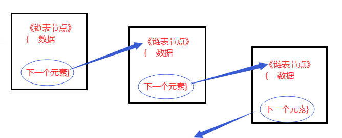

# C#简单集合与泛型集合

- 集合引用System.Collections
- 泛型集合引用System.Collections.Generic

---

## 1> 简单数据集合

---

### 1.1 ArrayList

- 动态数组ArrayList是C#封装好的类，本质是object的数组，

```csharp
      ArrayList arr = new ArrayList();
<增>: arr.Add(object obj);
      arr.AddRange(Collections);
<删>: arr.Remove(element);
      arr.RemoveAt(Index);
      arr.RemoveRange(index1,index2)
      arr.Clear();
<查>: arr.Contains(element);
      arr[index];
      arr.IndexOf(element);
      arr.LastIndexOf(element);
<改>: arr[index] = obj;
<插>: arr.Insert(index,value);
      arr.InsertRange(index,Collections);
<其他>: arr.Count;
        arr.Sort();//正序
        arr.Reserve();//倒序
```

- 优点：支持自动改变大小的功能，可以灵活的插入元素，增删查改。
- 缺点：和一般的数组一样，效率低，频繁装拆箱，不是类型安全的。

---

### 1.2 stack

- 栈：已封装，本质是object[]数组。

- 存储规则：栈存存储器，是一种先进后出的数据结构，先存入的数据后获取，后存入的数据先获取。

```csharp
stack stk = new stack();
<增>：压栈，stk.Push(object obj);
<取>：var a = stk.Pop();//顶层弹出
<查>：var b = stk.Peek();//查看顶层
      stk.Contains(element);
<清空>：stk.Clear();
<其他>：stk.Count;
```

- 遍历栈stack的时候，会从栈顶到栈底遍历。

---

### 1.3 Queue

- 队列是一种封装好的类，具有特殊的存储规则的object[]数组，特征是先进先出，先存入的数据先获取，后存入的数据后获取。

```csharp
     Queue que = new Queue();
 <增>：que.Enqueue(object obj);
 <取>：var a = que.Dequeue();//头部弹出
 <查>：var b = que.Peek();
       que.Contains(element);
 <清空>：que.Clear();
 //遍历的时候按照从头到尾的顺序
```

---

### 1.4 Hashtable

- 散列表基于键值对的哈希代码组织起来的。作用是提高数据查询的效率，使用键代替索引访问集合中的元素。

```csharp
    Hashtable ht = new Hashtable();
<增>：ht.Add(Key,Value)//object；
     ht[key] = value；
<删>：ht.Remove(key);//不存在无异常
     ht.Clear();
<查>：ht[key];//不存在返回空
     ht.Contains(Key);
     ht.ContainsKey(key);
     ht.ContainsValue(value);
<改>：只能改Key对应的值；ht[key] = new value;
<遍历>：遍历键 foreach ht.Keys;
       遍历值 foreach ht.Value;
       遍历键值：
       foreach (DictionaryEntry item in ht)
            { Console.WriteLine("" + item.Key + item.Value); }
迭代器遍历法：
  IDictionaryEnumerator myEnumerator = ht.GetEnumerator();
            bool flag = myEnumerator.MoveNext();
            while (flag)
            {
                Console.WriteLine(myEnumerator.Key);
                Console.WriteLine(myEnumerator.Value);
                flag = myEnumerator.MoveNext();
            }
```

---

## 2> 泛型数据集合

---

### 2.1 泛型

- 概念：泛型实现了数据变量类型参数化，达到了代码重用目的，通过数据类型参数化来实例同一份代码上操作多种类型。泛型T，R等相当于类型占位符，定义类或方法时使用替代符代表变量类型，当真正使用类或方法的时候在具体指定类型。

- 常见泛型分类：泛型类，泛型接口，泛型函数等。泛型类和普通类可以同名，但是属于两个类型。

- 作用：不同数据类型的对象的相同逻辑处理可以选择泛型。使用泛型可以一定程度上避免拆装箱操作。

---

### 2.2 泛型约束

- 泛型约束表示让泛型的类型偶遇一定的限制，用where声明约束条件：//6种

  - where T：struct（值类型）
  - class（引用类型）
  - new()（指定类型必须有公共无参构造函数）
  - 类名（某个类本身和派生类）
  - 接口名（某个接口的派生类型）
  - 另一个泛型字母（另一个泛型类型本身或者派生类型）

- 各约束讲解：
  - 值类型约束，引用类型约束，必须指定类型可以使用.
  - new（）：必须是具有公共无参构造的非抽象类型。
  - 类约束：限定T必须是此类型或者其子类。
  - 接口约束：限定接口及其派生接口或类。
  - 泛型类型约束：T1和T2一致类型或其派生。

- 约束的组合使用：
  - where T : class,new();//new()只能放在最后一个。
  - struct不能与new()搭配
  - struct，class，unmanaged，notnull，default不能组合或重复。

- 多个泛型：where T：~~ where R：~~；

---

### 2.3 List< T>

- List\<T>可变类型的泛型数组，增删改查遍历的方法与ArrayList相同，但List要求数据类型必须为T，且查阅时不能越界。

### 2.4 Dictionary<TKey,TValue>

- 拥有泛型类型的Hashtable，可以自定义类型的键值对。

```csharp
 foreach ( KeyValuePair<int,string> item in 
                        new Dictionary<int,string>() )
            {
                Console.WriteLine(item.Key);
                Console.WriteLine(item.Value);
            }
```

---

### 2.5 顺式存储和链式存储

- 数据结构是计算机存储，组织数据的方式或规则，指相互之间存在一种或多种特定关系的数据元素的集合。

- 常见的数据结构：数组，栈，队列，链表，树，图，堆，散列表。

- 线性表是一种数据结构，是由n个具体相同特征的数据元素的有序序列，如数组，ArrayList，Stack，Queue，链表等。

- 顺式存储和链式存储是数据结构中的两种存储结构：

>顺式存储：用一组地址连续的存储单元依次存储线性表的各个数据元素，数组，Stack，Queue，List，ArrayList是顺式存储，只是数组，Stack和Queue的组织规则不同而已。
>
>链式存储：用一组任意的存储单元存储线性表的各个数据元素，如单向链表，双向链表，循环链表。

---

### 2.6 单向链表

- 图解：

    

- 链表增加相对数组增加元素不会增加新的内存垃圾，链表的存储块与块之间存在一定的联络特性，各自的存储并不是连续相关的。

- 从增删改查的角度认为，链式存储的增删在计算上优于顺式存储，链式不用先数组等那样移动顺序，只改变关联顺序。顺式存储在查改上优于链式存储，可以直接通过索引器得到元素，链式需要遍历查找。

- 自定义单向链表：

```csharp
//待更新
```

---

### 2.7 LinkedList 泛型双向链表

- C#封装好，本质是可变类型的泛型双向链表。

- 关联类LinkedListNode（链表节点类）

```csharp
//声明：
  LinkedList<int> lik = new LinkedList<int>();
 //增：
  lik.AddLast(value); //尾部添加，value表示Node节点
  lik.AddFirst(value);//头部增加，
 //删：
  lik.RemoveFirst(firstNode);//移除头节点
  lik.RemoveLast(LastNode);//移除尾节点
  lik.Remove(Node);//移除某一个节点
  lik.Clear();
 //查
  LinkedListNode<int> firstNode = lik.First;
  LinkedListNode<int> LastNode = lik.Last;
  LinkedListNode<int> Node = lik.Find（Node）;
 //指定节点，无法索引只能遍历
 //插
  LinkedListNode<int> node = lik.Find(Node)
      lik.AddAfter(node,Node1);
      lik.AddBefore(node,Node2);
 //查
   lik.Contains(value)
 //改:先得到某个节点，再改该节点的值
   LinkedListNode<int> node = lik.Find(Node)
   node.value = new value;
 //遍历
    >  foreach(var item in lik){    //foreach遍历
            cw(item);
       }
    >  LinkedListNode<int> nowNode = lik.First;
       while (nowNode != null){     //从头节点开始
            cw(nowNode.Value);
            nowNode = nowNode.Nest;
       }
    >  LinkedListNode<int> nowNode = lik.Last;
       while (nowNode != null){     //从尾节点开始
            cw(nowNode.Value);
            nowNode = nowNode.Previous;
       }
```

---

### 2.8 泛型栈和队列

- Stack\<T>和Queue\<T>,与非泛型的对应集合用法一致，减少了类型的装箱拆箱。

---
