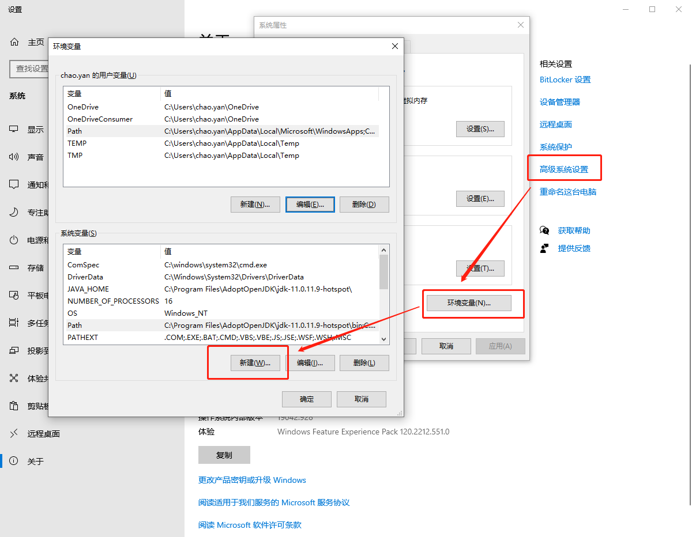

# Java简介

---

## 1> Java简介

* Java目前有甲骨文公司下的Sun公司在1995年创立的面向对象设计的编程语言，后续发展主要分为三个体系：JavaSE(标准版)，JavaEE(企业版)，JavaME(微型版)

---

## 2> 主要特性

* 语法与C和CSS接近，具有简单，面向对象，分布式，安全的，跨平台的，具有一定的可移植性，在任何的JVM环境中都可以运行，依赖于java虚拟机，性能高效，多线程特征，动态的。

---

## 3> 开发环境配置

>在官网下载集成的Java开发工具包，安装完成后配置环境变量：
* 需要配置三个变量名：**JAVA_HOME， CLASSPATH，Path**

* Android Studio开发安装时会自动配置好环境变量，或者也可手动配置

---

* 可以在VScode中下载Java全家桶插件配置Java环境，开发IDE有很多种，以VScode为主。

