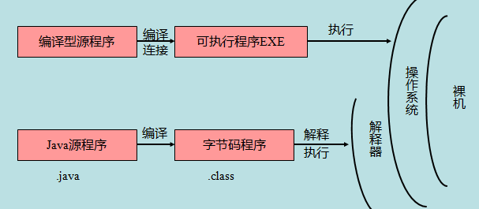

# Java 基础语法

* 一个 Java 程序可以认为是一系列对象的集合，拥有类，对象，方法，和实例变量的概念

---


## 1> HelloWorld

* 语法和 C#，C 相似
```java
public static void main(String[] args)
```
<访问修饰符> <语句修饰符> <返回类型> <方法名称> (参数列表)
```java
public class HelloWorld(){
  public static void main(String[] args){
    System.out.println("Hello World");
  }
}
```

---


## 2> 在命令行运行 HelloWorld

* 保存文本为：HelloWorld,java;
* 在所在文件夹运行 GitBase 测试，输入命令行指令（参考 git 板块）
```shell
$ javac HelloWorld.java
$ java HelloWorld 
```
>Javac 将*.java 文件编译成.CLASS 文件，供计算机读取。
* 可以在 VScode 环境下直接运行，和 Lua 的原理相似
* 保存的格式使用 UTF-8

---


## 3> 基本语法

* 大小写敏感，标识符大小写不同代表两个数据类型。
* 类名 Pascal 规则，方法名驼峰规则。
* 源文件名必须和类名(拥有Public修饰的类)一致，且大小写要一致，后缀为.java
* 主方法入口是：Main（string[] args）
* 标识符的命名规则与 C 保持一致

---


## 4> 修饰符

* 访问控制修饰符：default，public，protected，private
* 非访问控制修饰符：final，abstract，static，synchronized

---


## 5> 变量

* 局部变量，类变量(静态成员)和成员变量(非静态成员)

---


## 6> 数组

* 数组是储存在堆上的对象，可以保存多个同类型变量。

---


## 7> 枚举

* 枚举可以单独声明或者声明在类里面。方法、变量、构造函数也可以在枚举中定义。
* 与C#的常量组枚举有所区别，可以在java枚举中限制变量只能是预先设定好的值。
>定义果汁的大中小杯型号
```java
class FreshJuice {
   enum FreshJuiceSize{ SMALL, MEDIUM , LARGE }
   FreshJuiceSize size;
}
 
public class FreshJuiceTest {
   public static void main(String[] args){
      FreshJuice juice = new FreshJuice();
      juice.size = FreshJuice.FreshJuiceSize.MEDIUM  ;
   }
}
```

---


## 8> Java关键字

|类别|关键字|说明|
|:----|:----|:----|
|访问控制|private|私有的|
|    |protected|受保护的|
|    |public|公共的|
|    |default|默认|
|类、方法和变量修饰符|abstract|声明抽象|
|    |class|类|
|    |extends|扩充,继承|
|    |final|最终值,不可改变的|
|    |implements|实现（接口）|
|    |interface|接口|
|    |native|本地，原生方法（非 Java 实现）|
|    |new|新,创建|
|    |static|静态|
|    |strictfp|严格,精准|
|    |synchronized|线程,同步|
|    |transient|短暂|
|    |volatile|易失|
|程序控制语句|break|跳出循环|
|    |case|定义一个值以供 switch 选择|
|    |continue|继续|
|    |default|默认|
|    |do|运行|
|    |else|否则|
|    |for|循环|
|    |if|如果|
|    |instanceof|实例|
|    |return|返回|
|    |switch|根据值选择执行|
|    |while|循环|
|错误处理|assert|断言表达式是否为真|
|    |catch|捕捉异常|
|    |finally|有没有异常都执行|
|    |throw|抛出一个异常对象|
|    |throws|声明一个异常可能被抛出|
|    |try|捕获异常|
|包相关|import|引入|
|    |package|包|
|基本类型|boolean|布尔型|
|    |byte|字节型|
|    |char|字符型|
|    |double|双精度浮点|
|    |float|单精度浮点|
|    |int|整型|
|    |long|长整型|
|    |short|短整型|
|变量引用|super|父类,超类|
|    |this|本类|
|    |void|无返回值|
|保留关键字|goto|是关键字，但不能使用|
|    |const|是关键字，但不能使用|
|    |null|空|


---


## 9> 注释

* 单行：//
* 多行：/***/
* 文本注释：///
```java
public class HelloWorld {
   /* 这是第一个Java程序
    * 它将输出 Hello World
    * 这是一个多行注释的示例
    */
    public static void main(String[] args){
       // 这是单行注释的示例
       /* 这个也是单行注释的示例 */
       System.out.println("Hello World"); 
    }
}
```

---


## 10> 继承

* 在 Java 中，一个类可以由其他类派生。如果你要创建一个类，而且已经存在一个类具有你所需要的属性或方法，那么你可以将新创建的类继承该类。
* 利用继承的方法，可以重用已存在类的方法和属性，而不用重写这些代码。被继承的类称为超类（super class），派生类称为子类（subclass）

---


## 11> 接口

* 在 Java 中，接口可理解为对象间相互通信的协议。接口在继承中扮演着很重要的角色。
* 接口只定义派生要用到的方法，但是方法的具体实现完全取决于派生类。

---


## 12> 源程序与编译型运行的区别




---


