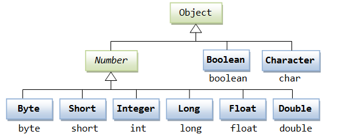
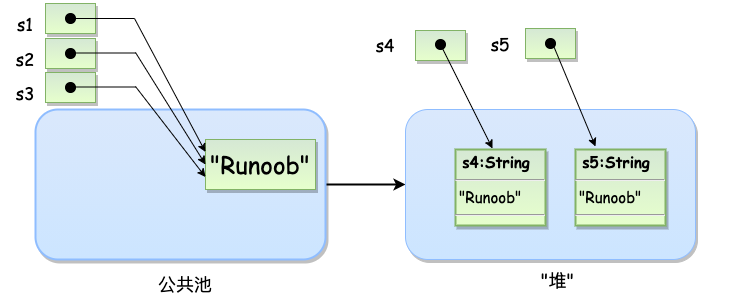
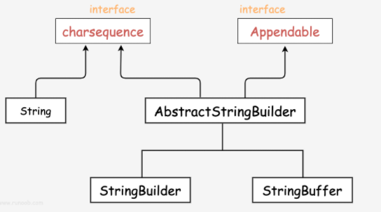
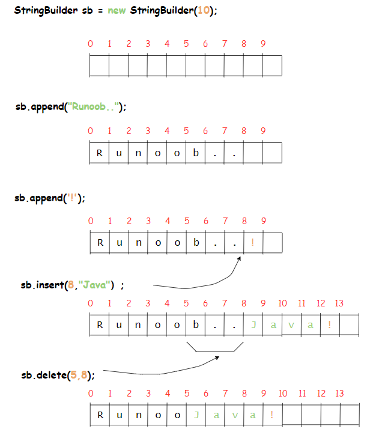
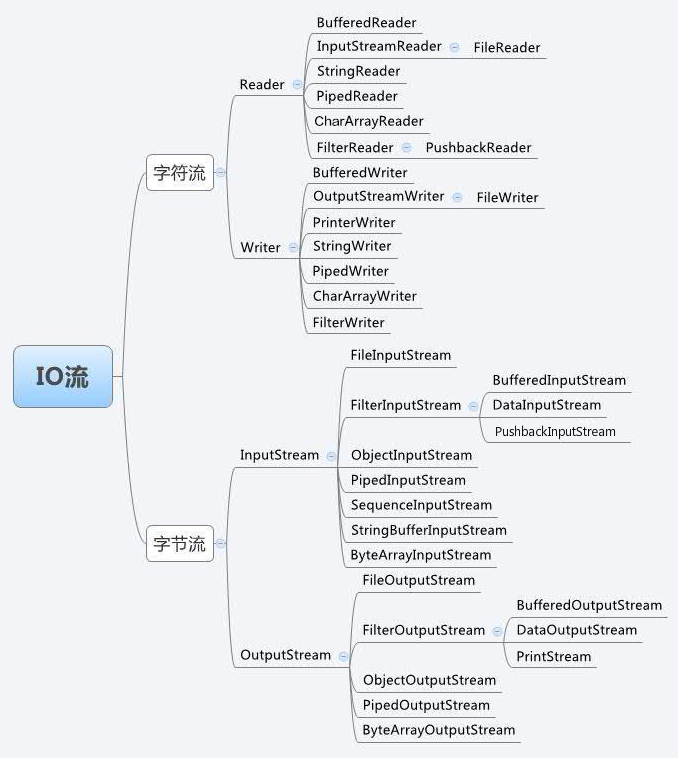

# Java 内置类


---


## 1> Number




---


## 2> Math

* Java 的 Math 包含了用于执行基本数学运算的属性和方法，如初等指数、对数、平方根和三角函数。
```java
public class Test {  
    public static void main (String []args)  
    {  
        System.out.println("90 度的正弦值：" + Math.sin(Math.PI/2));  
        System.out.println("0 度的余弦值：" + Math.cos(0));  
        System.out.println("60 度的正切值：" + Math.tan(Math.PI/3));  
        System.out.println("1 的反正切值： " + Math.atan(1));  
        System.out.println("π/2的角度值：" + Math.toDegrees(Math.PI/2));  
        System.out.println(Math.PI);  
    }  
}
```

---


## 3> Number&Math


---


### 3.1 xxxValue()

* xxxValue() 方法用于将 Number 对象转换为 xxx 数据类型的值并返回。
  
|byte|**byteValue() :**<br>以 byte 形式返回指定的数值。|
|:----|:----|
|abstract double|**doubleValue() :**<br>以 double 形式返回指定的数值。|
|abstract float|**floatValue() :**<br>以 float 形式返回指定的数值。|
|abstract int|**intValue() :**<br>以 int 形式返回指定的数值。|
|abstract long|**longValue() :**<br>以 long 形式返回指定的数值。|
|short|**shortValue() :**<br>以 short 形式返回指定的数值。|

```java
public class Test{ 
 
   public static void main(String args[]){
      Integer x = 5;
      // 返回 byte 原生数据类型
      System.out.println( x.byteValue() );
 
      // 返回 double 原生数据类型
      System.out.println(x.doubleValue());
 
      // 返回 long 原生数据类型
      System.out.println( x.longValue() );      
   }
}
```

---


### 3.2 compareTo()

* compareTo() 方法用于将 Number 对象与方法的参数进行比较。可用于比较 Byte, Long, Integer 等
* 该方法用于两个相同数据类型的比较，两个不同类型的数据不能用此方法来比较。
* 返回值：
    * 如果指定的数与参数相等返回 0。
    * 如果指定的数小于参数返回 -1。
    * 如果指定的数大于参数返回 1。
```java
public class Test{ 
   public static void main(String args[]){
      Integer x = 5;
      System.out.println(x.compareTo(3));
      System.out.println(x.compareTo(5));
      System.out.println(x.compareTo(8));            
     }
}
```

---


### 3.3 equals()

* equals() 方法用于判断 Number 对象与方法的参数进是否相等。
```java
public boolean equals(Object o)
```
* 如 Number 对象不为 Null，且与方法的参数类型与数值都相等返回 True，否则返回 False。
```java
public class Test{
        public static void main(String args[]){
                Integer x = 5;
                Integer y = 10;
                Integer z =5;
                Short a = 5;
                System.out.println(x.equals(y));  //false
                System.out.println(x.equals(z));  //true
                System.out.println(x.equals(a));  //false
        }
}
```

---


### 3.4toString()

* **toString():**返回表示 Integer 值的 String 对象。
* **toString(int i):**返回表示指定 int 的 String 对象。
```java
public class Test{
    public static void main(String args[]){
        Integer x = 5;
        System.out.println(x.toString());  
        System.out.println(Integer.toString(12)); 
    }
}
```

---
### 

### 3.5 parsexxx()/parseInt

* parseInt() 方法用于将字符串参数作为有符号的十进制整数进行解析。
* 如果方法有两个参数， 使用第二个参数指定的基数，将字符串参数解析为有符号的整数。
```java
static int parseInt(String s)
static int parseInt(String s, int radix)
```
* **s**-- 十进制表示的字符串。
* **radix**-- 指定的基数。
* **parseInt(String s):**返回用十进制参数表示的整数值。
* **parseInt(int i):**使用指定基数的字符串参数表示的整数 (基数可以是 10, 2, 8, 或 16 等进制数) 。
```java
public class Test{
    public static void main(String args[]){
        int x =Integer.parseInt("9");
        double c = Double.parseDouble("5");
        int b = Integer.parseInt("444",16);
        System.out.println(x); //9
        System.out.println(c); //5.0
        System.out.println(b); //1092
    }
}
```

---


### 3.6abs()

* 返回参数的绝对值
```java
double abs(double d)
float abs(float f)
int abs(int i)
long abs(long lng)
```

---


### 3.7 ceil()

* 对一个数进行上舍入，返回值大于或等于给定的参数，类型为双精度浮点数
```java
double ceil(double d)
double ceil(float f)
```

---


### 3.8 floor()

* 对一个数进行下舍入，返回值小于或等于给定的参数
```java
double ceil(double d)
double ceil(float f)
```

---


### 3.9 rint()

* 返回最接近参数的整数值。
```java
double rint(double d)
Math.rint(100.500)=100.0;
//rint() 方法返回最接近参数的整数值。若存在两个这样的数，则返回其中的偶数值：
Math.rint(101.500)=102.0;
```

---


### 3.10 valueOf()

* valueOf() 方法用于返回给定参数的原生 Number 对象值，参数可以是原生数据类型, String 等。
* 该方法是静态方法。该方法可以接收两个参数一个是字符串，一个是基数。
```java
static Integer valueOf(int i)
static Integer valueOf(String s)
static Integer valueOf(String s, int radix)
public class Test{
public static void main(String args[]){
                Integer x =Integer.valueOf(9);
                Double c = Double.valueOf(5);
                Float a = Float.valueOf("80");              
                Integer b = Integer.valueOf("444",16);   // 使用 16 进制
                System.out.println(x); //9
                System.out.println(c); //5.0
                System.out.println(a); //80.0
                System.out.println(b); //1092
        }
}
```

---


### 3.11 round()

- **round**表示"**四舍五入**"，算法为**Math.floor(x+0.5)**，即将原来的数字加上 0.5 后再向下取整，所以**Math.round(11.5)**的结果为 12，Math.round(-11.5) 的结果为 -11。


---


### 3.12 其他

* min(x,y),max() 最小值最大值
* exp(x)。方法用于返回自然数底数 e 的参数次方。
* log(x)。返回参数的自然数底数的对数值。
* pow(x,y)。返回 x 的 y 次方。
* sqrt(a)。a 的算数平方根。
* sin(),cos(),tan()，三角函数
* asin(),acos(),atan()，反三角函数
* atan2(x，y) ,用于将矩形坐标 (x, y) 转换成极坐标 (r, theta)，返回所得角 theta。该方法通过计算 y/x 的反正切值来计算相角 theta，范围为从 -pi 到 pi。
* toDegrees(x) 转化成角度值
* toRadians(x) 将角度转换成弧度
* random(), 在 0.0~1.0 之间的随机数

---


## 4> Character

* Character 类用于对单个字符进行操作。
* Character 类在对象中包装一个基本类型 char 的值
* 在实际开发过程中，我们经常会遇到需要使用对象，而不是内置数据类型的情况。为了解决这个问题，Java 语言为内置数据类型 char 提供了包装类 Character 类。
* Character 类提供了一系列方法来操纵字符。你可以使用 Character 的构造方法创建一个 Character 类对象
```java
// 原始字符 'a' 装箱到 Character 对象 ch 中
Character ch = 'a';
 
// 原始字符 'x' 用 test 方法装箱
// 返回拆箱的值到 'c'
char c = test('x');
```

---


>常见方法

|isLetter()|是否是一个字母|
|:----|:----|
|isDigit()|是否是一个数字字符|
|isWhitespace()|是否是一个空白字符|
|isUpperCase()|是否是大写字母|
|isLowerCase()|是否是小写字母|
|toUpperCase()|指定字母的大写形式|
|toLowerCase()|指定字母的小写形式|
|toString()|返回字符的字符串形式，字符串的长度仅为 1|


---


## 5> String

* 字符串广泛应用 在 Java 编程中，在 Java 中字符串属于对象，Java 提供了 String 类来创建和操作字符串。
```java
String s1 = "Runoob";              // String 直接创建
String s2 = "Runoob";              // String 直接创建
String s3 = s1;                    // 相同引用
String s4 = new String("Runoob");   // String 对象创建
String s5 = new String("Runoob");   // String 对象创建
```
* String 创建的字符串存储在公共池中，而 new 创建的字符串对象在堆上：



* String 类是不可改变的，所以你一旦创建了 String 对象，那它的值就无法改变了

---


### 5.1 字符串的长度 length()

```java
public class StringDemo {
    public static void main(String args[]) {
        String site = "Java_Hello";
        int len = site.length();
        System.out.println( "The str length is " + len );
   }
}
```

---


### 5.2 连接字符串 concat()

```java
string1.concat(string2);
//str1+str2
```

---


### 5.3 创建格式化字符串

* 输出格式化数字可以使用 printf() 和 format() 方法。
* String 类使用静态方法 format() 返回一个String 对象而不是 PrintStream 对象。
* String 类的静态方法 format() 能用来创建可复用的格式化字符串，而不仅仅是用于一次打印输出。
```java
String fs;
fs = String.format("浮点型变量的值为 " +
"%f, 整型变量的值为 " +
" %d, 字符串变量的值为 " +
" %s", floatVar, intVar, stringVar);
```

---


### 5.4 String方法参考

|1|[char charAt(int index)](https://www.runoob.com/java/java-string-charat.html?fileGuid=9dvkrJHKg66hJyXG)<br>返回指定索引处的 char 值。|
|:----|:----|
|2|[int compareTo(Object o)](https://www.runoob.com/java/java-string-compareto.html?fileGuid=9dvkrJHKg66hJyXG)<br>把这个字符串和另一个对象比较。|
|3|[int compareTo(String anotherString)](https://www.runoob.com/java/java-string-compareto.html?fileGuid=9dvkrJHKg66hJyXG)<br>按字典顺序比较两个字符串。|
|4|[int compareToIgnoreCase(String str)](https://www.runoob.com/java/java-string-comparetoignorecase.html?fileGuid=9dvkrJHKg66hJyXG)<br>按字典顺序比较两个字符串，不考虑大小写。|
|5|[String concat(String str)](https://www.runoob.com/java/java-string-concat.html?fileGuid=9dvkrJHKg66hJyXG)<br>将指定字符串连接到此字符串的结尾。|
|6|[boolean contentEquals(StringBuffer sb)](https://www.runoob.com/java/java-string-contentequals.html?fileGuid=9dvkrJHKg66hJyXG)<br>当且仅当字符串与指定的StringBuffer有相同顺序的字符时候返回真。|
|7|[static String copyValueOf(char[] data)](https://www.runoob.com/java/java-string-copyvalueof.html?fileGuid=9dvkrJHKg66hJyXG)<br>返回指定数组中表示该字符序列的 String。|
|8|[static String copyValueOf(char[] data, int offset, int count)](https://www.runoob.com/java/java-string-copyvalueof.html?fileGuid=9dvkrJHKg66hJyXG)<br>返回指定数组中表示该字符序列的 String。|
|9|[boolean endsWith(String suffix)](https://www.runoob.com/java/java-string-endswith.html?fileGuid=9dvkrJHKg66hJyXG)<br>测试此字符串是否以指定的后缀结束。|
|10|[boolean equals(Object anObject)](https://www.runoob.com/java/java-string-equals.html?fileGuid=9dvkrJHKg66hJyXG)<br>将此字符串与指定的对象比较。|
|11|[boolean equalsIgnoreCase(String anotherString)](https://www.runoob.com/java/java-string-equalsignorecase.html?fileGuid=9dvkrJHKg66hJyXG)<br>将此 String 与另一个 String 比较，不考虑大小写。|
|12|[byte[] getBytes()](https://www.runoob.com/java/java-string-getbytes.html?fileGuid=9dvkrJHKg66hJyXG)<br>使用平台的默认字符集将此 String 编码为 byte 序列，并将结果存储到一个新的 byte 数组中。|
|13|[byte[] getBytes(String charsetName)](https://www.runoob.com/java/java-string-getbytes.html?fileGuid=9dvkrJHKg66hJyXG)<br>使用指定的字符集将此 String 编码为 byte 序列，并将结果存储到一个新的 byte 数组中。|
|14|[void getChars(int srcBegin, int srcEnd, char[] dst, int dstBegin)](https://www.runoob.com/java/java-string-getchars.html?fileGuid=9dvkrJHKg66hJyXG)<br>将字符从此字符串复制到目标字符数组。|
|15|[int hashCode()](https://www.runoob.com/java/java-string-hashcode.html?fileGuid=9dvkrJHKg66hJyXG)<br>返回此字符串的哈希码。|
|16|[int indexOf(int ch)](https://www.runoob.com/java/java-string-indexof.html?fileGuid=9dvkrJHKg66hJyXG)<br>返回指定字符在此字符串中第一次出现处的索引。|
|17|[int indexOf(int ch, int fromIndex)](https://www.runoob.com/java/java-string-indexof.html?fileGuid=9dvkrJHKg66hJyXG)<br>返回在此字符串中第一次出现指定字符处的索引，从指定的索引开始搜索。|
|18|[int indexOf(String str)](https://www.runoob.com/java/java-string-indexof.html?fileGuid=9dvkrJHKg66hJyXG)<br>返回指定子字符串在此字符串中第一次出现处的索引。|
|19|[int indexOf(String str, int fromIndex)](https://www.runoob.com/java/java-string-indexof.html?fileGuid=9dvkrJHKg66hJyXG)<br>返回指定子字符串在此字符串中第一次出现处的索引，从指定的索引开始。|
|20|[String intern()](https://www.runoob.com/java/java-string-intern.html?fileGuid=9dvkrJHKg66hJyXG)<br>返回字符串对象的规范化表示形式。|
|21|[int lastIndexOf(int ch)](https://www.runoob.com/java/java-string-lastindexof.html?fileGuid=9dvkrJHKg66hJyXG)<br>返回指定字符在此字符串中最后一次出现处的索引。|
|22|[int lastIndexOf(int ch, int fromIndex)](https://www.runoob.com/java/java-string-lastindexof.html?fileGuid=9dvkrJHKg66hJyXG)<br>返回指定字符在此字符串中最后一次出现处的索引，从指定的索引处开始进行反向搜索。|
|23|[int lastIndexOf(String str)](https://www.runoob.com/java/java-string-lastindexof.html?fileGuid=9dvkrJHKg66hJyXG)<br>返回指定子字符串在此字符串中最右边出现处的索引。|
|24|[int lastIndexOf(String str, int fromIndex)](https://www.runoob.com/java/java-string-lastindexof.html?fileGuid=9dvkrJHKg66hJyXG)<br>返回指定子字符串在此字符串中最后一次出现处的索引，从指定的索引开始反向搜索。|
|25|[int length()](https://www.runoob.com/java/java-string-length.html?fileGuid=9dvkrJHKg66hJyXG)<br>返回此字符串的长度。|
|26|[boolean matches(String regex)](https://www.runoob.com/java/java-string-matches.html?fileGuid=9dvkrJHKg66hJyXG)<br>告知此字符串是否匹配给定的正则表达式。|
|27|[boolean regionMatches(boolean ignoreCase, int toffset, String other, int ooffset, int len)](https://www.runoob.com/java/java-string-regionmatches.html?fileGuid=9dvkrJHKg66hJyXG)<br>测试两个字符串区域是否相等。|
|28|[boolean regionMatches(int toffset, String other, int ooffset, int len)](https://www.runoob.com/java/java-string-regionmatches.html?fileGuid=9dvkrJHKg66hJyXG)<br>测试两个字符串区域是否相等。|
|29|[String replace(char oldChar, char newChar)](https://www.runoob.com/java/java-string-replace.html?fileGuid=9dvkrJHKg66hJyXG)<br>返回一个新的字符串，它是通过用 newChar 替换此字符串中出现的所有 oldChar 得到的。|
|30|[String replaceAll(String regex, String replacement)](https://www.runoob.com/java/java-string-replaceall.html?fileGuid=9dvkrJHKg66hJyXG)<br>使用给定的 replacement 替换此字符串所有匹配给定的正则表达式的子字符串。|
|31|[String replaceFirst(String regex, String replacement)](https://www.runoob.com/java/java-string-replacefirst.html?fileGuid=9dvkrJHKg66hJyXG)<br>使用给定的 replacement 替换此字符串匹配给定的正则表达式的第一个子字符串。|
|32|[String[] split(String regex)](https://www.runoob.com/java/java-string-split.html?fileGuid=9dvkrJHKg66hJyXG)<br>根据给定正则表达式的匹配拆分此字符串。|
|33|[String[] split(String regex, int limit)](https://www.runoob.com/java/java-string-split.html?fileGuid=9dvkrJHKg66hJyXG)<br>根据匹配给定的正则表达式来拆分此字符串。|
|34|[boolean startsWith(String prefix)](https://www.runoob.com/java/java-string-startswith.html?fileGuid=9dvkrJHKg66hJyXG)<br>测试此字符串是否以指定的前缀开始。|
|35|[boolean startsWith(String prefix, int toffset)](https://www.runoob.com/java/java-string-startswith.html?fileGuid=9dvkrJHKg66hJyXG)<br>测试此字符串从指定索引开始的子字符串是否以指定前缀开始。|
|36|[CharSequence subSequence(int beginIndex, int endIndex)](https://www.runoob.com/java/java-string-subsequence.html?fileGuid=9dvkrJHKg66hJyXG)<br>返回一个新的字符序列，它是此序列的一个子序列。|
|37|[String substring(int beginIndex)](https://www.runoob.com/java/java-string-substring.html?fileGuid=9dvkrJHKg66hJyXG)<br>返回一个新的字符串，它是此字符串的一个子字符串。|
|38|[String substring(int beginIndex, int endIndex)](https://www.runoob.com/java/java-string-substring.html?fileGuid=9dvkrJHKg66hJyXG)<br>返回一个新字符串，它是此字符串的一个子字符串。|
|39|[char[] toCharArray()](https://www.runoob.com/java/java-string-tochararray.html?fileGuid=9dvkrJHKg66hJyXG)<br>将此字符串转换为一个新的字符数组。|
|40|[String toLowerCase()](https://www.runoob.com/java/java-string-tolowercase.html?fileGuid=9dvkrJHKg66hJyXG)<br>使用默认语言环境的规则将此 String 中的所有字符都转换为小写。|
|41|[String toLowerCase(Locale locale)](https://www.runoob.com/java/java-string-tolowercase.html?fileGuid=9dvkrJHKg66hJyXG)<br>使用给定 Locale 的规则将此 String 中的所有字符都转换为小写。|
|42|[String toString()](https://www.runoob.com/java/java-string-tostring.html?fileGuid=9dvkrJHKg66hJyXG)<br>返回此对象本身（它已经是一个字符串！）。|
|43|[String toUpperCase()](https://www.runoob.com/java/java-string-touppercase.html?fileGuid=9dvkrJHKg66hJyXG)<br>使用默认语言环境的规则将此 String 中的所有字符都转换为大写。|
|44|[String toUpperCase(Locale locale)](https://www.runoob.com/java/java-string-touppercase.html?fileGuid=9dvkrJHKg66hJyXG)<br>使用给定 Locale 的规则将此 String 中的所有字符都转换为大写。|
|45|[String trim()](https://www.runoob.com/java/java-string-trim.html?fileGuid=9dvkrJHKg66hJyXG)<br>返回字符串的副本，忽略前导空白和尾部空白。|
|46|[static String valueOf(primitive data type x)](https://www.runoob.com/java/java-string-valueof.html?fileGuid=9dvkrJHKg66hJyXG)<br>返回给定data type类型x参数的字符串表示形式。|
|47|[contains(CharSequence chars)](https://www.runoob.com/java/java-string-contains.html?fileGuid=9dvkrJHKg66hJyXG)<br>判断是否包含指定的字符系列。|
|48|[isEmpty()](https://www.runoob.com/java/java-string-isempty.html?fileGuid=9dvkrJHKg66hJyXG)<br>判断字符串是否为空。|


---


### 5.5 转义字符

|\t|在文中该处插入一个tab键|
|:----|:----|
|\b|在文中该处插入一个后退键|
|\n|在文中该处换行|
|\r|在文中该处插入回车|
|\f|在文中该处插入换页符|
|\'|在文中该处插入单引号|
|\"|在文中该处插入双引号|
|\\|在文中该处插入反斜杠|


---


## 6> Java StringBuffer 和 StringBuilder 类

>当对字符串进行修改的时候，需要使用 StringBuffer 和 StringBuilder 类。
* 和 String 类不同的是，StringBuffer 和 StringBuilder 类的对象能够被多次的修改，并且不产生新的未使用对象。



* 在使用 StringBuffer 类时，每次都会对 StringBuffer 对象本身进行操作，而不是生成新的对象，所以如果需要对字符串进行修改推荐使用 StringBuffer。
* StringBuilder 类在 Java 5 中被提出，它和 StringBuffer 之间的最大不同在于 StringBuilder 的方法不是线程安全的（不能同步访问）。
* 由于 StringBuilder 相较于 StringBuffer 有速度优势，所以多数情况下建议使用 StringBuilder 类
```java
public class RunoobTest{
    public static void main(String args[]){
        StringBuilder sb = new StringBuilder(10);
        sb.append("Runoob..");
        System.out.println(sb);  
        sb.append("!");
        System.out.println(sb); 
        sb.insert(8, "Java");
        System.out.println(sb); 
        sb.delete(5,8);
        System.out.println(sb);  
    }
}
```


* 常见方法和String类似

---


## 7> Date(java.util.Date)

* 用来封装当前的日期和时间，Date提供两个构造函数来实例化Date对象
```java
第一个构造函数使用当前日期和时间来初始化对象。
Date( )
第二个构造函数接收一个参数，该参数是从1970年1月1日起的毫秒数。
Date(long millisec)
```

---


>常用方法

|1|**boolean after(Date date)**<br>若当调用此方法的Date对象在指定日期之后返回true,否则返回false。|
|:----|:----|
|2|**boolean before(Date date)**<br>若当调用此方法的Date对象在指定日期之前返回true,否则返回false。|
|3|**Object clone( )**<br>返回此对象的副本。|
|4|**int compareTo(Date date)**<br>比较当调用此方法的Date对象和指定日期。两者相等时候返回0。调用对象在指定日期之前则返回负数。调用对象在指定日期之后则返回正数。|
|5|**int compareTo(Object obj)**<br>若obj是Date类型则操作等同于compareTo(Date) 。否则它抛出ClassCastException。|
|6|**boolean equals(Object date)**<br>当调用此方法的Date对象和指定日期相等时候返回true,否则返回false。|
|7|**long getTime( )**<br>返回自 1970 年 1 月 1 日 00:00:00 GMT 以来此 Date 对象表示的毫秒数。|
|8|**int hashCode( )**<br>返回此对象的哈希码值。|
|9|**void setTime(long time)**<br>用自1970年1月1日00:00:00 GMT以后time毫秒数设置时间和日期。|
|10|**String toString( )**<br>把此 Date 对象转换为以下形式的 String： dow mon dd hh:mm:ss zzz yyyy 其中： dow 是一周中的某一天 (Sun, Mon, Tue, Wed, Thu, Fri, Sat)。|


---


### 7.1 获取当前的时间

```java
import java.util.Date;
  
public class DateDemo {
   public static void main(String args[]) {
       // 初始化 Date 对象
       Date date = new Date();
        
       // 使用 toString() 函数显示日期时间
       System.out.println(date.toString());
   }
}
```

---


### 7.2 日期比较

>Java使用以下三种方法来比较两个日期：
* 使用 getTime() 方法获取两个日期（自1970年1月1日经历的毫秒数值），然后比较这两个值。
* 使用方法 before()，after() 和 equals()。例如，一个月的12号比18号早，则 new Date(99, 2, 12).before(new Date (99, 2, 18)) 返回true。
* 使用 compareTo() 方法，它是由 Comparable 接口定义的，Date 类实现了这个接口。

---


### 7.3 SimpleDateFormat格式化日期

* SimpleDateFormat 是一个以语言环境敏感的方式来格式化和分析日期的类。SimpleDateFormat 允许你选择任何用户自定义日期时间格式来运行。
```java
import java.util.*;
import java.text.*;
public class DateDemo {
   public static void main(String args[]) {
      Date dNow = new Date( );
      SimpleDateFormat ft = 
      new SimpleDateFormat ("E yyyy.MM.dd 'at' hh:mm:ss a zzz");
      System.out.println("Current Date: " + ft.format(dNow));
   }
}////Current Date: Wed 2016.11.09 at 08:23:19 AM UTC
```
* 这一行代码确立了转换的格式，其中 yyyy 是完整的公元年，MM 是月份，dd 是日期，HH:mm:ss 是时、分、秒。
* 注意:  有的格式大写，有的格式小写，例如 MM 是月份，mm 是分；HH 是 24 小时制，而 hh 是 12 小时制。

---


### 7.4 日期和时间的格式化编码

|G|纪元标记|AD|
|:----|:----|:----|
|y|四位年份|2001|
|M|月份|July or 07|
|d|一个月的日期|10|
|h|A.M./P.M. (1~12)格式小时|12|
|H|一天中的小时 (0~23)|22|
|m|分钟数|30|
|s|秒数|55|
|S|毫秒数|234|
|E|星期几|Tuesday|
|D|一年中的日子|360|
|F|一个月中第几周的周几|2 (second Wed. in July)|
|w|一年中第几周|40|
|W|一个月中第几周|1|
|a|A.M./P.M. 标记|PM|
|k|一天中的小时(1~24)|24|
|K|A.M./P.M. (0~11)格式小时|10|
|z|时区|Eastern Standard Time|
|'|文字定界符|Delimiter|
|"|单引号|`|


---


### 7.5 使用printf格式化日期

* printf 方法可以很轻松地格式化时间和日期。使用两个字母格式，它以 %t 开头并且以下面表格中的一个字母结尾。
  
|转  换  符|说    明|示    例|
|:----|:----|:----|
|c|包括全部日期和时间信息|星期六 十月 27 14:21:20 CST 2007|
|F|"年-月-日"格式|2007-10-27|
|D|"月/日/年"格式|10/27/07|
|r|"HH:MM:SS PM"格式（12时制）|02:25:51 下午|
|T|"HH:MM:SS"格式（24时制）|14:28:16|
|R|"HH:MM"格式（24时制）|14:28|

```java
import java.util.Date;
 
public class DateDemo {
 
  public static void main(String args[]) {
     // 初始化 Date 对象
     Date date = new Date();
 
     //c的使用  
    System.out.printf("全部日期和时间信息：%tc%n",date); //%n表示换行         
    //f的使用  
    System.out.printf("年-月-日格式：%tF%n",date);  
    //d的使用  
    System.out.printf("月/日/年格式：%tD%n",date);  
    //r的使用  
    System.out.printf("HH:MM:SS PM格式（12时制）：%tr%n",date);  
    //t的使用  
    System.out.printf("HH:MM:SS格式（24时制）：%tT%n",date);  
    //R的使用  
    System.out.printf("HH:MM格式（24时制）：%tR",date);  
  }
}
/*
* 全部日期和时间信息：星期一 九月 10 10:43:36 CST 2012  
* 年-月-日格式：2012-09-10  
* 月/日/年格式：09/10/12  
* HH:MM:SS PM格式（12时制）：10:43:36 上午  
* HH:MM:SS格式（24时制）：10:43:36  
* HH:MM格式（24时制）：10:43  
*/
```

---


* 如果你需要重复提供日期，那么利用这种方式来格式化它的每一部分就有点复杂了。因此，可以利用一个格式化字符串指出要被格式化的参数的索引。
* 索引必须紧跟在%后面，而且必须以$结束。
```java
import java.util.Date;
  
public class DateDemo {
 
   public static void main(String args[]) {
       // 初始化 Date 对象
       Date date = new Date();
        
       // 使用toString()显示日期和时间
       System.out.printf("%1$s %2$tB %2$td, %2$tY", 
                         "Due date:", date);
   }
   //%1$s表示第一个位置是String "Due date:"
}
```
>可以使用 < 标志。它表明先前被格式化的参数要被再次使用。
```java
import java.util.Date;

public class DateDemo {

public static void main(String args[]) {
// 初始化 Date 对象
Date date = new Date();

// 显示格式化时间
System.out.printf("%s %tB %<te, %<tY",
"Due date:", date);
}//<表示将继续使用date参数
}
```

---


>参考
```java
import java.util.*;

public class DateDemo {
public static void main(String args[]) {
Date date=new Date();
//b的使用，月份简称
String str=String.format(Locale.US,"英文月份简称：%tb",date);
System.out.println(str);
System.out.printf("本地月份简称：%tb%n",date);
//B的使用，月份全称
str=String.format(Locale.US,"英文月份全称：%tB",date);
System.out.println(str);
System.out.printf("本地月份全称：%tB%n",date);
//a的使用，星期简称
str=String.format(Locale.US,"英文星期的简称：%ta",date);
System.out.println(str);
//A的使用，星期全称
System.out.printf("本地星期的简称：%tA%n",date);
//C的使用，年前两位
System.out.printf("年的前两位数字（不足两位前面补0）：%tC%n",date);
//y的使用，年后两位
System.out.printf("年的后两位数字（不足两位前面补0）：%ty%n",date);
//j的使用，一年的天数
System.out.printf("一年中的天数（即年的第几天）：%tj%n",date);
//m的使用，月份
System.out.printf("两位数字的月份（不足两位前面补0）：%tm%n",date);
//d的使用，日（二位，不够补零）
System.out.printf("两位数字的日（不足两位前面补0）：%td%n",date);
//e的使用，日（一位不补零）
System.out.printf("月份的日（前面不补0）：%te",date);
}
}
//------------------------------------
/*
* 英文月份简称：May
* 本地月份简称：五月
* 英文月份全称：May
* 本地月份全称：五月
* 英文星期的简称：Thu
* 本地星期的简称：星期四
* 年的前两位数字（不足两位前面补0）：20
* 年的后两位数字（不足两位前面补0）：17
* 一年中的天数（即年的第几天）：124
* 两位数字的月份（不足两位前面补0）：05
* 两位数字的日（不足两位前面补0）：04
* 月份的日（前面不补0）：4
*/
```

---


### 7.6 解析字符串为时间SimpleDateFormat.parse()

* SimpleDateFormat 类有一些附加的方法，特别是parse()，它试图按照给定的SimpleDateFormat 对象的格式化存储来解析字符串。
```java
import java.util.*;
import java.text.*;
  
public class DateDemo {
 
   public static void main(String args[]) {
      SimpleDateFormat ft = new SimpleDateFormat ("yyyy-MM-dd"); 
 
      String input = args.length == 0 ? "1818-11-11" : args[0]; 
 
      System.out.print(input + " Parses as "); 
 
      Date t; 
 
      try { 
          t = ft.parse(input); 
          System.out.println(t); 
      } catch (ParseException e) { 
          System.out.println("Unparseable using " + ft); 
      }
   } //1818-11-11 Parses as Wed Nov 11 00:00:00 CST 1818
}
```

---


### 7.7 Java休眠

* sleep()使当前线程进入停滞状态（阻塞当前线程），让出cpu的使用、目的是不让当前线程独占该进程所获取的CPU资源。
```java
import java.util.*;
  
public class SleepDemo {
   public static void main(String args[]) {
      try { 
         System.out.println(new Date( ) + "\n"); 
         Thread.sleep(1000*3);   // 休眠3秒
         System.out.println(new Date( ) + "\n"); 
      } catch (Exception e) { 
          System.out.println("Got an exception!"); 
      }
   }
}
```

---


### 7.8 测量时间

```java
import java.util.*;

public class DiffDemo {

public static void main(String args[]) {
try {
long start = System.currentTimeMillis( );
System.out.println(new Date( ) + "\n");
Thread.sleep(5*60*10);
System.out.println(new Date( ) + "\n");
long end = System.currentTimeMillis( );
long diff = end - start;
System.out.println("Difference is : " + diff);
} catch (Exception e) {
System.out.println("Got an exception!");
}
}
}
```

---


## 8> Java流，文件和IO

* Java.io 包几乎包含了所有操作输入、输出需要的类。所有这些流类代表了输入源和输出目标。
* Java.io 包中的流支持很多种格式，比如：基本类型、对象、本地化字符集等等。
* 一个流可以理解为一个数据的序列。输入流表示从一个源读取数据，输出流表示向一个目标写数据。
* Java 为 I/O 提供了强大的而灵活的支持，使其更广泛地应用到文件传输和网络编程中。

---


### 8.1 读取控制台输入

* Java 的控制台输入由 System.in 完成。为了获得一个绑定到控制台的字符流，你可以把 System.in 包装在一个 BufferedReader 对象中来创建一个字符流。
```java
BufferedReader br = new BufferedReader(new 
                      InputStreamReader(System.in));
```
* BufferedReader 对象创建后，我们便可以使用 read() 方法从控制台读取一个字符，或者用 readLine() 方法读取一个字符串。
```java
//使用 BufferedReader 在控制台读取字符
 
import java.io.*;
 
public class BRRead {
    public static void main(String[] args) throws IOException {
        char c;
        // 使用 System.in 创建 BufferedReader
        BufferedReader br = new BufferedReader(new InputStreamReader(System.in));
        System.out.println("输入字符, 按下 'q' 键退出。");
        // 读取字符
        do {
            c = (char) br.read();
            System.out.println(c);
        } while (c != 'q');
    }
}
```

---


### 8.2 从控制台读取字符串

* 从标准输入读取一个字符串需要使用 BufferedReader 的 readLine() 方法
```java
//使用 BufferedReader 在控制台读取字符
import java.io.*;
 
public class BRReadLines {
    public static void main(String[] args) throws IOException {
        // 使用 System.in 创建 BufferedReader
        BufferedReader br = new BufferedReader(new InputStreamReader(System.in));
        String str;
        System.out.println("Enter lines of text.");
        System.out.println("Enter 'end' to quit.");
        do {
            str = br.readLine();
            System.out.println(str);
        } while (!str.equals("end"));
    }
}
```

---


### 8.3 控制台输出

* 控制台的输出由 print( ) 和 println() 完成。这些方法都由类 PrintStream 定义，System.out 是该类对象的一个引用。
* PrintStream 继承了 OutputStream类，并且实现了方法 write()。这样，write() 也可以用来往控制台写操作。
```java
import java.io.*;
 
//演示 System.out.write().
public class WriteDemo {
    public static void main(String[] args) {
        int b;
        b = 'A';
        System.out.write(b);
        System.out.write('\n');
    }
}
```

---


### 8.4 读写文件

* 一个流被定义为一个数据序列。**输入流**用于从源读取数据，**输出流**用于向目标写数据。
>输入流和输出流的类层次图




---


### 8.5 FileInputStream

* 该流用于从文件读取数据，有多种构造方法可用来创建对象。
* 可以使用字符串类型的文件名来创建一个输入流对象来读取文件：
```java
InputStream f = new FileInputStream(FilePath_str 或 new File(filePath));
```
>流方法

|1|**public void close() throws IOException{}**<br>关闭此文件输入流并释放与此流有关的所有系统资源。抛出IOException异常。|
|:----|:----|
|2|**protected void finalize()throws IOException {}**<br>这个方法清除与该文件的连接。确保在不再引用文件输入流时调用其 close 方法。抛出IOException异常。|
|3|**public int read(int r)throws IOException{}**<br>这个方法从 InputStream 对象读取指定字节的数据。返回为整数值。返回下一字节数据，如果已经到结尾则返回-1。|
|4|**public int read(byte[] r) throws IOException{}**<br>这个方法从输入流读取r.length长度的字节。返回读取的字节数。如果是文件结尾则返回-1。|
|5|**public int available() throws IOException{}**<br>返回下一次对此输入流调用的方法可以不受阻塞地从此输入流读取的字节数。返回一个整数值。|


---


### 8.6 FileOutputStream

* 该类用来创建一个文件并向文件中写数据。如果该流在打开文件进行输出前，目标文件不存在，那么该流会创建该文件。
* 有两个构造方法可以用来创建 FileOutputStream 对象。使用字符串类型的文件名来创建一个输出流对象：
```java
OutputStream f = new FileOutputStream("C:/java/hello")
// or new File(filePath)
```
>流方法

|1|**public void close() throws IOException{}**<br>关闭此文件输入流并释放与此流有关的所有系统资源。抛出IOException异常。|
|:----|:----|
|2|**protected void finalize()throws IOException {}**<br>这个方法清除与该文件的连接。确保在不再引用文件输入流时调用其 close 方法。抛出IOException异常。|
|3|**public void write(int w)throws IOException{}**<br>这个方法把指定的字节写到输出流中。|
|4|**public void write(byte[] w)**<br>把指定数组中w.length长度的字节写到OutputStream中。|


---


### 8.7InputStream 和 OutputStream 用法

>首先创建文件test.txt，并把给定的数字以二进制形式写进该文件，同时输出到控制台上。但是可能存在乱码的情况
```java
import java.io.*;

public class fileStreamTest {
public static void main(String[] args) {
try {
byte bWrite[] = { 11, 21, 3, 40, 5 };
//输出流
            OutputStream os = new FileOutputStream("test.txt");
//当前根目录不存在时会创建一个新file
            for (int x = 0; x < bWrite.length; x++) {
os.write(bWrite[x]); // writes the bytes
}
os.close();

            //输入流
InputStream is = new FileInputStream("test.txt");
int size = is.available();

for (int i = 0; i < size; i++) {
System.out.print((char) is.read() + "  ");
}
is.close();
} catch (IOException e) {
System.out.print("Exception");
}
}
}
```
>优化写入，解决乱码问题
```java
//文件名 :fileStreamTest2.java
import java.io.*;
 
public class fileStreamTest2 {
    public static void main(String[] args) throws IOException {
 
        File f = new File("a.txt");
        FileOutputStream fop = new FileOutputStream(f);
        // 构建FileOutputStream对象,文件不存在会自动新建
 
        OutputStreamWriter writer = new OutputStreamWriter(fop, "UTF-8");
        // 构建OutputStreamWriter对象,参数可以指定编码,默认为操作系统默认编码,windows上是gbk
 
        writer.append("中文输入");
        // 写入到缓冲区
 
        writer.append("\r\n");
        // 换行
 
        writer.append("English");
        // 刷新缓存冲,写入到文件,如果下面已经没有写入的内容了,直接close也会写入
 
        writer.close();
        // 关闭写入流,同时会把缓冲区内容写入文件,所以上面的注释掉
 
        fop.close();
        // 关闭输出流,释放系统资源
        //上方语句表示写入指定编码的字符至文件中。
 
        //下方读取文件中的字节流，并转化成指定编码拼接到终端输出
        FileInputStream fip = new FileInputStream(f);
        // 构建FileInputStream对象
 
        InputStreamReader reader = new InputStreamReader(fip, "UTF-8");
        // 构建InputStreamReader对象,编码与写入相同
 
        StringBuffer sb = new StringBuffer();
        while (reader.ready()) {
            sb.append((char) reader.read());
            // 转成char加到StringBuffer对象中
        }
        System.out.println(sb.toString());
        reader.close();
        // 关闭读取流
 
        fip.close();
        // 关闭输入流,释放系统资源
 
    }
}
```

---


### 8.8 文件和I/O

>关于文件和IO的类：
* [File Class(类)](https://www.runoob.com/java/java-file.html?fileGuid=9dvkrJHKg66hJyXG)
    * Java文件类以抽象的方式代表文件名和目录路径名。该类主要用于文件和目录的创建、文件的查找和文件的删除等。
    * File对象代表磁盘中实际存在的文件和目录。通过以下构造方法创建一个File对象。
    * 通过给定的父抽象路径名和子路径名字符串创建一个新的File实例。
* [FileReader Class(类)](https://www.runoob.com/java/java-filereader.html?fileGuid=9dvkrJHKg66hJyXG)
    * FileReader类从InputStreamReader类继承而来。该类按字符读取流中数据。
* [FileWriter Class(类)](https://www.runoob.com/java/java-filewriter.html?fileGuid=9dvkrJHKg66hJyXG)
    * FileWriter 类从 OutputStreamWriter 类继承而来。该类按字符向流中写入数据。

---


### 8.9 Java中的目录

>创建目录
* File类中有两个方法可以用来创建文件夹：
    * **mkdir( )**方法创建一个文件夹，成功则返回true，失败则返回false。失败表明File对象指定的路径已经存在，或者由于整个路径还不存在，该文件夹不能被创建。
    * **mkdirs()**方法创建一个文件夹和它的所有父文件夹。
```java
import java.io.File;
 
public class CreateDir {
    public static void main(String[] args) {
        String dirname = "/tmp/user/java/bin";
        File d = new File(dirname);
        // 现在创建目录
        d.mkdirs();
    }
}
```
>读取目录
* 一个目录其实就是一个 File 对象，它包含其他文件和文件夹。
* 如果创建一个 File 对象并且它是一个目录，那么调用 isDirectory() 方法会返回 true。
* 可以通过调用该对象上的 list() 方法，来提取它包含的文件和文件夹的列表。
```java
import java.io.File;
 
public class DirList {
    public static void main(String args[]) {
        String dirname = "/tmp";
        File f1 = new File(dirname);
        if (f1.isDirectory()) {
            System.out.println("目录 " + dirname);
            String s[] = f1.list();
            for (int i = 0; i < s.length; i++) {
                File f = new File(dirname + "/" + s[i]);
                if (f.isDirectory()) {
                    System.out.println(s[i] + " 是一个目录");
                } else {
                    System.out.println(s[i] + " 是一个文件");
                }
            }
        } else {
            System.out.println(dirname + " 不是一个目录");
        }
    }
}
```
>删除目录或文件
* 删除文件可以使用 java.io.File.delete() 方法。
* 以下代码会删除目录 /tmp/java/，需要注意的是当删除某一目录时，必须保证该目录下没有其他文件才能正确删除，否则将删除失败。
```java
import java.io.File;
 
public class DeleteFileDemo {
    public static void main(String[] args) {
        // 这里修改为自己的测试目录
        File folder = new File("/tmp/java/");
        deleteFolder(folder);
    }
 
    // 删除文件及目录
    public static void deleteFolder(File folder) {
        File[] files = folder.listFiles();
        if (files != null) {
            for (File f : files) {
                if (f.isDirectory()) {
                    deleteFolder(f);
                } else {
                    f.delete();
                }
            }
        }
        folder.delete();
    }
}
```

---


