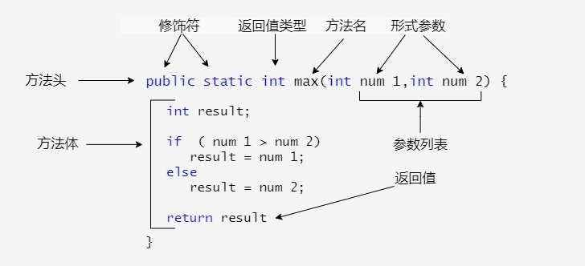

# Java 方法


---


## 1> 方法概念

>**System.out.println()**
    * println() 是一个方法。
    * System 是系统类。
    * out 是标准输出对象。
>Java 方法是语句的集合，它们在一起执行一个功能。
* 方法是解决一类问题的步骤的有序组合
* 方法包含于类或对象中
* 方法在程序中被创建，在其他地方被引用
>方法的优点
* 使程序变得更简短而清晰。
* 有利于程序维护。
* 可以提高程序开发的效率。
* 提高了代码的重用性

---


## 2> 方法的定义

```plain
修饰符 返回值类型 方法名(参数类型 参数名){
    ...
    方法体
    ...
    return 返回值;
}
```



---


## 3> 方法的调用

>Java 支持两种调用方法的方式，根据方法是否返回值来选择。
* 当程序调用一个方法时，程序的控制权交给了被调用的方法。当被调用方法的返回语句执行或者到达方法体闭括号时候交还控制权给程序。
* 当方法返回一个值的时候，方法调用通常被当做一个值。

---


## 4>void 关键字

* void 表示方法没有返回值，方法体中可以省略 return

---


## 5> 方法的重载

* 一个类的两个方法拥有相同的名字，但是有不同的参数列表。
* Java 编译器根据方法签名判断哪个方法应该被调用。
* 方法重载可以让程序更清晰易读。执行密切相关任务的方法应该使用相同的名字。
* 重载的方法必须拥有不同的参数列表。你不能仅仅依据修饰符或者返回类型的不同来重载方法。

---


## 6> 变量作用域

* 变量的范围是程序中该变量可以被引用的部分。
* 方法内定义的变量被称为局部变量。
* 局部变量的作用范围从声明开始，直到包含它的块结束。
* 局部变量必须声明才可以使用。
* 方法的参数范围涵盖整个方法。参数实际上是一个局部变量。
* for 循环的初始化部分声明的变量，其作用范围在整个循环。
* 但循环体内声明的变量其适用范围是从它声明到循环体结束。
* 可以在一个方法里，不同的非嵌套块中多次声明一个具有相同的名称局部变量，但你不能在嵌套块内两次声明局部变量。

---


## 7> 命令行参数的使用

* 有时候你希望运行一个程序时候再传递给它消息。这要靠传递命令行参数给 main()函数实现。
* 命令行参数是在执行程序时候紧跟在程序名字后面的信息。
```java
public class CommandLine {
   public static void main(String args[]){ 
      for(int i=0; i<args.length; i++){
         System.out.println("args[" + i + "]: " + args[i]);
      }
   }
}
```
>命令行运行
```shell
$ javac CommandLine.java 
$ java CommandLine this is a command line 200 -100
args[0]: this
args[1]: is
args[2]: a
args[3]: command
args[4]: line
args[5]: 200
args[6]: -100
```

---


## 8> 构造方法

* 当一个对象被创建时候，构造方法用来初始化该对象。构造方法和它所在类的名字相同，但构造方法没有返回值。
* 通常会使用构造方法给一个类的实例变量赋初值，或者执行其它必要的步骤来创建一个完整的对象。
* 所有的类都有构造方法，因为 Java 自动提供了一个默认构造方法，默认构造方法的访问修饰符和类的访问修饰符相同(类为 public，构造函数也为 public；类改为 protected，构造函数也改为 protected)。
```java
// 一个简单的构造函数
class MyClass {
int x;

// 以下是构造函数
MyClass() {
x = 10;
}
}
public class ConsDemo {
   public static void main(String args[]) {
      MyClass t1 = new MyClass();
      MyClass t2 = new MyClass();
      System.out.println(t1.x + " " + t2.x);
   }
}
```

---
## 

## 9> 可变参数

* JDK 1.5 开始，Java 支持传递同类型的可变参数给一个方法。
```java
typeName... parameterName
```
* 在方法声明中，在指定参数类型后加一个省略号(...) 。
* 一个方法中只能指定一个可变参数，它必须是方法的最后一个参数。任何普通的参数必须在它之前声明。
```java
public class VarargsDemo {
    public static void main(String args[]) {
        // 调用可变参数的方法
        printMax(34, 3, 3, 2, 56.5);
        printMax(new double[]{1, 2, 3});
    }
 
    public static void printMax( double... numbers) {
        if (numbers.length == 0) {
            System.out.println("No argument passed");
            return;
        }
 
        double result = numbers[0];
 
        for (int i = 1; i <  numbers.length; i++){
            if (numbers[i] >  result) {
                result = numbers[i];
            }
        }
        System.out.println("The max value is " + result);
    }
}
```

---


## 10> finalize()方法

* Java 允许定义这样的方法，它在对象被垃圾收集器析构(回收)之前调用，这个方法叫做 finalize( )，它用来清除回收对象。
```java
protected void finalize()
{
// 在这里终结代码
}
```
* 关键字 protected 是一个限定符，它确保 finalize() 方法不会被该类以外的代码调用。
* 当然，Java 的内存回收可以由 JVM 来自动完成。如果你手动使用，则可以使用上面的方法。
```java
public class FinalizationDemo {  
  public static void main(String[] args) {  
    Cake c1 = new Cake(1);  
    Cake c2 = new Cake(2);  
    Cake c3 = new Cake(3);  
      
    c2 = c3 = null;  
    System.gc(); //调用 Java 垃圾收集器
  }  
}  
//------------------------null 则触发自身的 finalize 方法进行垃圾回收。
class Cake extends Object {  
  private int id;  
  public Cake(int id) {  
    this.id = id;  
    System.out.println("Cake Object " + id + "is created");  
  }  
    
  protected void finalize() throws java.lang.Throwable {  
    super.finalize();  
    System.out.println("Cake Object " + id + "is disposed");  
  }  
}
```
>命令行运行
```shell
$ javac FinalizationDemo.java 
$ java FinalizationDemo
Cake Object 1is created
Cake Object 2is created
Cake Object 3is created
Cake Object 3is disposed
Cake Object 2is disposed
```

---


