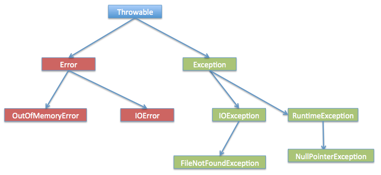

# 异常处理


---


## 1> 常见异常错误

>异常发生的原因有很多，通常包含以下几大类：
* 用户输入了非法数据。
* 要打开的文件不存在。
* 网络通信时连接中断，或者JVM内存溢出。
>这些异常有的是因为用户错误引起，有的是程序错误引起的，还有其它一些是因为物理错误引起的。
* **检查性异常**：最具代表的检查性异常是用户错误或问题引起的异常，这是程序员无法预见的。例如要打开一个不存在文件时，一个异常就发生了，这些异常在编译时不能被简单地忽略。
* **运行时异常**： 运行时异常是可能被程序员避免的异常。与检查性异常相反，运行时异常可以在编译时被忽略。
* **错误**： 错误不是异常，而是脱离程序员控制的问题。错误在代码中通常被忽略。例如，当栈溢出时，一个错误就发生了，它们在编译也检查不到的。

---


## 2>Exception 类的层次

* 所有的异常类是从 java.lang.Exception 类继承的子类。
* Exception 类是 Throwable 类的子类。除了Exception类外，Throwable还有一个子类Error 。
* Java 程序通常不捕获错误。错误一般发生在严重故障时，它们在Java程序处理的范畴之外。
* Error 用来指示运行时环境发生的错误。




---


## 3> Java内置异常类

* Java 语言定义了一些异常类在 java.lang 标准包中。

---


### 3.1 非检查性异常

|**异常**|**描述**|
|:----|:----|
|ArithmeticException|当出现异常的运算条件时，抛出此异常。例如，一个整数"除以零"时，抛出此类的一个实例。|
|ArrayIndexOutOfBoundsException|用非法索引访问数组时抛出的异常。如果索引为负或大于等于数组大小，则该索引为非法索引。|
|ArrayStoreException|试图将错误类型的对象存储到一个对象数组时抛出的异常。|
|ClassCastException|当试图将对象强制转换为不是实例的子类时，抛出该异常。|
|IllegalArgumentException|抛出的异常表明向方法传递了一个不合法或不正确的参数。|
|IllegalMonitorStateException|抛出的异常表明某一线程已经试图等待对象的监视器，或者试图通知其他正在等待对象的监视器而本身没有指定监视器的线程。|
|IllegalStateException|在非法或不适当的时间调用方法时产生的信号。换句话说，即 Java 环境或 Java 应用程序没有处于请求操作所要求的适当状态下。|
|IllegalThreadStateException|线程没有处于请求操作所要求的适当状态时抛出的异常。|
|IndexOutOfBoundsException|指示某排序索引（例如对数组、字符串或向量的排序）超出范围时抛出。|
|NegativeArraySizeException|如果应用程序试图创建大小为负的数组，则抛出该异常。|
|NullPointerException|当应用程序试图在需要对象的地方使用 null 时，抛出该异常|
|NumberFormatException|当应用程序试图将字符串转换成一种数值类型，但该字符串不能转换为适当格式时，抛出该异常。|
|SecurityException|由安全管理器抛出的异常，指示存在安全侵犯。|
|StringIndexOutOfBoundsException|此异常由 String 方法抛出，指示索引或者为负，或者超出字符串的大小。|
|UnsupportedOperationException|当不支持请求的操作时，抛出该异常。|


---


### 3.2 检查性异常

|**异常**|**描述**|
|:----|:----|
|ClassNotFoundException|应用程序试图加载类时，找不到相应的类，抛出该异常。|
|CloneNotSupportedException|当调用 Object 类中的 clone 方法克隆对象，但该对象的类无法实现 Cloneable 接口时，抛出该异常。|
|IllegalAccessException|拒绝访问一个类的时候，抛出该异常。|
|InstantiationException|当试图使用 Class 类中的 newInstance 方法创建一个类的实例，而指定的类对象因为是一个接口或是一个抽象类而无法实例化时，抛出该异常。|
|InterruptedException|一个线程被另一个线程中断，抛出该异常。|
|NoSuchFieldException|请求的变量不存在|
|NoSuchMethodException|请求的方法不存在|


---


## 4> 异常方法

|**序号**|**方法及说明**|
|:----|:----|
|1|**public String getMessage()**<br>返回关于发生的异常的详细信息。这个消息在Throwable 类的构造函数中初始化了。|
|2|**public Throwable getCause()**<br>返回一个Throwable 对象代表异常原因。|
|3|**public String toString()**<br>使用getMessage()的结果返回类的串级名字。|
|4|**public void printStackTrace()**<br>打印toString()结果和栈层次到System.err，即错误输出流。|
|5|**public StackTraceElement [] getStackTrace()**<br>返回一个包含堆栈层次的数组。下标为0的元素代表栈顶，最后一个元素代表方法调用堆栈的栈底。|
|6|**public Throwable fillInStackTrace()**<br>用当前的调用栈层次填充Throwable 对象栈层次，添加到栈层次任何先前信息中。|


---


## 5> 捕获异常 try~catch

```java
try
{
   // 程序代码
}catch(ExceptionName e1)
{
   //Catch 块
}
```
* Catch 语句包含要捕获异常类型的声明。当保护代码块中发生一个异常时，try 后面的 catch 块就会被检查。
* 如果发生的异常包含在 catch 块中，异常会被传递到该 catch 块，这和传递一个参数到方法是一样。
```java
// 文件名 : ExcepTest.java
import java.io.*;
public class ExcepTest{
 
   public static void main(String args[]){
      try{
         int a[] = new int[2];
         System.out.println("Access element three :" + a[3]);
      }catch(ArrayIndexOutOfBoundsException e){
         System.out.println("Exception thrown  :" + e);
      }
      System.out.println("Out of the block");
   }
}
```
* 可以多重捕获 catch~catch~catch

---


## 6> throws/throw

* 如果一个方法没有捕获到一个检查性异常，那么该方法必须使用 throws 关键字来声明。throws 关键字放在方法签名的尾部。
* 也可以使用 throw 关键字抛出一个异常，无论它是新实例化的还是刚捕获到的。
```java
import java.io.*;
public class className
{
   public void withdraw(double amount) throws RemoteException
   //<,InsufficientFundsException>//支持多个异常
   {
       // Method implementation
   }
   //Remainder of class definition
}
```

---


## 7> finally

* finally 关键字用来创建在 try 代码块后面执行的代码块。
* 无论是否发生异常，finally 代码块中的代码总会被执行。
```java
try{
// 程序代码
}catch(异常类型1 异常的变量名1){
// 程序代码
}catch(异常类型2 异常的变量名2){
// 程序代码
}finally{
// 程序代码
}
```

---


## 8> 自定义异常

>在 Java 中你可以自定义异常。编写自己的异常类时需要记住下面的几点。
* 所有异常都必须是 Throwable 的子类。
* 如果希望写一个检查性异常类，则需要继承 Exception 类。
* 如果你想写一个运行时异常类，那么需要继承 RuntimeException 类
```java
//一个银行账户的模拟，通过银行卡的号码完成识别，可以进行存钱和取钱的操作。
// 文件名InsufficientFundsException.java
import java.io.*;
 
//自定义异常类，继承Exception类
public class InsufficientFundsException extends Exception
{
  //此处的amount用来储存当出现异常（取出钱多于余额时）所缺乏的钱
  private double amount;
  public InsufficientFundsException(double amount)
  {
    this.amount = amount;
  } 
  public double getAmount()
  {
    return amount;
  }
}
```
>自定义异常演示
```java
// 文件名称 CheckingAccount.java
import java.io.*;
 
//此类模拟银行账户
public class CheckingAccount
{
  //balance为余额，number为卡号
   private double balance;
   private int number;
   public CheckingAccount(int number)
   {
      this.number = number;
   }
  //方法：存钱
   public void deposit(double amount)
   {
      balance += amount;
   }
  //方法：取钱
   public void withdraw(double amount) throws
                              InsufficientFundsException
   {
      if(amount <= balance)
      {
         balance -= amount;
      }
      else
      {
         double needs = amount - balance;
         throw new InsufficientFundsException(needs);
      }
   }
  //方法：返回余额
   public double getBalance()
   {
      return balance;
   }
  //方法：返回卡号
   public int getNumber()
   {
      return number;
   }
}
```

---


>异常演示：BankDemo 程序示范了如何调用 CheckingAccount 类的 deposit() 和 withdraw() 方法。
```java
//文件名称 BankDemo.java
public class BankDemo
{
   public static void main(String [] args)
   {
      CheckingAccount c = new CheckingAccount(101);
      System.out.println("Depositing $500...");
      c.deposit(500.00);
      try
      {
         System.out.println("\nWithdrawing $100...");
         c.withdraw(100.00);
         System.out.println("\nWithdrawing $600...");
         c.withdraw(600.00);
      }catch(InsufficientFundsException e)
      {
         System.out.println("Sorry, but you are short $"
                                  + e.getAmount());
         e.printStackTrace();
      }
    }
}
/*
Depositing $500...
Withdrawing $100...
Withdrawing $600...
Sorry, but you are short $200.0
InsufficientFundsException
        at CheckingAccount.withdraw(CheckingAccount.java:25)
        at BankDemo.main(BankDemo.java:13)
*/
```

---


## 9> 通用异常

* 在Java中定义了两种类型的异常和错误。
    * **JVM(Java虚拟机) 异常**：由 JVM 抛出的异常或错误。例如：NullPointerException 类，ArrayIndexOutOfBoundsException 类，ClassCastException 类。
    * **程序级异常**：由程序或者API程序抛出的异常。例如 IllegalArgumentException 类，IllegalStateException 类。

---


